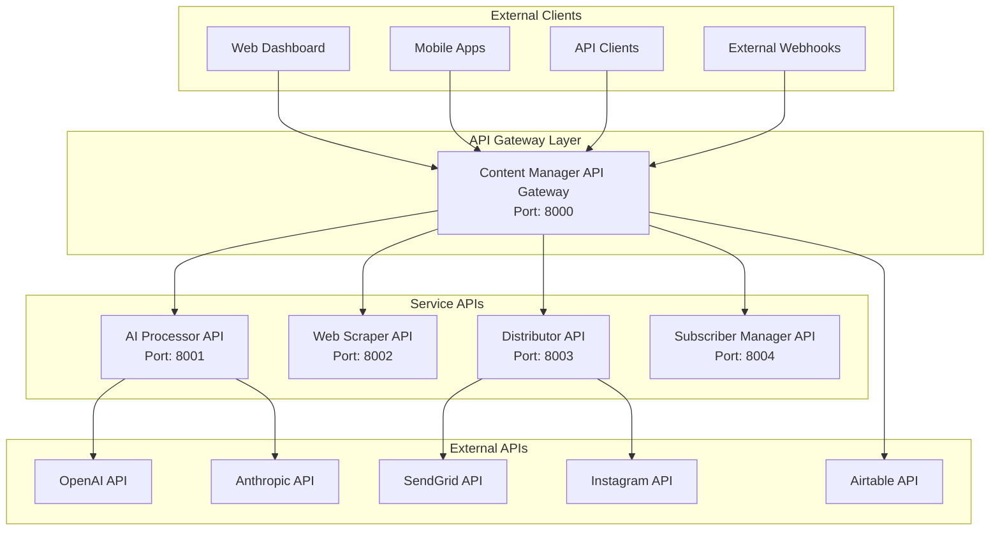
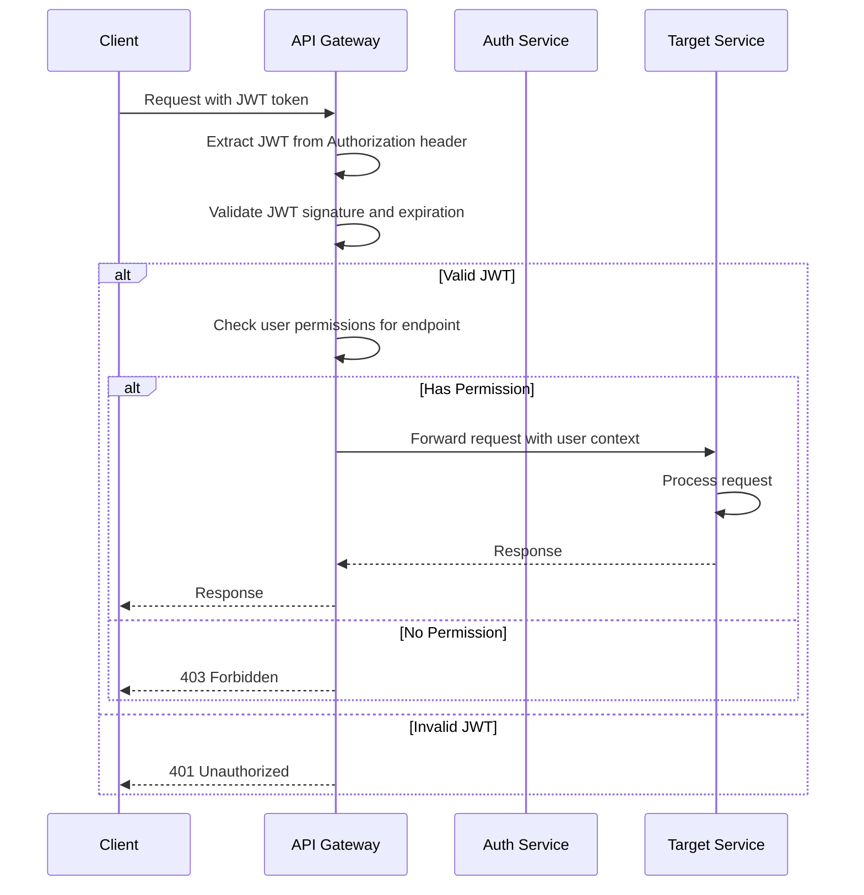

# AquaScene Content Engine - API Architecture

## Table of Contents
1. [API Overview](#api-overview)
2. [API Design Principles](#api-design-principles)
3. [Service API Specifications](#service-api-specifications)
4. [Authentication and Authorization](#authentication-and-authorization)
5. [API Gateway Pattern](#api-gateway-pattern)
6. [Request/Response Patterns](#requestresponse-patterns)
7. [Error Handling and Status Codes](#error-handling-and-status-codes)
8. [Rate Limiting and Throttling](#rate-limiting-and-throttling)
9. [API Versioning Strategy](#api-versioning-strategy)
10. [Documentation and OpenAPI](#documentation-and-openapi)

## API Overview

The AquaScene Content Engine implements a RESTful API architecture with the Content Manager serving as the primary API Gateway. Each microservice exposes its own API while the Content Manager orchestrates and aggregates functionality for external consumers.

### API Architecture Diagram


### API Portfolio Overview
```yaml
Content Manager API (Primary Gateway):
  Base URL: http://localhost:8000/api/v1
  Authentication: JWT Bearer Token
  Rate Limit: 1000 requests/hour per user
  Documentation: /docs (OpenAPI 3.0)
  
AI Processor API (Internal):
  Base URL: http://localhost:8001
  Authentication: Service-to-service JWT
  Rate Limit: 100 requests/hour per service
  Features: Content generation, quality validation
  
Web Scraper API (Internal):
  Base URL: http://localhost:8002
  Authentication: Service-to-service JWT
  Rate Limit: 50 requests/hour per service
  Features: Content scraping, data extraction
  
Distributor API (Internal):
  Base URL: http://localhost:8003
  Authentication: Service-to-service JWT
  Rate Limit: 200 requests/hour per service
  Features: Newsletter, Instagram automation
  
Subscriber Manager API (Internal):
  Base URL: http://localhost:8004
  Authentication: Service-to-service JWT
  Rate Limit: 500 requests/hour per service
  Features: User management, segmentation
```

## API Design Principles

### 1. RESTful Design
- **Resource-Based URLs**: URLs represent resources, not actions
- **HTTP Verbs**: Proper use of GET, POST, PUT, DELETE, PATCH
- **Stateless**: Each request contains all necessary information
- **Cacheable**: Responses include appropriate cache headers

### 2. Consistent Response Format
```json
{
  "data": {}, // or [] for arrays
  "meta": {
    "timestamp": "2024-01-15T10:30:00Z",
    "version": "1.0.0",
    "request_id": "req_12345"
  },
  "pagination": { // for paginated responses
    "page": 1,
    "per_page": 20,
    "total": 150,
    "total_pages": 8
  },
  "links": { // HATEOAS links
    "self": "/api/v1/content?page=1",
    "next": "/api/v1/content?page=2",
    "prev": null
  }
}
```

### 3. Error Response Format
```json
{
  "error": {
    "code": "VALIDATION_ERROR",
    "message": "Validation failed for the request",
    "details": [
      {
        "field": "title",
        "message": "Title is required",
        "code": "REQUIRED_FIELD"
      }
    ]
  },
  "meta": {
    "timestamp": "2024-01-15T10:30:00Z",
    "request_id": "req_12345"
  }
}
```

### 4. API-First Development
- **OpenAPI Specification**: All APIs documented with OpenAPI 3.0
- **Contract Testing**: API contracts tested before implementation
- **Mock Servers**: Early development using API mocks
- **Code Generation**: Client SDKs generated from specifications

## Service API Specifications

### Content Manager API (Gateway)

#### Core Content Management
```yaml
Content Operations:
  GET    /api/v1/content                    # List content with filtering
  POST   /api/v1/content                    # Create new content
  GET    /api/v1/content/{id}               # Get specific content
  PUT    /api/v1/content/{id}               # Update content (full)
  PATCH  /api/v1/content/{id}               # Update content (partial)
  DELETE /api/v1/content/{id}               # Delete content
  POST   /api/v1/content/{id}/publish       # Publish content
  POST   /api/v1/content/{id}/unpublish     # Unpublish content

Content Workflow:
  POST   /api/v1/content/{id}/approve       # Approve content for publishing
  POST   /api/v1/content/{id}/reject        # Reject content with feedback
  GET    /api/v1/content/{id}/history       # Get content version history
  POST   /api/v1/content/{id}/schedule      # Schedule content for publishing

Content Analytics:
  GET    /api/v1/content/{id}/metrics       # Get content performance metrics
  GET    /api/v1/content/{id}/engagement    # Get engagement statistics
  POST   /api/v1/content/{id}/track         # Track custom events
```

#### Content Generation (Proxy to AI Service)
```yaml
AI Generation:
  POST   /api/v1/generate/content           # Generate single content piece
  POST   /api/v1/generate/batch             # Batch content generation
  GET    /api/v1/generate/batch/{job_id}    # Get batch job status
  GET    /api/v1/generate/batch/{job_id}/results # Get batch results
  POST   /api/v1/generate/batch/{job_id}/cancel  # Cancel batch job

Templates:
  GET    /api/v1/templates                  # List available templates
  GET    /api/v1/templates/{id}             # Get template details
  POST   /api/v1/templates                  # Create custom template
  PUT    /api/v1/templates/{id}             # Update template
```

#### Newsletter Management (Proxy to Distributor)
```yaml
Newsletter Operations:
  GET    /api/v1/newsletters                # List newsletter issues
  POST   /api/v1/newsletters                # Create newsletter issue
  GET    /api/v1/newsletters/{id}           # Get newsletter details
  PUT    /api/v1/newsletters/{id}           # Update newsletter
  POST   /api/v1/newsletters/{id}/send      # Send newsletter
  POST   /api/v1/newsletters/{id}/schedule  # Schedule newsletter

Newsletter Analytics:
  GET    /api/v1/newsletters/{id}/metrics   # Get newsletter performance
  GET    /api/v1/newsletters/analytics      # Overall newsletter analytics
```

#### Subscriber Management (Proxy to Subscriber Service)
```yaml
Subscriber Operations:
  GET    /api/v1/subscribers                # List subscribers
  POST   /api/v1/subscribers                # Create subscriber
  GET    /api/v1/subscribers/{id}           # Get subscriber details
  PUT    /api/v1/subscribers/{id}           # Update subscriber
  DELETE /api/v1/subscribers/{id}           # Delete subscriber (GDPR)
  POST   /api/v1/subscribers/{id}/unsubscribe # Unsubscribe user

Segmentation:
  GET    /api/v1/segments                   # List subscriber segments
  POST   /api/v1/segments                   # Create segment
  GET    /api/v1/segments/{id}              # Get segment details
  PUT    /api/v1/segments/{id}              # Update segment
  GET    /api/v1/segments/{id}/subscribers  # Get segment subscribers
```

### AI Processor API (Internal)

#### Content Generation Endpoints
```yaml
Generation Operations:
  POST   /generate                          # Generate content
  POST   /batch/generate                    # Batch generation
  GET    /batch/{job_id}                    # Get batch job status
  GET    /batch/{job_id}/results            # Get batch results
  POST   /batch/{job_id}/cancel             # Cancel batch job

Model Management:
  GET    /models                            # List available models
  GET    /models/{provider}                 # Get provider models
  POST   /models/route                      # Get optimal model for request
  GET    /models/performance                # Get performance stats

Quality Validation:
  POST   /validate/content                  # Validate content quality
  POST   /validate/brand                    # Validate brand compliance
  POST   /validate/facts                    # Fact-check content
  POST   /optimize/content                  # Optimize content

Knowledge Base:
  GET    /knowledge/stats                   # Get knowledge base statistics
  POST   /knowledge/query                   # Query knowledge base
  POST   /knowledge/update                  # Update knowledge base
```

### Web Scraper API (Internal)

#### Scraping Operations
```yaml
Scraping Jobs:
  POST   /scrape/url                        # Scrape single URL
  POST   /scrape/batch                      # Batch URL scraping
  GET    /jobs                              # List scraping jobs
  GET    /jobs/{job_id}                     # Get job status
  POST   /jobs/{job_id}/cancel              # Cancel job

Target Management:
  GET    /targets                           # List scraping targets
  POST   /targets                           # Create scraping target
  GET    /targets/{id}                      # Get target details
  PUT    /targets/{id}                      # Update target
  DELETE /targets/{id}                      # Delete target
  POST   /targets/{id}/test                 # Test target configuration

Content Extraction:
  POST   /extract/content                   # Extract content from HTML
  POST   /extract/metadata                  # Extract metadata
  POST   /extract/images                    # Extract images
  GET    /extract/rules                     # Get extraction rules
```

### Distributor API (Internal)

#### Email Distribution
```yaml
Email Operations:
  POST   /email/send                        # Send single email
  POST   /email/bulk                        # Send bulk emails
  GET    /email/campaigns                   # List email campaigns
  GET    /email/campaigns/{id}              # Get campaign details
  POST   /email/campaigns/{id}/send         # Send campaign
  GET    /email/templates                   # List email templates

Instagram Operations:
  POST   /instagram/post                    # Create Instagram post
  POST   /instagram/schedule                # Schedule Instagram post
  GET    /instagram/posts                   # List scheduled posts
  GET    /instagram/posts/{id}              # Get post details
  PUT    /instagram/posts/{id}              # Update scheduled post
  DELETE /instagram/posts/{id}              # Cancel scheduled post

Analytics:
  GET    /analytics/email                   # Email analytics
  GET    /analytics/instagram               # Instagram analytics
  GET    /analytics/campaigns/{id}          # Campaign-specific analytics
```

### Subscriber Manager API (Internal)

#### Subscriber Operations
```yaml
Subscriber CRUD:
  GET    /subscribers                       # List subscribers
  POST   /subscribers                       # Create subscriber
  GET    /subscribers/{id}                  # Get subscriber
  PUT    /subscribers/{id}                  # Update subscriber
  DELETE /subscribers/{id}                  # Delete subscriber
  PATCH  /subscribers/{id}/status           # Update status
  
Preference Management:
  GET    /subscribers/{id}/preferences      # Get preferences
  PUT    /subscribers/{id}/preferences      # Update preferences
  POST   /subscribers/{id}/consent          # Record consent
  GET    /subscribers/{id}/consent-history  # Get consent history

Segmentation:
  GET    /segments                          # List segments
  POST   /segments                          # Create segment
  GET    /segments/{id}                     # Get segment
  PUT    /segments/{id}                     # Update segment
  POST   /segments/{id}/refresh             # Refresh dynamic segment
  GET    /segments/{id}/subscribers         # Get segment members

GDPR Compliance:
  POST   /gdpr/export/{subscriber_id}       # Export subscriber data
  POST   /gdpr/delete/{subscriber_id}       # Delete subscriber data
  GET    /gdpr/requests                     # List GDPR requests
  GET    /gdpr/requests/{id}                # Get request status
```

## Authentication and Authorization

### JWT-Based Authentication

#### Token Structure
```json
{
  "header": {
    "typ": "JWT",
    "alg": "HS256"
  },
  "payload": {
    "sub": "user_12345",
    "iat": 1642248000,
    "exp": 1642251600,
    "aud": "aquascene-content-engine",
    "iss": "aquascene-auth",
    "roles": ["admin", "content_editor"],
    "permissions": ["content:read", "content:write", "newsletter:send"],
    "session_id": "sess_abcdef123456"
  },
  "signature": "..."
}
```

#### Authentication Flow


### Role-Based Access Control (RBAC)

#### Role Definitions
```yaml
Roles:
  super_admin:
    description: Full system access
    permissions: ["*"]
    
  admin:
    description: Administrative access
    permissions:
      - "content:*"
      - "subscribers:*"
      - "newsletters:*"
      - "analytics:read"
      - "system:read"
      
  content_editor:
    description: Content creation and editing
    permissions:
      - "content:read"
      - "content:write" 
      - "content:approve"
      - "templates:read"
      - "analytics:read"
      
  content_reviewer:
    description: Content review and approval
    permissions:
      - "content:read"
      - "content:approve"
      - "content:reject"
      - "analytics:read"
      
  newsletter_manager:
    description: Newsletter management
    permissions:
      - "newsletters:*"
      - "subscribers:read"
      - "content:read"
      - "templates:read"
      
  viewer:
    description: Read-only access
    permissions:
      - "content:read"
      - "newsletters:read"
      - "analytics:read"
```

### Service-to-Service Authentication
```python
# Service JWT for internal communication
class ServiceTokenManager:
    def __init__(self, secret_key: str, service_name: str):
        self.secret_key = secret_key
        self.service_name = service_name
    
    def generate_service_token(self) -> str:
        payload = {
            "sub": f"service:{self.service_name}",
            "iat": datetime.utcnow(),
            "exp": datetime.utcnow() + timedelta(hours=1),
            "aud": "aquascene-services",
            "iss": "aquascene-auth",
            "service": True,
            "permissions": self.get_service_permissions()
        }
        return jwt.encode(payload, self.secret_key, algorithm="HS256")
    
    def get_service_permissions(self) -> List[str]:
        # Service-specific permissions
        service_permissions = {
            "content-manager": ["*"],  # Gateway has all permissions
            "ai-processor": ["content:read", "content:write"],
            "web-scraper": ["content:write", "scraping:*"],
            "distributor": ["content:read", "newsletters:*", "subscribers:read"],
            "subscriber-manager": ["subscribers:*", "segments:*"]
        }
        return service_permissions.get(self.service_name, [])
```

## API Gateway Pattern

### Request Processing Pipeline
```python
class APIGateway:
    def __init__(self):
        self.middleware_stack = [
            CORSMiddleware(),
            RateLimitMiddleware(),
            AuthenticationMiddleware(),
            AuthorizationMiddleware(),
            LoggingMiddleware(),
            MetricsMiddleware()
        ]
        self.service_registry = ServiceRegistry()
    
    async def process_request(self, request: Request) -> Response:
        # Apply middleware stack
        for middleware in self.middleware_stack:
            request = await middleware.process_request(request)
            if middleware.should_terminate(request):
                return middleware.create_response(request)
        
        # Route to appropriate service
        service = self.service_registry.get_service(request.path)
        
        # Forward request to service
        response = await service.handle_request(request)
        
        # Apply response middleware
        for middleware in reversed(self.middleware_stack):
            response = await middleware.process_response(response)
        
        return response
```

### Service Registry and Load Balancing
```python
class ServiceRegistry:
    def __init__(self):
        self.services = {
            "/api/v1/generate": AIProcessorService(),
            "/api/v1/scrape": WebScraperService(),
            "/api/v1/newsletters": DistributorService(),
            "/api/v1/subscribers": SubscriberManagerService()
        }
        self.load_balancer = LoadBalancer()
    
    def get_service(self, path: str) -> ServiceClient:
        # Find matching service pattern
        for pattern, service in self.services.items():
            if path.startswith(pattern):
                return self.load_balancer.get_instance(service)
        
        raise ServiceNotFoundError(f"No service found for path: {path}")
```

## Request/Response Patterns

### Request Validation
```python
from pydantic import BaseModel, validator
from typing import List, Optional
from datetime import datetime

class ContentCreateRequest(BaseModel):
    title: str
    content_type: str
    content: str
    tags: List[str] = []
    categories: List[str] = []
    target_audience: Optional[str] = None
    scheduled_for: Optional[datetime] = None
    
    @validator('title')
    def title_must_not_be_empty(cls, v):
        if not v or not v.strip():
            raise ValueError('Title cannot be empty')
        return v.strip()
    
    @validator('content_type')
    def content_type_must_be_valid(cls, v):
        valid_types = ['article', 'newsletter', 'social_post', 'guide']
        if v not in valid_types:
            raise ValueError(f'Content type must be one of: {valid_types}')
        return v
    
    @validator('content')
    def content_must_meet_minimum_length(cls, v):
        if len(v.strip()) < 50:
            raise ValueError('Content must be at least 50 characters long')
        return v.strip()
```

### Response Serialization
```python
class ContentResponse(BaseModel):
    id: str
    title: str
    content_type: str
    content: str
    status: str
    quality_score: Optional[float]
    tags: List[str]
    categories: List[str]
    word_count: int
    estimated_reading_time: int
    created_at: datetime
    updated_at: datetime
    published_at: Optional[datetime]
    
    class Config:
        from_attributes = True
        json_encoders = {
            datetime: lambda v: v.isoformat()
        }

class PaginatedContentResponse(BaseModel):
    data: List[ContentResponse]
    meta: dict
    pagination: dict
    links: dict
```

### Async Request Handling
```python
class ContentController:
    def __init__(self, content_service: ContentService):
        self.content_service = content_service
    
    @router.post("/content", response_model=ContentResponse)
    async def create_content(
        self, 
        request: ContentCreateRequest,
        current_user: User = Depends(get_current_user),
        background_tasks: BackgroundTasks = BackgroundTasks()
    ) -> ContentResponse:
        # Validate user permissions
        if not current_user.has_permission("content:write"):
            raise HTTPException(
                status_code=403, 
                detail="Insufficient permissions"
            )
        
        # Create content
        content = await self.content_service.create_content(
            request, created_by=current_user.id
        )
        
        # Trigger background tasks
        background_tasks.add_task(
            self.trigger_quality_check, content.id
        )
        background_tasks.add_task(
            self.update_search_index, content.id
        )
        
        return ContentResponse.from_orm(content)
```

## Error Handling and Status Codes

### HTTP Status Code Strategy
```yaml
Success Codes:
  200 OK: Successful GET, PUT, PATCH requests
  201 Created: Successful POST requests that create resources
  202 Accepted: Async operations accepted for processing
  204 No Content: Successful DELETE requests

Client Error Codes:
  400 Bad Request: Invalid request syntax or validation errors
  401 Unauthorized: Authentication required or invalid
  403 Forbidden: Valid auth but insufficient permissions
  404 Not Found: Resource not found
  409 Conflict: Request conflicts with current resource state
  422 Unprocessable Entity: Valid syntax but semantic errors
  429 Too Many Requests: Rate limit exceeded

Server Error Codes:
  500 Internal Server Error: Unexpected server error
  501 Not Implemented: Endpoint not yet implemented
  502 Bad Gateway: Upstream service error
  503 Service Unavailable: Service temporarily unavailable
  504 Gateway Timeout: Upstream service timeout
```

### Error Response Classes
```python
from enum import Enum
from typing import Optional, List, Dict, Any

class ErrorCode(Enum):
    # Validation Errors
    VALIDATION_ERROR = "VALIDATION_ERROR"
    REQUIRED_FIELD = "REQUIRED_FIELD" 
    INVALID_FORMAT = "INVALID_FORMAT"
    VALUE_OUT_OF_RANGE = "VALUE_OUT_OF_RANGE"
    
    # Authentication/Authorization Errors
    AUTHENTICATION_REQUIRED = "AUTHENTICATION_REQUIRED"
    INVALID_TOKEN = "INVALID_TOKEN"
    TOKEN_EXPIRED = "TOKEN_EXPIRED"
    INSUFFICIENT_PERMISSIONS = "INSUFFICIENT_PERMISSIONS"
    
    # Resource Errors
    RESOURCE_NOT_FOUND = "RESOURCE_NOT_FOUND"
    RESOURCE_CONFLICT = "RESOURCE_CONFLICT"
    RESOURCE_LOCKED = "RESOURCE_LOCKED"
    
    # Service Errors
    SERVICE_UNAVAILABLE = "SERVICE_UNAVAILABLE"
    EXTERNAL_SERVICE_ERROR = "EXTERNAL_SERVICE_ERROR"
    RATE_LIMIT_EXCEEDED = "RATE_LIMIT_EXCEEDED"

class APIError(BaseModel):
    code: ErrorCode
    message: str
    details: Optional[List[Dict[str, Any]]] = None
    
class ErrorResponse(BaseModel):
    error: APIError
    meta: Dict[str, Any]

# Exception Handlers
@app.exception_handler(ValidationError)
async def validation_exception_handler(request: Request, exc: ValidationError):
    details = []
    for error in exc.errors():
        details.append({
            "field": ".".join(str(loc) for loc in error["loc"]),
            "message": error["msg"],
            "code": "VALIDATION_ERROR"
        })
    
    return JSONResponse(
        status_code=400,
        content=ErrorResponse(
            error=APIError(
                code=ErrorCode.VALIDATION_ERROR,
                message="Validation failed",
                details=details
            ),
            meta={
                "timestamp": datetime.utcnow().isoformat(),
                "request_id": request.state.request_id
            }
        ).dict()
    )
```

### Global Exception Handling
```python
@app.exception_handler(HTTPException)
async def http_exception_handler(request: Request, exc: HTTPException):
    error_mapping = {
        400: ErrorCode.VALIDATION_ERROR,
        401: ErrorCode.AUTHENTICATION_REQUIRED,
        403: ErrorCode.INSUFFICIENT_PERMISSIONS,
        404: ErrorCode.RESOURCE_NOT_FOUND,
        409: ErrorCode.RESOURCE_CONFLICT,
        429: ErrorCode.RATE_LIMIT_EXCEEDED,
        500: ErrorCode.INTERNAL_ERROR
    }
    
    return JSONResponse(
        status_code=exc.status_code,
        content=ErrorResponse(
            error=APIError(
                code=error_mapping.get(exc.status_code, ErrorCode.INTERNAL_ERROR),
                message=exc.detail
            ),
            meta={
                "timestamp": datetime.utcnow().isoformat(),
                "request_id": getattr(request.state, 'request_id', None)
            }
        ).dict()
    )
```

## Rate Limiting and Throttling

### Rate Limiting Strategy
```python
from redis import Redis
import asyncio
from datetime import datetime, timedelta

class RateLimiter:
    def __init__(self, redis_client: Redis):
        self.redis = redis_client
    
    async def check_rate_limit(
        self, 
        key: str, 
        limit: int, 
        window: int
    ) -> tuple[bool, dict]:
        """
        Check rate limit using sliding window algorithm
        Returns: (is_allowed, rate_limit_info)
        """
        current_time = datetime.utcnow().timestamp()
        pipeline = self.redis.pipeline()
        
        # Remove expired entries
        pipeline.zremrangebyscore(key, 0, current_time - window)
        
        # Count current requests
        pipeline.zcard(key)
        
        # Add current request
        pipeline.zadd(key, {str(current_time): current_time})
        
        # Set expiration
        pipeline.expire(key, window)
        
        results = await pipeline.execute()
        current_requests = results[1]
        
        is_allowed = current_requests < limit
        
        rate_limit_info = {
            "limit": limit,
            "remaining": max(0, limit - current_requests - 1),
            "reset_time": current_time + window,
            "retry_after": None if is_allowed else window
        }
        
        return is_allowed, rate_limit_info

# Rate Limiting Middleware
class RateLimitMiddleware:
    def __init__(self, rate_limiter: RateLimiter):
        self.rate_limiter = rate_limiter
        self.rate_limits = {
            "/api/v1/generate": {"limit": 10, "window": 3600},  # 10/hour
            "/api/v1/content": {"limit": 100, "window": 3600},   # 100/hour
            "/api/v1/subscribers": {"limit": 200, "window": 3600} # 200/hour
        }
    
    async def __call__(self, request: Request, call_next):
        user_id = getattr(request.state, 'user_id', request.client.host)
        endpoint = self.get_endpoint_pattern(request.url.path)
        
        if endpoint in self.rate_limits:
            rate_config = self.rate_limits[endpoint]
            key = f"rate_limit:{user_id}:{endpoint}"
            
            is_allowed, rate_info = await self.rate_limiter.check_rate_limit(
                key, rate_config["limit"], rate_config["window"]
            )
            
            if not is_allowed:
                return JSONResponse(
                    status_code=429,
                    content={"error": "Rate limit exceeded"},
                    headers={
                        "X-RateLimit-Limit": str(rate_info["limit"]),
                        "X-RateLimit-Remaining": str(rate_info["remaining"]),
                        "X-RateLimit-Reset": str(rate_info["reset_time"]),
                        "Retry-After": str(rate_info["retry_after"])
                    }
                )
            
            # Add rate limit headers to successful responses
            response = await call_next(request)
            response.headers["X-RateLimit-Limit"] = str(rate_info["limit"])
            response.headers["X-RateLimit-Remaining"] = str(rate_info["remaining"])
            response.headers["X-RateLimit-Reset"] = str(rate_info["reset_time"])
            
            return response
        
        return await call_next(request)
```

## API Versioning Strategy

### URL-Based Versioning
```python
# Version-specific routers
v1_router = APIRouter(prefix="/api/v1")
v2_router = APIRouter(prefix="/api/v2")

# Version-specific implementations
@v1_router.get("/content")
async def get_content_v1():
    # Version 1 implementation
    pass

@v2_router.get("/content")
async def get_content_v2():
    # Version 2 implementation with new features
    pass

# Version deprecation handling
class APIVersionMiddleware:
    def __init__(self):
        self.deprecated_versions = {
            "v1": {
                "sunset_date": "2024-12-31",
                "replacement": "v2"
            }
        }
    
    async def __call__(self, request: Request, call_next):
        version = self.extract_version(request.url.path)
        
        if version in self.deprecated_versions:
            response = await call_next(request)
            deprecation_info = self.deprecated_versions[version]
            
            response.headers["Deprecation"] = deprecation_info["sunset_date"]
            response.headers["Link"] = f'<{request.url.path.replace(version, deprecation_info["replacement"])}>; rel="successor-version"'
            response.headers["Warning"] = f'299 - "API version {version} is deprecated"'
            
            return response
        
        return await call_next(request)
```

## Documentation and OpenAPI

### OpenAPI Specification Generation
```python
from fastapi import FastAPI
from fastapi.openapi.utils import get_openapi

app = FastAPI()

def custom_openapi():
    if app.openapi_schema:
        return app.openapi_schema
    
    openapi_schema = get_openapi(
        title="AquaScene Content Engine API",
        version="1.0.0",
        description="""
        The AquaScene Content Engine API provides comprehensive content management,
        AI-powered generation, and multi-channel distribution capabilities.
        
        ## Authentication
        Most endpoints require authentication using JWT bearer tokens.
        
        ## Rate Limiting
        API calls are rate-limited per user and endpoint.
        
        ## Errors
        The API returns structured error responses with detailed error codes.
        """,
        routes=app.routes,
    )
    
    # Add custom security scheme
    openapi_schema["components"]["securitySchemes"] = {
        "bearerAuth": {
            "type": "http",
            "scheme": "bearer",
            "bearerFormat": "JWT"
        }
    }
    
    # Add global security requirement
    for path in openapi_schema["paths"]:
        for method in openapi_schema["paths"][path]:
            if method != "options":
                openapi_schema["paths"][path][method]["security"] = [
                    {"bearerAuth": []}
                ]
    
    app.openapi_schema = openapi_schema
    return app.openapi_schema

app.openapi = custom_openapi

# API Documentation endpoints
@app.get("/docs", include_in_schema=False)
async def swagger_ui():
    return get_swagger_ui_html(
        openapi_url="/openapi.json",
        title="API Documentation",
        swagger_favicon_url="/static/favicon.ico"
    )

@app.get("/redoc", include_in_schema=False) 
async def redoc():
    return get_redoc_html(
        openapi_url="/openapi.json",
        title="API Documentation"
    )
```

### API Testing and Validation
```python
# Contract testing with OpenAPI
import pytest
from openapi_spec_validator import validate_spec
from openapi_spec_validator.readers import read_from_filename

def test_openapi_spec_is_valid():
    """Test that the OpenAPI specification is valid"""
    spec_dict, spec_url = read_from_filename('openapi.json')
    validate_spec(spec_dict)

# API endpoint testing
@pytest.mark.asyncio
async def test_content_creation_endpoint():
    """Test content creation follows API contract"""
    async with AsyncClient(app=app, base_url="http://test") as ac:
        response = await ac.post(
            "/api/v1/content",
            json={
                "title": "Test Content",
                "content_type": "article", 
                "content": "This is test content for the API test."
            },
            headers={"Authorization": "Bearer test_token"}
        )
    
    assert response.status_code == 201
    assert "id" in response.json()["data"]
    assert response.json()["data"]["title"] == "Test Content"
```

This comprehensive API architecture documentation provides the foundation for understanding how the AquaScene Content Engine exposes its functionality through well-designed REST APIs, ensuring consistency, security, and scalability across all services.