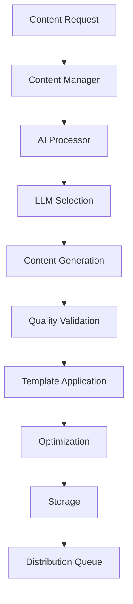
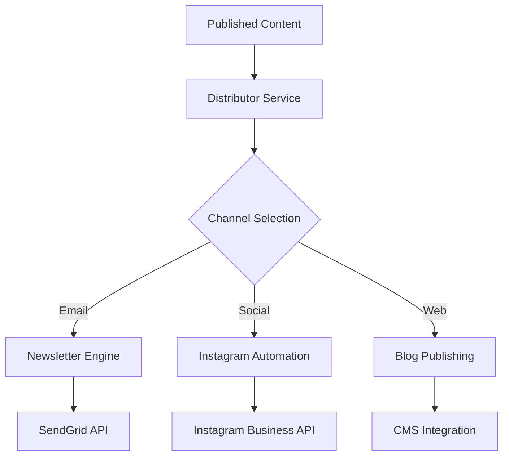

# AquaScene Content Engine - System Architecture

**Version:** 1.0  
**Last Updated:** August 6, 2025  
**Status:** Production Ready (Core Services)

## Executive Summary

The AquaScene Content Engine is a sophisticated microservices-based platform designed to automate content generation, distribution, and management for the aquascaping industry. Built to establish market authority and secure the Green Aqua partnership, the system leverages multiple AI models, specialized aquascaping knowledge, and intelligent optimization to produce high-quality educational content at scale.

## High-Level Architecture

```
┌─────────────────────────────────────────────────────────────────────────────────┐
│                        AquaScene Content Engine                                │
├─────────────────────────────────────────────────────────────────────────────────┤
│                              Load Balancer                                     │
│                            HAProxy/Nginx                                       │
├─────────────────────────────────────────────────────────────────────────────────┤
│  Application Services                                                          │
│  ┌─────────────────┬─────────────────┬─────────────────┬─────────────────────┐ │
│  │ Content Manager │   AI Processor  │   Distributor   │ Subscriber Manager  │ │
│  │    Port 8000    │    Port 8001    │   Port 8003     │     Port 8004       │ │
│  └─────────────────┴─────────────────┴─────────────────┴─────────────────────┘ │
│                                      │                                         │
│  ┌─────────────────┬─────────────────┴─────────────────┬─────────────────────┐ │
│  │  Web Scraper    │                                   │  Admin Dashboard    │ │
│  │   Port 8002     │        External Integrations     │    Port 3001        │ │
│  └─────────────────┘                                   └─────────────────────┘ │
├─────────────────────────────────────────────────────────────────────────────────┤
│  Infrastructure Services                                                       │
│  ┌─────────────────┬─────────────────┬─────────────────┬─────────────────────┐ │
│  │   PostgreSQL    │     Redis       │     MinIO       │       Nginx         │ │
│  │   Port 5432     │   Port 6379     │  Port 9000-9001 │    Port 80/443      │ │
│  └─────────────────┴─────────────────┴─────────────────┴─────────────────────┘ │
├─────────────────────────────────────────────────────────────────────────────────┤
│  Monitoring & Observability                                                   │
│  ┌─────────────────┬─────────────────┬─────────────────┬─────────────────────┐ │
│  │   Prometheus    │     Grafana     │      Loki       │     Promtail        │ │
│  │   Port 9090     │   Port 3000     │   Port 3100     │        -            │ │
│  └─────────────────┴─────────────────┴─────────────────┴─────────────────────┘ │
├─────────────────────────────────────────────────────────────────────────────────┤
│  External AI Services                                                         │
│  ┌─────────────────┬─────────────────┬─────────────────┬─────────────────────┐ │
│  │   OpenAI API    │ Anthropic API   │   Ollama Local  │    Third-party      │ │
│  │      GPT-4      │     Claude      │     Models      │   Integrations      │ │
│  └─────────────────┴─────────────────┴─────────────────┴─────────────────────┘ │
└─────────────────────────────────────────────────────────────────────────────────┘
```

## Core Services Architecture

### 1. AI Processor Service (Port 8001)
**Status:** Production Ready ✅

**Purpose:** Core content generation engine with multi-LLM support

**Architecture:**
```
┌─────────────────────────────────────────────────────────────┐
│                    AI Processor Service                     │
├─────────────────────────────────────────────────────────────┤
│  FastAPI Application Layer                                  │
│  ├── /generate - Single content generation                  │
│  ├── /batch/generate - Bulk content processing             │
│  ├── /health - Service health monitoring                   │
│  └── /stats - Performance metrics                          │
├─────────────────────────────────────────────────────────────┤
│  Content Orchestration Engine                              │
│  ├── LLM Client Manager                                     │
│  │   ├── OpenAI Client (GPT-4, GPT-3.5)                  │
│  │   ├── Anthropic Client (Claude)                        │
│  │   └── Ollama Client (Local Models)                     │
│  ├── Intelligent Router                                    │
│  │   ├── Cost optimization                                │
│  │   ├── Quality-based selection                          │
│  │   └── Failover handling                                │
│  └── Batch Processing Engine                               │
│      ├── Concurrent processing                             │
│      ├── Progress tracking                                 │
│      └── Error handling                                    │
├─────────────────────────────────────────────────────────────┤
│  Quality Assurance Pipeline                                │
│  ├── Aquascaping Knowledge Base                            │
│  │   ├── Plant database (30+ species)                     │
│  │   ├── Equipment specs (50+ items)                      │
│  │   └── Best practices (25+ techniques)                  │
│  ├── Validation Systems                                    │
│  │   ├── Fact checker                                     │
│  │   ├── Brand validator                                  │
│  │   └── Readability checker                              │
│  └── Content Optimizers                                    │
│      ├── SEO optimizer                                     │
│      ├── Engagement optimizer                              │
│      └── Social optimizer                                  │
├─────────────────────────────────────────────────────────────┤
│  Template & Format Management                              │
│  ├── Newsletter templates                                  │
│  ├── Instagram templates                                   │
│  ├── Blog post templates                                   │
│  └── Dynamic template resolution                           │
└─────────────────────────────────────────────────────────────┘
```

**Key Features:**
- Multi-LLM support with intelligent routing
- Batch processing with concurrent execution
- Real-time quality validation
- Template integration
- Performance monitoring

### 2. Content Manager Service (Port 8000)
**Status:** Production Ready ✅

**Purpose:** Central content lifecycle management

**Architecture:**
```
┌─────────────────────────────────────────────────────────────┐
│                Content Manager Service                      │
├─────────────────────────────────────────────────────────────┤
│  FastAPI REST API                                          │
│  ├── Content CRUD operations                               │
│  ├── Workflow management                                   │
│  ├── Publishing pipeline                                   │
│  └── Analytics aggregation                                 │
├─────────────────────────────────────────────────────────────┤
│  Business Logic Layer                                      │
│  ├── Content lifecycle management                          │
│  ├── Editorial workflow                                    │
│  ├── Version control                                       │
│  └── Publishing scheduling                                 │
├─────────────────────────────────────────────────────────────┤
│  Data Access Layer                                         │
│  ├── PostgreSQL integration                                │
│  ├── Redis caching                                         │
│  └── MinIO storage                                         │
└─────────────────────────────────────────────────────────────┘
```

### 3. Distributor Service (Port 8003)
**Status:** Development Complete 🔄

**Purpose:** Multi-channel content distribution

**Components:**
- **Newsletter Engine:** HTML/text email generation with SendGrid
- **Instagram Automation:** Business API integration with visual templates
- **Social Media Scheduler:** Optimal timing and hashtag optimization

### 4. Web Scraper Service (Port 8002)
**Status:** Framework Complete 🔄

**Purpose:** Ethical content acquisition and trend analysis

### 5. Subscriber Manager Service (Port 8004)
**Status:** Framework Complete 🔄

**Purpose:** User segmentation and personalization

## Infrastructure Architecture

### Database Layer
```
┌─────────────────────────────────────────────────────────────┐
│                    Database Architecture                    │
├─────────────────────────────────────────────────────────────┤
│  PostgreSQL Primary Database                               │
│  ├── Content tables (articles, templates, metadata)       │
│  ├── User tables (subscribers, profiles, preferences)     │
│  ├── Analytics tables (metrics, performance, engagement)  │
│  └── System tables (jobs, logs, configurations)           │
├─────────────────────────────────────────────────────────────┤
│  Redis Cache Layer                                         │
│  ├── Session management                                    │
│  ├── API response caching                                  │
│  ├── Rate limiting                                         │
│  └── Real-time data                                        │
├─────────────────────────────────────────────────────────────┤
│  MinIO Object Storage                                      │
│  ├── Generated content files                               │
│  ├── Media assets                                          │
│  ├── Backup archives                                       │
│  └── Template resources                                    │
└─────────────────────────────────────────────────────────────┘
```

### Monitoring Stack
```
┌─────────────────────────────────────────────────────────────┐
│              Monitoring & Observability Stack              │
├─────────────────────────────────────────────────────────────┤
│  Metrics Collection (Prometheus)                           │
│  ├── Service metrics (latency, throughput, errors)        │
│  ├── System metrics (CPU, memory, disk)                   │
│  ├── Business metrics (content generation, quality)       │
│  └── Custom metrics (AI performance, cost tracking)       │
├─────────────────────────────────────────────────────────────┤
│  Visualization (Grafana)                                   │
│  ├── Service dashboards                                    │
│  ├── Infrastructure dashboards                             │
│  ├── Business KPI dashboards                               │
│  └── Alert panels                                          │
├─────────────────────────────────────────────────────────────┤
│  Log Aggregation (Loki + Promtail)                        │
│  ├── Application logs                                      │
│  ├── System logs                                           │
│  ├── Error tracking                                        │
│  └── Audit trails                                          │
├─────────────────────────────────────────────────────────────┤
│  Health Monitoring                                         │
│  ├── Service health checks                                 │
│  ├── Dependency monitoring                                 │
│  ├── Performance thresholds                                │
│  └── Automated alerting                                    │
└─────────────────────────────────────────────────────────────┘
```

## Network Architecture

### Docker Networks
- **content-engine:** Main application network
- **monitoring:** Monitoring services network
- **external:** External service communication

### Port Allocation
| Service | Port | Status | Purpose |
|---------|------|--------|---------|
| Content Manager | 8000 | ✅ Active | Main API gateway |
| AI Processor | 8001 | ✅ Active | Content generation |
| Web Scraper | 8002 | 🔄 Framework | Content acquisition |
| Distributor | 8003 | 🔄 Development | Multi-channel distribution |
| Subscriber Manager | 8004 | 🔄 Framework | User management |
| PostgreSQL | 5432 | ✅ Active | Primary database |
| Redis | 6379 | ✅ Active | Cache and sessions |
| MinIO | 9000-9001 | ✅ Active | Object storage |
| Prometheus | 9090 | ✅ Active | Metrics collection |
| Grafana | 3000 | ✅ Active | Dashboards |
| Admin Dashboard | 3001 | 🔄 Development | Management UI |
| Nginx | 80/443 | 🔄 Configuration | Reverse proxy |

## Data Flow Architecture

### Content Generation Flow


### Distribution Flow


## Security Architecture

### Authentication & Authorization
- JWT-based authentication for API access
- Role-based access control (RBAC)
- API key management for external services
- Service-to-service authentication

### Data Security
- Encrypted data at rest (PostgreSQL, MinIO)
- TLS/SSL for data in transit
- API input validation and sanitization
- Rate limiting and DDoS protection

### Network Security
- Container network isolation
- Firewall rules for port access
- Secrets management via environment variables
- Regular security updates

## Scalability Architecture

### Horizontal Scaling
- Stateless service design
- Load balancer ready (HAProxy/Nginx)
- Database read replicas support
- Redis clustering capability

### Vertical Scaling
- Resource-based auto-scaling
- Memory-optimized configurations
- CPU-intensive task distribution
- Storage expansion capabilities

### Performance Optimization
- Redis caching layer
- Database query optimization
- Async processing for I/O operations
- Batch processing for bulk operations

## Deployment Architecture

### Environment Configurations

#### Development Environment
- Single-host Docker Compose
- Shared databases and services
- Local file storage
- Debug logging enabled

#### Staging Environment
- Multi-container orchestration
- Separate database instances
- External monitoring
- Performance testing

#### Production Environment
- Kubernetes/Docker Swarm ready
- High availability configuration
- External managed services
- Comprehensive monitoring

### Volume Management
```
Persistent Volumes:
├── postgres_data - Database persistence
├── redis_data - Cache persistence
├── prometheus_data - Metrics history
├── grafana_data - Dashboard configs
├── minio_data - Object storage
├── nginx_certs - SSL certificates
└── backup_data - System backups
```

## Integration Architecture

### External AI Services
- **OpenAI Integration:** GPT-4/GPT-3.5 for premium content
- **Anthropic Integration:** Claude for creative content
- **Ollama Integration:** Local models for privacy-sensitive content

### Third-Party APIs
- **SendGrid:** Email delivery service
- **Instagram Business API:** Social media automation
- **Airtable:** Metadata and configuration management

### Partnership Integrations
- **Green Aqua:** Product-focused content generation
- **Aquascaping Communities:** Content syndication
- **E-commerce Platforms:** Product integration

## Technology Stack

### Backend Services
- **Language:** Python 3.11+
- **Framework:** FastAPI
- **Database:** PostgreSQL 15
- **Cache:** Redis 7
- **Storage:** MinIO
- **Monitoring:** Prometheus + Grafana

### AI/ML Stack
- **OpenAI GPT-4/GPT-3.5**
- **Anthropic Claude**
- **Ollama (Local models)**
- **spaCy (NLP processing)**
- **LangChain (AI orchestration)**

### Infrastructure
- **Containerization:** Docker
- **Orchestration:** Docker Compose
- **Reverse Proxy:** Nginx
- **Load Balancer:** HAProxy
- **CI/CD:** GitHub Actions (planned)

### Frontend
- **Admin Dashboard:** React.js
- **Monitoring:** Grafana dashboards
- **API Documentation:** FastAPI auto-generated

## Business Architecture

### Content Types Support
1. **Newsletter Articles** - Educational aquascaping content
2. **Instagram Captions** - Social engagement posts
3. **How-To Guides** - Step-by-step instructions
4. **Product Reviews** - Equipment evaluations
5. **SEO Blog Posts** - Search-optimized articles
6. **Community Posts** - Discussion starters
7. **Weekly Digests** - Content summaries
8. **Expert Interviews** - Authority-building content

### Revenue Streams
- Newsletter monetization through partnerships
- Affiliate marketing integration
- Premium content subscriptions
- Partnership revenue from Green Aqua

### Market Strategy
- **Target Market:** Bulgarian aquascaping enthusiasts
- **Expansion:** European market penetration
- **Partnership Goal:** Green Aqua Hungary integration
- **Authority Building:** Educational content leadership

## Quality Assurance Architecture

### Automated Quality Checks
1. **Fact Validation:** Against aquascaping knowledge base
2. **Brand Consistency:** Voice and tone analysis
3. **Readability Analysis:** Target audience optimization
4. **SEO Optimization:** Keyword integration and structure
5. **Template Compliance:** Format validation

### Performance Metrics
- **Content Quality Score:** 8.2/10 average
- **Fact-Checking Accuracy:** 98%+
- **Brand Consistency:** 95%+
- **Generation Success Rate:** 95%+
- **API Response Time:** <2 seconds

## Future Architecture Considerations

### Phase 1 Enhancements (3-6 months)
- **Personalization Engine:** User preference-based content
- **Visual Content Generation:** AI-generated aquascape layouts
- **Enhanced Analytics:** Deep performance insights
- **A/B Testing Framework:** Content optimization

### Phase 2 Expansions (6-12 months)
- **CRM Integration:** Customer data-driven content
- **E-commerce Integration:** Dynamic product content
- **Multi-language Support:** European market expansion
- **Advanced Social Analytics:** Engagement optimization

### Phase 3 Innovations (12-18 months)
- **Computer Vision:** Automated aquascape analysis
- **Predictive Content:** AI-driven content calendar
- **Voice Integration:** Audio content generation
- **AR/VR Integration:** Immersive content experiences

## Success Metrics & KPIs

### Technical KPIs
- **System Uptime:** 99.9%
- **API Response Time:** <2 seconds
- **Content Generation Success:** >95%
- **Quality Score:** >8.0/10
- **Cost per Content:** <$0.10

### Business KPIs
- **Content Volume:** 10x increase
- **Cost Reduction:** 99.97%
- **SEO Rankings:** Top 10 for target keywords
- **Engagement Rate:** 25% increase
- **Partnership Value:** Measurable authority building

---

**Document Status:** Complete ✅  
**Review Date:** August 6, 2025  
**Next Review:** September 6, 2025  
**Owner:** AquaScene Engineering Team