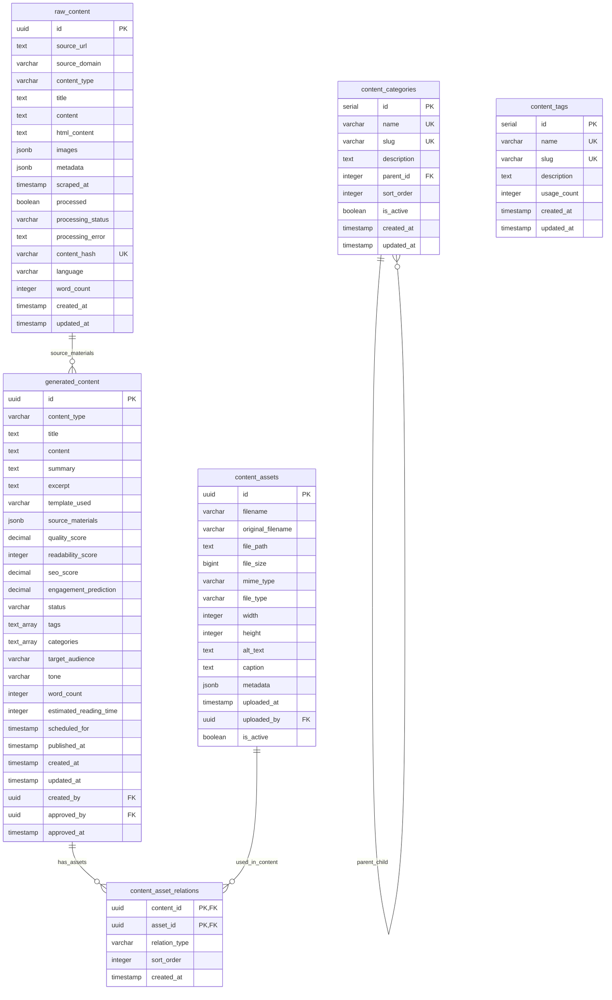
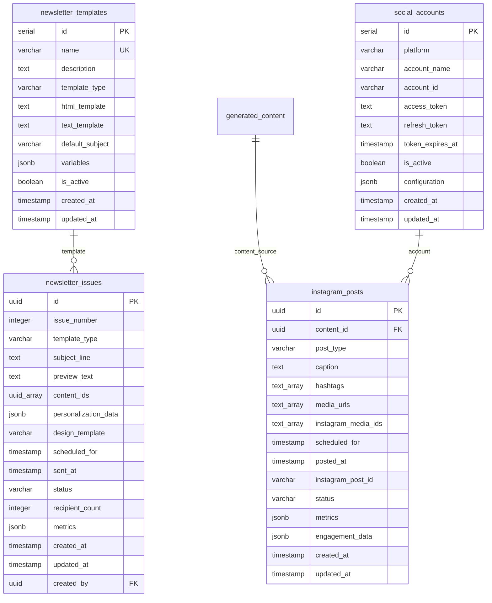
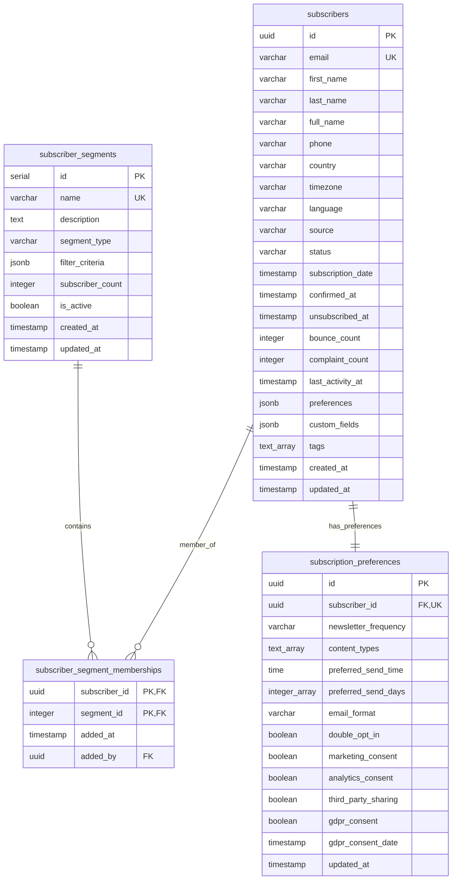
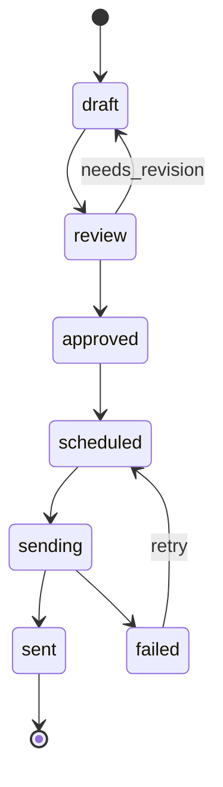
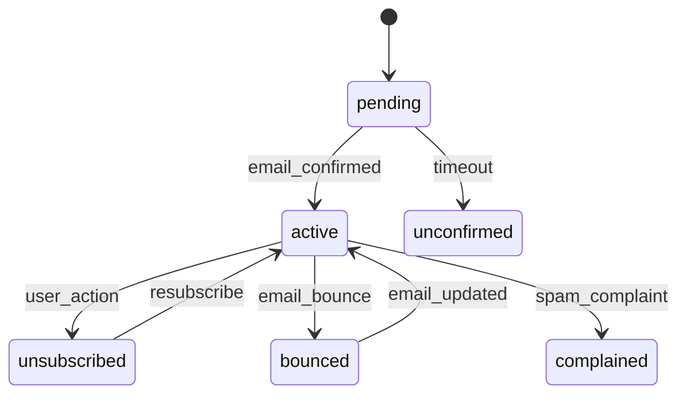
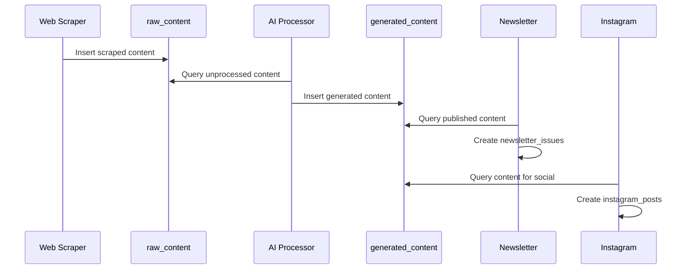
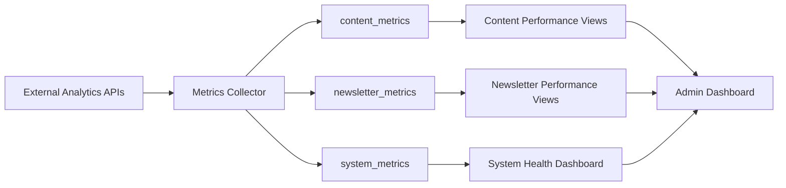

# AquaScene Content Engine - Database Schema Documentation

## Table of Contents
1. [Database Overview](#database-overview)
2. [Schema Design Principles](#schema-design-principles)
3. [Entity Relationship Diagrams](#entity-relationship-diagrams)
4. [Core Content Tables](#core-content-tables)
5. [Newsletter System Tables](#newsletter-system-tables)
6. [Subscriber Management Tables](#subscriber-management-tables)
7. [Social Media Integration Tables](#social-media-integration-tables)
8. [Web Scraping System Tables](#web-scraping-system-tables)
9. [Analytics and Metrics Tables](#analytics-and-metrics-tables)
10. [User Management Tables](#user-management-tables)
11. [Audit and Logging Tables](#audit-and-logging-tables)
12. [Indexes and Performance](#indexes-and-performance)
13. [Data Flow Patterns](#data-flow-patterns)

## Database Overview

The AquaScene Content Engine uses PostgreSQL 15 as its primary database, implementing a comprehensive schema that supports all aspects of content creation, management, and distribution.

### Database Configuration
```yaml
Database: PostgreSQL 15
Extensions:
  - uuid-ossp: UUID generation
  - pg_trgm: Text search optimization
  - pg_stat_statements: Query performance monitoring  
  - unaccent: Text search normalization
  
Connection Settings:
  Pool Size: 10-20 connections per service
  Max Overflow: 20 additional connections
  Pool Timeout: 30 seconds
  Connection Lifetime: 1 hour
  
Timezone: UTC
Character Set: UTF-8
```

### Database Structure Overview
```
Total Tables: 25
Total Indexes: 42
Total Functions: 4
Total Triggers: 15
Total Views: 3

Table Categories:
├── Core Content (5 tables)
├── Newsletter System (2 tables)
├── Subscriber Management (3 tables)
├── Social Media Integration (2 tables)
├── Web Scraping System (2 tables)
├── Analytics & Metrics (3 tables)
├── User Management (2 tables)
├── Audit & Logging (2 tables)
└── Supporting Tables (4 tables)
```

## Schema Design Principles

### 1. Normalized Design with Strategic Denormalization
- **3NF Compliance**: Core entities follow third normal form
- **Strategic Denormalization**: Performance-critical queries use calculated fields
- **JSONB Usage**: Semi-structured data stored in JSONB columns for flexibility

### 2. Scalability Patterns
- **UUID Primary Keys**: Distributed system compatibility
- **Partitioning Strategy**: Time-based partitioning for metrics and logs
- **Index Optimization**: Comprehensive indexing for common query patterns

### 3. Data Integrity and Consistency
- **Foreign Key Constraints**: Referential integrity enforcement
- **Check Constraints**: Data validation at database level
- **Triggers**: Automated timestamp updates and cascading operations

### 4. Performance Optimization
- **Connection Pooling**: Efficient connection management
- **Query Optimization**: Explain plan analysis for all queries
- **Materialized Views**: Pre-computed aggregations for analytics

## Entity Relationship Diagrams

### Core Content Domain


### Newsletter and Distribution Domain


### Subscriber Management Domain


## Core Content Tables

### raw_content
Primary storage for scraped and imported content from external sources.

```sql
CREATE TABLE raw_content (
    id UUID PRIMARY KEY DEFAULT gen_random_uuid(),
    source_url TEXT NOT NULL,
    source_domain VARCHAR(255) NOT NULL,
    content_type VARCHAR(50) NOT NULL,
    title TEXT,
    content TEXT,
    html_content TEXT,
    images JSONB DEFAULT '[]',
    metadata JSONB DEFAULT '{}',
    scraped_at TIMESTAMP DEFAULT NOW(),
    processed BOOLEAN DEFAULT FALSE,
    processing_status VARCHAR(20) DEFAULT 'pending',
    processing_error TEXT,
    content_hash VARCHAR(64),
    language VARCHAR(10) DEFAULT 'en',
    word_count INTEGER,
    created_at TIMESTAMP DEFAULT NOW(),
    updated_at TIMESTAMP DEFAULT NOW(),
    
    UNIQUE(content_hash)
);
```

**Key Features:**
- **Deduplication**: Content hash prevents duplicate content
- **Processing Pipeline**: Tracks processing status through the AI pipeline
- **Metadata Storage**: JSONB for flexible metadata storage
- **Language Detection**: Automatic language identification

**Indexes:**
```sql
CREATE INDEX CONCURRENTLY idx_raw_content_source_domain ON raw_content(source_domain);
CREATE INDEX CONCURRENTLY idx_raw_content_processed ON raw_content(processed, scraped_at);
CREATE INDEX CONCURRENTLY idx_raw_content_content_type ON raw_content(content_type);
CREATE INDEX CONCURRENTLY idx_raw_content_hash ON raw_content(content_hash);
```

### generated_content
Storage for AI-generated content with quality metrics and publishing workflow.

```sql
CREATE TABLE generated_content (
    id UUID PRIMARY KEY DEFAULT gen_random_uuid(),
    content_type VARCHAR(50) NOT NULL,
    title TEXT NOT NULL,
    content TEXT NOT NULL,
    summary TEXT,
    excerpt TEXT,
    template_used VARCHAR(100),
    source_materials JSONB DEFAULT '[]',
    quality_score DECIMAL(3,2),
    readability_score INTEGER,
    seo_score DECIMAL(3,2),
    engagement_prediction DECIMAL(3,2),
    status VARCHAR(20) DEFAULT 'draft',
    tags TEXT[],
    categories TEXT[],
    target_audience VARCHAR(50),
    tone VARCHAR(30),
    word_count INTEGER,
    estimated_reading_time INTEGER,
    scheduled_for TIMESTAMP,
    published_at TIMESTAMP NULL,
    created_at TIMESTAMP DEFAULT NOW(),
    updated_at TIMESTAMP DEFAULT NOW(),
    created_by UUID,
    approved_by UUID,
    approved_at TIMESTAMP
);
```

**Key Features:**
- **Quality Metrics**: AI-generated quality scores for content validation
- **Publishing Workflow**: Status tracking from draft to published
- **SEO Optimization**: Built-in SEO scoring and optimization
- **Flexible Taxonomy**: Array-based tags and categories

**Status Flow:**
```
draft → review → approved → scheduled → published
   ↓                ↓           ↓
rejected        needs_revision  cancelled
```

## Newsletter System Tables

### newsletter_issues
Campaign management for email newsletter distribution.

```sql
CREATE TABLE newsletter_issues (
    id UUID PRIMARY KEY DEFAULT gen_random_uuid(),
    issue_number INTEGER,
    template_type VARCHAR(50) NOT NULL,
    subject_line TEXT NOT NULL,
    preview_text TEXT,
    content_ids UUID[] NOT NULL,
    personalization_data JSONB DEFAULT '{}',
    design_template VARCHAR(100),
    scheduled_for TIMESTAMP,
    sent_at TIMESTAMP NULL,
    status VARCHAR(20) DEFAULT 'draft',
    recipient_count INTEGER DEFAULT 0,
    metrics JSONB DEFAULT '{}',
    created_at TIMESTAMP DEFAULT NOW(),
    updated_at TIMESTAMP DEFAULT NOW(),
    created_by UUID
);
```

**Newsletter Lifecycle:**


### newsletter_templates
Reusable email templates with variable support.

```sql
CREATE TABLE newsletter_templates (
    id SERIAL PRIMARY KEY,
    name VARCHAR(100) NOT NULL UNIQUE,
    description TEXT,
    template_type VARCHAR(50) NOT NULL,
    html_template TEXT NOT NULL,
    text_template TEXT,
    default_subject VARCHAR(255),
    variables JSONB DEFAULT '[]',
    is_active BOOLEAN DEFAULT TRUE,
    created_at TIMESTAMP DEFAULT NOW(),
    updated_at TIMESTAMP DEFAULT NOW()
);
```

**Template Types:**
- `weekly-digest`: Weekly content roundup
- `announcement`: Product/service announcements
- `how-to-guide`: Educational step-by-step content
- `community-showcase`: User-generated content highlights

## Subscriber Management Tables

### subscribers
Core subscriber information with privacy-compliant design.

```sql
CREATE TABLE subscribers (
    id UUID PRIMARY KEY DEFAULT gen_random_uuid(),
    email VARCHAR(255) NOT NULL UNIQUE,
    first_name VARCHAR(100),
    last_name VARCHAR(100),
    full_name VARCHAR(200),
    phone VARCHAR(50),
    country VARCHAR(100),
    timezone VARCHAR(50) DEFAULT 'UTC',
    language VARCHAR(10) DEFAULT 'en',
    source VARCHAR(50),
    status VARCHAR(20) DEFAULT 'active',
    subscription_date TIMESTAMP DEFAULT NOW(),
    confirmed_at TIMESTAMP,
    unsubscribed_at TIMESTAMP,
    bounce_count INTEGER DEFAULT 0,
    complaint_count INTEGER DEFAULT 0,
    last_activity_at TIMESTAMP DEFAULT NOW(),
    preferences JSONB DEFAULT '{}',
    custom_fields JSONB DEFAULT '{}',
    tags TEXT[],
    created_at TIMESTAMP DEFAULT NOW(),
    updated_at TIMESTAMP DEFAULT NOW()
);
```

**Subscriber Status Flow:**


### subscriber_segments
Dynamic and static subscriber segmentation for targeted campaigns.

```sql
CREATE TABLE subscriber_segments (
    id SERIAL PRIMARY KEY,
    name VARCHAR(100) NOT NULL UNIQUE,
    description TEXT,
    segment_type VARCHAR(30) DEFAULT 'manual',
    filter_criteria JSONB DEFAULT '{}',
    subscriber_count INTEGER DEFAULT 0,
    is_active BOOLEAN DEFAULT TRUE,
    created_at TIMESTAMP DEFAULT NOW(),
    updated_at TIMESTAMP DEFAULT NOW()
);
```

**Segment Types:**
- `manual`: Manually managed segments
- `automatic`: Rule-based dynamic segments
- `behavioral`: Based on user interactions
- `demographic`: Based on user attributes

### Example Filter Criteria
```json
{
  "engagement_level": "high",
  "subscription_age_days": "> 30",
  "content_preferences": ["plant-care", "equipment-reviews"],
  "location": {"country": "US", "timezone": "EST"},
  "activity": {
    "last_open_days": "< 7",
    "total_clicks": "> 10"
  }
}
```

## Social Media Integration Tables

### instagram_posts
Instagram content scheduling and analytics tracking.

```sql
CREATE TABLE instagram_posts (
    id UUID PRIMARY KEY DEFAULT gen_random_uuid(),
    content_id UUID REFERENCES generated_content(id),
    post_type VARCHAR(20) DEFAULT 'feed',
    caption TEXT,
    hashtags TEXT[],
    media_urls TEXT[],
    instagram_media_ids TEXT[],
    scheduled_for TIMESTAMP,
    posted_at TIMESTAMP,
    instagram_post_id VARCHAR(100),
    status VARCHAR(20) DEFAULT 'scheduled',
    metrics JSONB DEFAULT '{}',
    engagement_data JSONB DEFAULT '{}',
    created_at TIMESTAMP DEFAULT NOW(),
    updated_at TIMESTAMP DEFAULT NOW()
);
```

**Instagram Post Types:**
- `feed`: Regular Instagram feed posts
- `story`: Instagram Stories (24-hour content)
- `reel`: Short-form video content
- `igtv`: Long-form video content

**Metrics Structure:**
```json
{
  "impressions": 1250,
  "reach": 980,
  "likes": 45,
  "comments": 12,
  "shares": 8,
  "saves": 23,
  "engagement_rate": 0.071,
  "last_updated": "2024-01-15T10:30:00Z"
}
```

## Web Scraping System Tables

### scraper_targets
Configuration for web scraping sources and rules.

```sql
CREATE TABLE scraper_targets (
    id SERIAL PRIMARY KEY,
    name VARCHAR(100) NOT NULL UNIQUE,
    base_url VARCHAR(500) NOT NULL,
    domains TEXT[] NOT NULL,
    categories TEXT[],
    scraping_rules JSONB NOT NULL,
    rate_limit_delay INTEGER DEFAULT 2,
    max_pages INTEGER DEFAULT 100,
    is_active BOOLEAN DEFAULT TRUE,
    last_scraped_at TIMESTAMP,
    next_scrape_at TIMESTAMP,
    scrape_frequency INTERVAL DEFAULT '1 day',
    success_count INTEGER DEFAULT 0,
    error_count INTEGER DEFAULT 0,
    created_at TIMESTAMP DEFAULT NOW(),
    updated_at TIMESTAMP DEFAULT NOW()
);
```

**Scraping Rules Structure:**
```json
{
  "selectors": {
    "title": "h1.article-title",
    "content": ".article-content",
    "author": ".author-name",
    "date": ".publish-date",
    "images": "img.content-image"
  },
  "filters": {
    "min_word_count": 200,
    "exclude_patterns": ["advertisement", "sponsored"]
  },
  "extraction": {
    "follow_links": true,
    "max_depth": 3,
    "respect_robots_txt": true
  },
  "rate_limiting": {
    "requests_per_second": 0.5,
    "concurrent_requests": 1
  }
}
```

### scraping_jobs
Job execution tracking and error management.

```sql
CREATE TABLE scraping_jobs (
    id UUID PRIMARY KEY DEFAULT gen_random_uuid(),
    target_id INTEGER REFERENCES scraper_targets(id),
    job_type VARCHAR(30) DEFAULT 'scheduled',
    status VARCHAR(20) DEFAULT 'pending',
    started_at TIMESTAMP,
    completed_at TIMESTAMP,
    pages_scraped INTEGER DEFAULT 0,
    content_found INTEGER DEFAULT 0,
    errors_count INTEGER DEFAULT 0,
    error_details JSONB DEFAULT '[]',
    configuration JSONB DEFAULT '{}',
    created_at TIMESTAMP DEFAULT NOW(),
    updated_at TIMESTAMP DEFAULT NOW()
);
```

## Analytics and Metrics Tables

### content_metrics
Performance tracking for generated content.

```sql
CREATE TABLE content_metrics (
    id UUID PRIMARY KEY DEFAULT gen_random_uuid(),
    content_id UUID REFERENCES generated_content(id) ON DELETE CASCADE,
    metric_type VARCHAR(50) NOT NULL,
    metric_name VARCHAR(100) NOT NULL,
    metric_value DECIMAL(15,4),
    metric_data JSONB DEFAULT '{}',
    recorded_at TIMESTAMP DEFAULT NOW(),
    date_bucket DATE DEFAULT CURRENT_DATE,
    
    UNIQUE(content_id, metric_type, metric_name, date_bucket)
);
```

**Metric Types and Names:**
```yaml
engagement:
  - page_views
  - social_shares  
  - link_clicks
  - time_on_page
  - bounce_rate

seo:
  - search_impressions
  - search_clicks
  - average_position
  - ctr

email:
  - opens
  - clicks
  - forwards
  - unsubscribes

social:
  - likes
  - comments
  - shares
  - saves
  - reach
  - impressions
```

### newsletter_metrics
Email campaign performance tracking.

```sql
CREATE TABLE newsletter_metrics (
    id UUID PRIMARY KEY DEFAULT gen_random_uuid(),
    issue_id UUID REFERENCES newsletter_issues(id) ON DELETE CASCADE,
    metric_type VARCHAR(50) NOT NULL,
    sent_count INTEGER DEFAULT 0,
    delivered_count INTEGER DEFAULT 0,
    open_count INTEGER DEFAULT 0,
    click_count INTEGER DEFAULT 0,
    unsubscribe_count INTEGER DEFAULT 0,
    bounce_count INTEGER DEFAULT 0,
    complaint_count INTEGER DEFAULT 0,
    unique_opens INTEGER DEFAULT 0,
    unique_clicks INTEGER DEFAULT 0,
    open_rate DECIMAL(5,4),
    click_rate DECIMAL(5,4),
    unsubscribe_rate DECIMAL(5,4),
    bounce_rate DECIMAL(5,4),
    recorded_at TIMESTAMP DEFAULT NOW()
);
```

**Calculated Rates:**
```sql
-- Open Rate Calculation
open_rate = unique_opens::decimal / delivered_count

-- Click-Through Rate
click_rate = unique_clicks::decimal / delivered_count

-- Unsubscribe Rate
unsubscribe_rate = unsubscribe_count::decimal / delivered_count

-- Bounce Rate  
bounce_rate = bounce_count::decimal / sent_count
```

## Indexes and Performance

### Primary Indexes
```sql
-- Content search and filtering
CREATE INDEX CONCURRENTLY idx_generated_content_status ON generated_content(status);
CREATE INDEX CONCURRENTLY idx_generated_content_type_status ON generated_content(content_type, status);
CREATE INDEX CONCURRENTLY idx_generated_content_published ON generated_content(published_at DESC) WHERE published_at IS NOT NULL;
CREATE INDEX CONCURRENTLY idx_generated_content_tags ON generated_content USING GIN(tags);

-- Full-text search
CREATE INDEX CONCURRENTLY idx_generated_content_search ON generated_content USING gin(to_tsvector('english', title || ' ' || content));

-- Subscriber operations
CREATE INDEX CONCURRENTLY idx_subscribers_email ON subscribers(email);
CREATE INDEX CONCURRENTLY idx_subscribers_status ON subscribers(status);
CREATE INDEX CONCURRENTLY idx_subscribers_tags ON subscribers USING GIN(tags);

-- Analytics queries
CREATE INDEX CONCURRENTLY idx_content_metrics_content_date ON content_metrics(content_id, date_bucket);
CREATE INDEX CONCURRENTLY idx_content_metrics_type_date ON content_metrics(metric_type, date_bucket);

-- Scraping operations
CREATE INDEX CONCURRENTLY idx_raw_content_processed_scraped ON raw_content(processed, scraped_at);
CREATE INDEX CONCURRENTLY idx_scraping_jobs_status_target ON scraping_jobs(status, target_id);
```

### Composite Indexes for Complex Queries
```sql
-- Content discovery
CREATE INDEX CONCURRENTLY idx_content_quality_published ON generated_content(quality_score DESC, published_at DESC) 
WHERE status = 'published' AND quality_score >= 0.7;

-- Subscriber segmentation
CREATE INDEX CONCURRENTLY idx_subscribers_active_location ON subscribers(status, country, timezone) 
WHERE status = 'active';

-- Newsletter analytics
CREATE INDEX CONCURRENTLY idx_newsletter_performance ON newsletter_metrics(issue_id, open_rate DESC, click_rate DESC);
```

### Partitioning Strategy

#### Time-Based Partitioning for Metrics
```sql
-- Create partitioned table for content metrics
CREATE TABLE content_metrics_partitioned (
    LIKE content_metrics INCLUDING ALL
) PARTITION BY RANGE (date_bucket);

-- Create monthly partitions
CREATE TABLE content_metrics_2024_01 PARTITION OF content_metrics_partitioned
    FOR VALUES FROM ('2024-01-01') TO ('2024-02-01');

CREATE TABLE content_metrics_2024_02 PARTITION OF content_metrics_partitioned
    FOR VALUES FROM ('2024-02-01') TO ('2024-03-01');

-- Automated partition management
CREATE OR REPLACE FUNCTION create_monthly_partition(table_name text, start_date date)
RETURNS void AS $$
DECLARE
    partition_name text;
    end_date date;
BEGIN
    partition_name := table_name || '_' || to_char(start_date, 'YYYY_MM');
    end_date := start_date + interval '1 month';
    
    EXECUTE format('CREATE TABLE %I PARTITION OF %I FOR VALUES FROM (%L) TO (%L)',
                   partition_name, table_name, start_date, end_date);
END;
$$ LANGUAGE plpgsql;
```

## Data Flow Patterns

### Content Creation Flow


### Analytics Data Flow


### Subscriber Lifecycle Flow
```sql
-- Subscriber journey tracking
WITH subscriber_journey AS (
  SELECT 
    s.id,
    s.email,
    s.subscription_date,
    s.confirmed_at,
    s.status,
    sp.newsletter_frequency,
    COUNT(nm.open_count) as newsletters_opened,
    COUNT(cm.metric_value) as content_interactions
  FROM subscribers s
  LEFT JOIN subscription_preferences sp ON s.id = sp.subscriber_id
  LEFT JOIN newsletter_metrics nm ON nm.issue_id IN (
    SELECT ni.id FROM newsletter_issues ni 
    WHERE s.id = ANY(ni.recipient_ids)
  )
  LEFT JOIN content_metrics cm ON cm.metric_name = 'user_interaction' 
    AND cm.metric_data->>'subscriber_id' = s.id::text
  WHERE s.status = 'active'
  GROUP BY s.id, s.email, s.subscription_date, s.confirmed_at, s.status, sp.newsletter_frequency
)
SELECT * FROM subscriber_journey
ORDER BY newsletters_opened DESC, content_interactions DESC;
```

## Database Maintenance and Operations

### Automated Maintenance
```sql
-- Update statistics
CREATE OR REPLACE FUNCTION update_table_statistics()
RETURNS void AS $$
BEGIN
    ANALYZE subscribers;
    ANALYZE generated_content;
    ANALYZE content_metrics;
    ANALYZE newsletter_metrics;
    
    -- Update segment subscriber counts
    UPDATE subscriber_segments SET subscriber_count = (
        SELECT COUNT(*) FROM subscriber_segment_memberships 
        WHERE segment_id = subscriber_segments.id
    );
END;
$$ LANGUAGE plpgsql;

-- Schedule via pg_cron (if available) or external scheduler
-- SELECT cron.schedule('update-stats', '0 2 * * *', 'SELECT update_table_statistics();');
```

### Data Retention Policies
```sql
-- Archive old metrics data
CREATE OR REPLACE FUNCTION archive_old_metrics()
RETURNS void AS $$
BEGIN
    -- Archive content metrics older than 2 years
    DELETE FROM content_metrics 
    WHERE date_bucket < CURRENT_DATE - INTERVAL '2 years';
    
    -- Archive newsletter metrics older than 1 year  
    DELETE FROM newsletter_metrics
    WHERE recorded_at < CURRENT_DATE - INTERVAL '1 year';
    
    -- Archive audit logs older than 6 months
    DELETE FROM audit_log
    WHERE changed_at < CURRENT_DATE - INTERVAL '6 months';
END;
$$ LANGUAGE plpgsql;
```

### Backup and Recovery Strategy
```yaml
Backup Strategy:
  Full Backup: Daily at 2 AM UTC
  Incremental Backup: Every 4 hours
  WAL Archiving: Continuous
  Retention: 30 days full, 7 days incremental
  
Recovery Objectives:
  RTO (Recovery Time): 1 hour maximum
  RPO (Recovery Point): 5 minutes maximum
  
Backup Locations:
  Primary: Local filesystem
  Secondary: AWS S3 / MinIO
  Tertiary: Off-site cold storage
```

This comprehensive database schema documentation provides the foundation for understanding data organization, relationships, and optimization strategies within the AquaScene Content Engine.