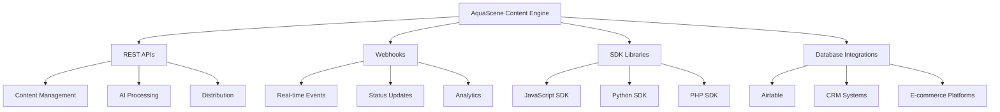

# AquaScene Content Engine - Integration Patterns & Best Practices

**Version:** 1.0  
**Last Updated:** August 6, 2025  
**Document Type:** Enterprise Integration Guide  
**Status:** Production Ready

## Table of Contents

1. [Integration Overview](#integration-overview)
2. [Airtable Integration Patterns](#airtable-integration-patterns)
3. [External Service Integrations](#external-service-integrations)
4. [Webhook and Event-Driven Architecture](#webhook-and-event-driven-architecture)
5. [SDK and Client Libraries](#sdk-and-client-libraries)
6. [Partnership Integration Patterns](#partnership-integration-patterns)
7. [Enterprise Integration Architecture](#enterprise-integration-architecture)
8. [Security and Compliance](#security-and-compliance)

## Integration Overview

### System Integration Architecture

The AquaScene Content Engine provides comprehensive integration capabilities through multiple patterns and protocols, enabling seamless connection with existing business systems, partner platforms, and third-party services.



### Integration Capabilities Matrix

| Integration Type | Complexity | Timeline | Business Value |
|------------------|------------|----------|----------------|
| **REST API** | Low | 1-2 days | High |
| **Webhook Events** | Low | 2-3 days | High |
| **SDK Integration** | Medium | 3-5 days | Very High |
| **Database Sync** | Medium | 5-7 days | High |
| **Airtable Integration** | Low | 1-3 days | Very High |
| **CRM Integration** | High | 10-15 days | Very High |
| **E-commerce Integration** | High | 15-20 days | Extremely High |

## Airtable Integration Patterns

### Overview

Airtable serves as the central metadata and configuration management system for the AquaScene Content Engine, providing flexible data structure and easy content team management.

### 1. Content Metadata Management

#### Schema Structure
```json
{
  "Content_Master": {
    "fields": [
      "Content_ID",
      "Title", 
      "Content_Type",
      "Status",
      "Quality_Score",
      "SEO_Keywords",
      "Target_Audience",
      "Generated_Date",
      "Published_Date",
      "Performance_Metrics"
    ]
  },
  "Content_Templates": {
    "fields": [
      "Template_ID",
      "Template_Name",
      "Content_Type", 
      "Structure",
      "Brand_Guidelines",
      "Optimization_Settings"
    ]
  },
  "Publishing_Calendar": {
    "fields": [
      "Schedule_ID",
      "Content_ID",
      "Publish_Date",
      "Channels",
      "Status",
      "Performance_Tracking"
    ]
  }
}
```

#### Integration Pattern: Bidirectional Sync

```python
# Airtable Integration Example
class AirtableIntegration:
    def __init__(self, api_key: str, base_id: str):
        self.client = pyairtable.Api(api_key)
        self.base = self.client.base(base_id)
    
    async def sync_content_metadata(self, content_data: dict):
        """Sync content metadata to Airtable"""
        table = self.base.table("Content_Master")
        
        record = {
            "Content_ID": content_data["id"],
            "Title": content_data["title"],
            "Content_Type": content_data["type"],
            "Status": "Generated",
            "Quality_Score": content_data["quality_score"],
            "SEO_Keywords": content_data["seo_keywords"],
            "Generated_Date": datetime.now().isoformat()
        }
        
        # Create or update record
        existing = table.all(formula=f"{{Content_ID}}='{content_data['id']}'")
        if existing:
            table.update(existing[0]['id'], record)
        else:
            table.create(record)
    
    async def get_publishing_schedule(self) -> List[dict]:
        """Retrieve publishing schedule from Airtable"""
        table = self.base.table("Publishing_Calendar")
        records = table.all(
            formula="AND({Status}='Scheduled', {Publish_Date}>=TODAY())"
        )
        
        return [
            {
                "content_id": record["fields"]["Content_ID"],
                "publish_date": record["fields"]["Publish_Date"],
                "channels": record["fields"]["Channels"]
            }
            for record in records
        ]
    
    async def update_performance_metrics(self, content_id: str, metrics: dict):
        """Update content performance metrics"""
        table = self.base.table("Content_Master")
        records = table.all(formula=f"{{Content_ID}}='{content_id}'")
        
        if records:
            table.update(records[0]['id'], {
                "Performance_Metrics": json.dumps(metrics),
                "Last_Updated": datetime.now().isoformat()
            })
```

#### Usage Scenarios

1. **Content Planning**: Editorial teams use Airtable views to plan content calendars
2. **Performance Tracking**: Automated updates of content performance metrics
3. **Quality Management**: Track quality scores and optimization results
4. **Template Management**: Configure and manage content templates
5. **Workflow Automation**: Trigger content generation based on calendar events

### 2. Template Configuration Management

#### Template Structure in Airtable
```json
{
  "Newsletter_Article_Template": {
    "structure": [
      "Engaging_Introduction",
      "Main_Content_Sections",
      "Practical_Tips",
      "Product_Recommendations",
      "Call_To_Action"
    ],
    "brand_guidelines": {
      "tone": "Friendly and educational",
      "expertise_level": "Intermediate",
      "word_count_range": "1200-1500",
      "include_safety_tips": true
    },
    "seo_settings": {
      "keyword_density": "2-3%",
      "headings_required": true,
      "meta_description": true
    }
  }
}
```

#### Dynamic Template Loading
```python
async def load_template_from_airtable(template_id: str) -> dict:
    """Load template configuration from Airtable"""
    table = airtable_base.table("Content_Templates")
    record = table.get(template_id)
    
    return {
        "structure": json.loads(record["fields"]["Structure"]),
        "brand_guidelines": json.loads(record["fields"]["Brand_Guidelines"]),
        "optimization_settings": json.loads(record["fields"]["Optimization_Settings"])
    }
```

### 3. Automated Workflow Triggers

#### Webhook Integration Pattern
```python
@app.webhook("/airtable/content-scheduled")
async def handle_content_scheduled(webhook_data: dict):
    """Handle Airtable webhook for scheduled content"""
    
    content_request = {
        "content_type": webhook_data["fields"]["Content_Type"],
        "topic": webhook_data["fields"]["Topic"],
        "target_audience": webhook_data["fields"]["Target_Audience"],
        "publish_date": webhook_data["fields"]["Publish_Date"],
        "template_id": webhook_data["fields"]["Template_ID"]
    }
    
    # Generate content
    result = await ai_processor.generate_content(content_request)
    
    # Update Airtable with results
    await airtable.update_record(
        webhook_data["id"],
        {
            "Status": "Generated",
            "Content_ID": result["content_id"],
            "Quality_Score": result["quality_score"]
        }
    )
    
    return {"status": "success"}
```

## External Service Integrations

### 1. Email Marketing Platforms

#### SendGrid Integration
```python
class EmailDistributionIntegration:
    def __init__(self, sendgrid_api_key: str):
        self.sg = sendgrid.SendGridAPIClient(api_key=sendgrid_api_key)
    
    async def send_newsletter(self, content: dict, recipients: List[str]):
        """Send newsletter via SendGrid"""
        
        message = Mail(
            from_email='newsletter@aquascene.bg',
            to_emails=recipients,
            subject=content['subject'],
            html_content=content['html_content']
        )
        
        # Add custom headers for tracking
        message.custom_args = {
            'content_id': content['id'],
            'campaign_type': 'newsletter',
            'generated_by': 'ai_processor'
        }
        
        try:
            response = self.sg.send(message)
            await self.track_email_metrics(content['id'], response)
            return response
        except Exception as e:
            await self.handle_email_error(content['id'], str(e))
            raise
    
    async def track_email_metrics(self, content_id: str, response):
        """Track email delivery metrics"""
        # Update analytics database
        await analytics_db.update_email_metrics(
            content_id=content_id,
            sent_at=datetime.now(),
            sendgrid_message_id=response.headers.get('X-Message-Id')
        )
```

#### Mailchimp Integration
```python
class MailchimpIntegration:
    def __init__(self, api_key: str, server_prefix: str):
        self.client = MailchimpMarketing.Client({
            "api_key": api_key,
            "server": server_prefix
        })
    
    async def create_campaign_from_content(self, content: dict, list_id: str):
        """Create Mailchimp campaign from generated content"""
        
        campaign = {
            "type": "regular",
            "recipients": {"list_id": list_id},
            "settings": {
                "subject_line": content['subject'],
                "title": f"AquaScene Newsletter - {content['title']}",
                "from_name": "AquaScene Team",
                "reply_to": "hello@aquascene.bg",
                "to_name": "*|FNAME|*"
            }
        }
        
        # Create campaign
        response = self.client.campaigns.create(campaign)
        campaign_id = response["id"]
        
        # Set content
        self.client.campaigns.set_content(campaign_id, {
            "html": content['html_content']
        })
        
        return campaign_id
```

### 2. Social Media Platform Integration

#### Instagram Business API Integration
```python
class InstagramIntegration:
    def __init__(self, access_token: str, business_account_id: str):
        self.access_token = access_token
        self.business_account_id = business_account_id
        self.graph_url = "https://graph.facebook.com/v17.0"
    
    async def create_media_post(self, content: dict, image_url: str):
        """Create Instagram media post"""
        
        # Step 1: Create media container
        container_response = await self._create_media_container(
            image_url, content['caption'], content['hashtags']
        )
        
        # Step 2: Publish media container
        if container_response.get('id'):
            publish_response = await self._publish_media(container_response['id'])
            
            # Track post performance
            await self.track_post_metrics(
                content['content_id'], 
                publish_response.get('id')
            )
            
            return publish_response
    
    async def _create_media_container(self, image_url: str, caption: str, hashtags: List[str]):
        """Create media container for Instagram post"""
        full_caption = f"{caption}\n\n{' '.join(['#' + tag for tag in hashtags])}"
        
        params = {
            'image_url': image_url,
            'caption': full_caption,
            'access_token': self.access_token
        }
        
        async with httpx.AsyncClient() as client:
            response = await client.post(
                f"{self.graph_url}/{self.business_account_id}/media",
                params=params
            )
            return response.json()
    
    async def get_post_insights(self, post_id: str):
        """Get Instagram post performance insights"""
        metrics = ['impressions', 'engagement', 'reach', 'saved']
        
        params = {
            'metric': ','.join(metrics),
            'access_token': self.access_token
        }
        
        async with httpx.AsyncClient() as client:
            response = await client.get(
                f"{self.graph_url}/{post_id}/insights",
                params=params
            )
            return response.json()
```

### 3. Analytics and Monitoring Integration

#### Google Analytics 4 Integration
```python
class GoogleAnalyticsIntegration:
    def __init__(self, property_id: str, credentials_path: str):
        self.property_id = property_id
        self.client = BetaAnalyticsDataClient.from_service_account_file(
            credentials_path
        )
    
    async def track_content_performance(self, content_id: str, url: str):
        """Track content performance in GA4"""
        
        request = RunReportRequest(
            property=f"properties/{self.property_id}",
            date_ranges=[DateRange(start_date="7daysAgo", end_date="today")],
            dimensions=[
                Dimension(name="pagePath"),
                Dimension(name="sessionSource")
            ],
            metrics=[
                Metric(name="screenPageViews"),
                Metric(name="averageSessionDuration"),
                Metric(name="bounceRate")
            ],
            dimension_filter=FilterExpression(
                filter=Filter(
                    field_name="pagePath",
                    string_filter=Filter.StringFilter(
                        match_type=Filter.StringFilter.MatchType.EXACT,
                        value=url
                    )
                )
            )
        )
        
        response = self.client.run_report(request)
        return self._parse_analytics_response(response, content_id)
    
    def _parse_analytics_response(self, response, content_id: str) -> dict:
        """Parse GA4 response into content metrics"""
        metrics = {
            "content_id": content_id,
            "page_views": 0,
            "avg_session_duration": 0,
            "bounce_rate": 0,
            "traffic_sources": {}
        }
        
        for row in response.rows:
            page_views = int(row.metric_values[0].value)
            session_duration = float(row.metric_values[1].value)
            bounce_rate = float(row.metric_values[2].value)
            source = row.dimension_values[1].value
            
            metrics["page_views"] += page_views
            metrics["avg_session_duration"] = session_duration
            metrics["bounce_rate"] = bounce_rate
            metrics["traffic_sources"][source] = page_views
        
        return metrics
```

## Webhook and Event-Driven Architecture

### Webhook Configuration and Management

#### Webhook Registration API
```python
@app.post("/api/v1/webhooks")
async def register_webhook(webhook_config: WebhookConfig):
    """Register a new webhook endpoint"""
    
    webhook = await webhook_service.create_webhook(
        url=webhook_config.url,
        events=webhook_config.events,
        secret=webhook_config.secret,
        headers=webhook_config.headers
    )
    
    return {"webhook_id": webhook.id, "status": "registered"}

@app.put("/api/v1/webhooks/{webhook_id}")
async def update_webhook(webhook_id: str, config: WebhookConfig):
    """Update existing webhook configuration"""
    
    await webhook_service.update_webhook(webhook_id, config)
    return {"status": "updated"}

@app.delete("/api/v1/webhooks/{webhook_id}")
async def delete_webhook(webhook_id: str):
    """Delete webhook endpoint"""
    
    await webhook_service.delete_webhook(webhook_id)
    return {"status": "deleted"}
```

#### Event Types and Payloads

##### Content Generation Events
```python
# content.generation.started
{
    "event": "content.generation.started",
    "timestamp": "2025-08-06T12:00:00Z",
    "data": {
        "content_id": "gen-550e8400-e29b-41d4-a716-446655440000",
        "request_id": "req-123456",
        "content_type": "newsletter_article",
        "topic": "Beginner aquascaping guide",
        "llm_provider": "openai",
        "estimated_completion": "2025-08-06T12:02:30Z"
    }
}

# content.generation.completed
{
    "event": "content.generation.completed",
    "timestamp": "2025-08-06T12:02:15Z",
    "data": {
        "content_id": "gen-550e8400-e29b-41d4-a716-446655440000",
        "request_id": "req-123456",
        "status": "success",
        "quality_score": 8.7,
        "word_count": 1450,
        "generation_time_seconds": 12.5,
        "cost_usd": 0.05,
        "validation_results": {
            "fact_check_passed": true,
            "brand_consistency_score": 9.0,
            "readability_score": 8.2
        }
    }
}

# content.generation.failed
{
    "event": "content.generation.failed",
    "timestamp": "2025-08-06T12:02:15Z",
    "data": {
        "content_id": "gen-550e8400-e29b-41d4-a716-446655440000",
        "request_id": "req-123456",
        "error_type": "validation_failed",
        "error_message": "Content failed fact validation",
        "retry_possible": true,
        "retry_count": 1
    }
}
```

##### Distribution Events
```python
# newsletter.sent
{
    "event": "newsletter.sent",
    "timestamp": "2025-08-06T12:00:00Z",
    "data": {
        "campaign_id": "camp-550e8400-e29b-41d4-a716-446655440000",
        "content_id": "550e8400-e29b-41d4-a716-446655440000",
        "subject": "This Week in Aquascaping",
        "recipients_count": 1250,
        "segments": ["beginners", "intermediate"],
        "provider": "sendgrid",
        "scheduled_time": "2025-08-06T12:00:00Z"
    }
}

# social.posted
{
    "event": "social.posted",
    "timestamp": "2025-08-06T15:00:00Z",
    "data": {
        "post_id": "ig-550e8400-e29b-41d4-a716-446655440000",
        "content_id": "550e8400-e29b-41d4-a716-446655440000",
        "platform": "instagram",
        "post_type": "photo",
        "engagement_metrics": {
            "initial_likes": 0,
            "initial_comments": 0,
            "initial_shares": 0
        }
    }
}
```

#### Webhook Security Implementation

```python
import hmac
import hashlib
from fastapi import HTTPException, Header

def verify_webhook_signature(
    payload: bytes, 
    signature: str, 
    secret: str
) -> bool:
    """Verify webhook HMAC signature"""
    expected_signature = hmac.new(
        secret.encode('utf-8'),
        payload,
        hashlib.sha256
    ).hexdigest()
    
    return hmac.compare_digest(
        signature, 
        f"sha256={expected_signature}"
    )

@app.post("/webhooks/content-updates")
async def handle_webhook(
    request: Request,
    x_signature: str = Header(..., alias="X-Signature-256")
):
    """Handle incoming webhook with signature verification"""
    
    body = await request.body()
    
    if not verify_webhook_signature(body, x_signature, WEBHOOK_SECRET):
        raise HTTPException(status_code=401, detail="Invalid signature")
    
    payload = await request.json()
    await process_webhook_event(payload)
    
    return {"status": "processed"}
```

## SDK and Client Libraries

### JavaScript/Node.js SDK

#### Installation and Setup
```bash
npm install @aquascene/content-engine-sdk
```

```javascript
const AquaSceneSDK = require('@aquascene/content-engine-sdk');

const client = new AquaSceneSDK({
    baseUrl: 'https://api.aquascene.bg',
    apiKey: process.env.AQUASCENE_API_KEY,
    timeout: 30000
});
```

#### Content Generation
```javascript
// Generate single content piece
const content = await client.content.generate({
    contentType: 'newsletter_article',
    topic: 'Setting up your first planted aquarium',
    targetAudience: 'beginners',
    seoKeywords: ['planted aquarium', 'aquascaping', 'beginner guide'],
    optimizationStrategy: 'seo_focused'
});

console.log(`Generated content: ${content.data.content}`);

// Batch content generation
const batchJob = await client.content.generateBatch({
    name: 'Weekly Content Calendar',
    requests: [
        {
            contentType: 'newsletter_article',
            topic: 'Top 5 beginner aquatic plants'
        },
        {
            contentType: 'instagram_caption',
            topic: 'Beautiful nature aquarium showcase'
        }
    ]
});

// Monitor batch progress
const status = await client.content.getBatchStatus(batchJob.data.batchId);
console.log(`Batch progress: ${status.data.progress.completed}/${status.data.progress.total}`);
```

#### Subscriber Management
```javascript
// Create subscriber
const subscriber = await client.subscribers.create({
    email: 'user@example.com',
    name: 'John Doe',
    preferences: {
        contentTypes: ['newsletter', 'tips'],
        frequency: 'weekly',
        topics: ['planted-tanks', 'aquascaping']
    }
});

// Update preferences
await client.subscribers.updatePreferences(subscriber.data.id, {
    frequency: 'bi_weekly',
    topics: ['planted-tanks', 'aquascaping', 'equipment']
});

// Get subscriber analytics
const analytics = await client.subscribers.getAnalytics(subscriber.data.id);
console.log(`Engagement rate: ${analytics.data.engagementRate}`);
```

### Python SDK

#### Installation and Setup
```bash
pip install aquascene-content-engine
```

```python
from aquascene import AquaSceneClient

client = AquaSceneClient(
    api_key=os.getenv('AQUASCENE_API_KEY'),
    base_url='https://api.aquascene.bg'
)
```

#### Advanced Usage Patterns
```python
import asyncio
from aquascene import AquaSceneClient
from aquascene.exceptions import ContentGenerationError

class ContentPipeline:
    def __init__(self, api_key: str):
        self.client = AquaSceneClient(api_key=api_key)
    
    async def generate_weekly_content(self, topics: List[str]) -> List[dict]:
        """Generate weekly content pipeline"""
        
        batch_requests = []
        for topic in topics:
            batch_requests.extend([
                {
                    'content_type': 'newsletter_article',
                    'topic': topic,
                    'target_audience': 'intermediate'
                },
                {
                    'content_type': 'instagram_caption',
                    'topic': f"Showcasing {topic}",
                    'optimization_strategy': 'social_focused'
                }
            ])
        
        try:
            # Generate batch content
            batch_job = await self.client.content.generate_batch({
                'name': 'Weekly Content Pipeline',
                'requests': batch_requests,
                'processing_mode': 'concurrent',
                'max_concurrent': 3
            })
            
            # Wait for completion with progress updates
            result = await self.client.content.wait_for_batch(
                batch_job.data.batch_id,
                progress_callback=self._log_progress
            )
            
            return result.data.results
            
        except ContentGenerationError as e:
            await self._handle_generation_error(e)
            raise
    
    def _log_progress(self, progress: dict):
        """Log batch generation progress"""
        completed = progress['completed']
        total = progress['total']
        print(f"Content generation progress: {completed}/{total} ({completed/total*100:.1f}%)")
    
    async def _handle_generation_error(self, error: ContentGenerationError):
        """Handle content generation errors"""
        print(f"Content generation failed: {error.message}")
        
        # Retry failed requests if possible
        if error.retryable:
            await asyncio.sleep(30)  # Wait before retry
            # Implement retry logic
```

### PHP SDK

#### Installation and Setup
```bash
composer require aquascene/content-engine-sdk
```

```php
<?php
use AquaScene\ContentEngine\Client;

$client = new Client([
    'api_key' => getenv('AQUASCENE_API_KEY'),
    'base_url' => 'https://api.aquascene.bg'
]);

// Generate content
$content = $client->content()->generate([
    'content_type' => 'newsletter_article',
    'topic' => 'Aquascaping for beginners',
    'target_audience' => 'beginners',
    'seo_keywords' => ['aquascaping', 'planted tank', 'beginner guide']
]);

echo "Generated content: " . $content['data']['content'];

// Create subscriber
$subscriber = $client->subscribers()->create([
    'email' => 'user@example.com',
    'name' => 'John Doe',
    'preferences' => [
        'content_types' => ['newsletter'],
        'frequency' => 'weekly'
    ]
]);

// Send newsletter
$campaign = $client->newsletters()->send([
    'content_id' => $content['data']['id'],
    'template_id' => 'weekly-digest',
    'recipients' => [
        'segment_ids' => ['beginners']
    ]
]);
```

## Partnership Integration Patterns

### Green Aqua Partnership Integration

#### Automated Product Content Generation
```python
class GreenAquaIntegration:
    def __init__(self, api_key: str, partner_id: str):
        self.api_key = api_key
        self.partner_id = partner_id
        self.content_engine = ContentEngineClient(api_key)
    
    async def generate_product_content(self, product_data: dict) -> dict:
        """Generate educational content featuring Green Aqua products"""
        
        content_request = {
            'content_type': 'newsletter_article',
            'topic': f"Complete guide to {product_data['category']} - featuring {product_data['name']}",
            'target_audience': product_data.get('target_audience', 'intermediate'),
            'custom_instructions': f"""
                Include educational content about {product_data['category']}.
                Naturally integrate information about {product_data['name']} from Green Aqua.
                Product details: {product_data['description']}
                Price range: {product_data['price_range']}
                Highlight key benefits: {', '.join(product_data['key_benefits'])}
                Include setup tips and best practices.
                Add call-to-action mentioning Green Aqua partnership.
            """,
            'brand_voice': 'educational and trustworthy',
            'seo_keywords': product_data['seo_keywords'],
            'partnership_data': {
                'partner': 'Green Aqua',
                'product_id': product_data['id'],
                'affiliate_link': product_data['affiliate_url']
            }
        }
        
        result = await self.content_engine.generate_content(content_request)
        
        # Track partnership content performance
        await self.track_partnership_content(
            result['data']['content_id'],
            product_data['id']
        )
        
        return result
    
    async def bulk_product_content_generation(self, products: List[dict]) -> dict:
        """Generate content for multiple Green Aqua products"""
        
        batch_requests = []
        for product in products:
            batch_requests.append({
                'content_type': 'newsletter_article',
                'topic': f"Expert guide to {product['name']} for aquascaping",
                'custom_instructions': f"""
                    Create comprehensive educational content about using {product['name']}.
                    Include setup instructions, compatibility information, and tips.
                    Mention Green Aqua as the trusted source for this product.
                    Affiliate link: {product['affiliate_url']}
                """,
                'partnership_data': {
                    'partner': 'Green Aqua',
                    'product_id': product['id']
                }
            })
        
        return await self.content_engine.generate_batch({
            'name': f'Green Aqua Product Content - {datetime.now().strftime("%Y-%m")}',
            'requests': batch_requests,
            'processing_mode': 'concurrent'
        })
```

#### Partnership Performance Tracking
```python
class PartnershipAnalytics:
    def __init__(self, database_url: str):
        self.db = AsyncDatabase(database_url)
    
    async def track_partnership_content(self, content_id: str, partner_product_id: str):
        """Track partnership content performance"""
        
        query = """
        INSERT INTO partnership_content_tracking 
        (content_id, partner_id, product_id, created_at)
        VALUES ($1, $2, $3, $4)
        """
        
        await self.db.execute(query, [
            content_id, 
            'green_aqua', 
            partner_product_id, 
            datetime.now()
        ])
    
    async def get_partnership_roi(self, partner_id: str, period_days: int = 30) -> dict:
        """Calculate partnership ROI metrics"""
        
        query = """
        SELECT 
            COUNT(*) as content_pieces,
            AVG(ct.quality_score) as avg_quality,
            SUM(ca.page_views) as total_views,
            SUM(ca.click_through_rate * ca.page_views) as total_clicks,
            SUM(pa.revenue_attributed) as attributed_revenue
        FROM partnership_content_tracking pct
        JOIN content_tracking ct ON pct.content_id = ct.content_id
        JOIN content_analytics ca ON pct.content_id = ca.content_id
        LEFT JOIN partner_attribution pa ON pct.content_id = pa.content_id
        WHERE pct.partner_id = $1 
        AND pct.created_at >= NOW() - INTERVAL '%s days'
        """
        
        result = await self.db.fetch_one(query, [partner_id, period_days])
        
        return {
            'partner_id': partner_id,
            'period_days': period_days,
            'content_pieces_generated': result['content_pieces'],
            'average_quality_score': float(result['avg_quality'] or 0),
            'total_page_views': result['total_views'] or 0,
            'total_clicks': result['total_clicks'] or 0,
            'attributed_revenue': float(result['attributed_revenue'] or 0),
            'roi_percentage': self._calculate_roi(result)
        }
```

### Multi-Partner Integration Framework

```python
class MultiPartnerIntegration:
    def __init__(self):
        self.partners = {}
        self.content_engine = ContentEngineClient()
    
    def register_partner(self, partner_id: str, config: dict):
        """Register new partnership integration"""
        self.partners[partner_id] = PartnerConfig(
            id=partner_id,
            name=config['name'],
            api_config=config['api'],
            content_guidelines=config['content_guidelines'],
            revenue_sharing=config['revenue_sharing'],
            integration_type=config['integration_type']
        )
    
    async def generate_partner_content(
        self, 
        partner_id: str, 
        content_type: str, 
        product_data: dict
    ) -> dict:
        """Generate content for specific partner"""
        
        partner = self.partners[partner_id]
        
        content_request = {
            'content_type': content_type,
            'topic': f"Professional guide to {product_data['category']}",
            'custom_instructions': self._build_partner_instructions(
                partner, 
                product_data
            ),
            'brand_voice': partner.content_guidelines['voice'],
            'seo_keywords': product_data['seo_keywords'],
            'partnership_data': {
                'partner': partner.name,
                'partner_id': partner_id,
                'product_id': product_data['id'],
                'revenue_sharing': partner.revenue_sharing
            }
        }
        
        result = await self.content_engine.generate_content(content_request)
        
        # Notify partner of content generation
        await self._notify_partner(partner_id, result)
        
        return result
    
    def _build_partner_instructions(self, partner: PartnerConfig, product_data: dict) -> str:
        """Build partner-specific content instructions"""
        
        base_instructions = f"""
        Create educational content about {product_data['category']}.
        Include product information for {product_data['name']} from {partner.name}.
        """
        
        # Add partner-specific guidelines
        if partner.content_guidelines.get('product_integration'):
            base_instructions += f"\n{partner.content_guidelines['product_integration']}"
        
        if partner.content_guidelines.get('call_to_action'):
            base_instructions += f"\n{partner.content_guidelines['call_to_action']}"
        
        return base_instructions
```

## Enterprise Integration Architecture

### CRM System Integration

#### Salesforce Integration
```python
class SalesforceIntegration:
    def __init__(self, username: str, password: str, security_token: str):
        self.sf = Salesforce(
            username=username,
            password=password,
            security_token=security_token
        )
    
    async def sync_subscriber_data(self, subscriber_data: dict):
        """Sync subscriber data to Salesforce"""
        
        # Check if contact exists
        existing = self.sf.Contact.get_by_custom_id(
            'Email', 
            subscriber_data['email']
        )
        
        contact_data = {
            'Email': subscriber_data['email'],
            'FirstName': subscriber_data['first_name'],
            'LastName': subscriber_data['last_name'],
            'AquaScaping_Interest_Level__c': subscriber_data['interest_level'],
            'Content_Preferences__c': json.dumps(subscriber_data['preferences']),
            'Subscription_Date__c': subscriber_data['subscribed_at'],
            'Lead_Source': 'AquaScene Newsletter'
        }
        
        if existing:
            self.sf.Contact.update(existing['Id'], contact_data)
        else:
            self.sf.Contact.create(contact_data)
    
    async def get_customer_insights(self, email: str) -> dict:
        """Get customer insights from Salesforce"""
        
        query = f"""
        SELECT Id, Email, FirstName, LastName, 
               Purchase_History__c, Interaction_Score__c,
               Preferred_Content_Type__c, Last_Engagement_Date__c
        FROM Contact 
        WHERE Email = '{email}'
        """
        
        result = self.sf.query(query)
        
        if result['records']:
            contact = result['records'][0]
            return {
                'customer_id': contact['Id'],
                'engagement_level': contact.get('Interaction_Score__c', 0),
                'purchase_history': json.loads(contact.get('Purchase_History__c', '{}')),
                'content_preferences': contact.get('Preferred_Content_Type__c', ''),
                'last_engagement': contact.get('Last_Engagement_Date__c')
            }
        
        return None
```

#### HubSpot Integration
```python
class HubSpotIntegration:
    def __init__(self, api_key: str):
        self.client = HubSpot(api_key=api_key)
    
    async def create_content_engagement_event(
        self, 
        contact_email: str, 
        content_data: dict
    ):
        """Create engagement event in HubSpot"""
        
        # Find contact
        contact = self.client.crm.contacts.basic_api.get_by_id(
            contact_email,
            id_property='email'
        )
        
        if contact:
            # Create custom event
            event_data = {
                'eventName': 'content_engagement',
                'occurredAt': datetime.now().isoformat(),
                'objectType': 'contact',
                'objectId': contact.id,
                'properties': {
                    'content_id': content_data['id'],
                    'content_type': content_data['type'],
                    'engagement_type': content_data['engagement_type'],
                    'quality_score': content_data['quality_score']
                }
            }
            
            self.client.events.events_api.create(event_data)
    
    async def get_lead_scoring_data(self, contact_email: str) -> dict:
        """Get lead scoring data for personalized content"""
        
        contact = self.client.crm.contacts.basic_api.get_by_id(
            contact_email,
            id_property='email',
            properties=['lifecyclestage', 'lead_score', 'aquascaping_experience']
        )
        
        if contact:
            return {
                'lifecycle_stage': contact.properties.get('lifecyclestage'),
                'lead_score': contact.properties.get('lead_score', 0),
                'experience_level': contact.properties.get('aquascaping_experience', 'beginner')
            }
        
        return {'experience_level': 'beginner', 'lead_score': 0}
```

### E-commerce Platform Integration

#### WooCommerce Integration
```python
class WooCommerceIntegration:
    def __init__(self, site_url: str, consumer_key: str, consumer_secret: str):
        self.wcapi = API(
            url=site_url,
            consumer_key=consumer_key,
            consumer_secret=consumer_secret,
            version="wc/v3"
        )
    
    async def generate_product_content(self, product_id: int) -> dict:
        """Generate content for WooCommerce product"""
        
        # Get product data
        product = self.wcapi.get(f"products/{product_id}").json()
        
        content_request = {
            'content_type': 'product_review',
            'topic': f"Complete review: {product['name']}",
            'custom_instructions': f"""
                Write a comprehensive review of {product['name']}.
                Category: {product['categories'][0]['name']}
                Price: {product['price']}
                Description: {product['short_description']}
                Include setup instructions, pros and cons, and best use cases.
                Target aquascaping enthusiasts looking for {product['categories'][0]['name'].lower()} equipment.
            """,
            'seo_keywords': [
                product['name'].lower(),
                product['categories'][0]['name'].lower(),
                'aquascaping equipment',
                'review'
            ],
            'e_commerce_data': {
                'product_id': product_id,
                'product_url': product['permalink'],
                'price': product['price'],
                'availability': product['stock_status']
            }
        }
        
        result = await content_engine.generate_content(content_request)
        
        # Update product with generated content
        await self.update_product_description(
            product_id, 
            result['data']['content']
        )
        
        return result
    
    async def bulk_product_content_update(self, category_id: int):
        """Update content for all products in category"""
        
        products = self.wcapi.get("products", {
            'category': category_id,
            'per_page': 100
        }).json()
        
        batch_requests = []
        for product in products:
            if not product.get('description') or len(product['description']) < 500:
                batch_requests.append({
                    'product_id': product['id'],
                    'content_request': self._build_product_content_request(product)
                })
        
        # Generate content in batches
        if batch_requests:
            batch_job = await content_engine.generate_batch({
                'name': f'WooCommerce Product Content - Category {category_id}',
                'requests': [req['content_request'] for req in batch_requests]
            })
            
            # Update products when generation completes
            await self._update_products_from_batch(batch_job, batch_requests)
```

### Multi-Tenant Enterprise Architecture

```python
class MultiTenantIntegration:
    def __init__(self, database_url: str):
        self.db = AsyncDatabase(database_url)
        self.tenant_configs = {}
    
    async def initialize_tenant(self, tenant_id: str, config: dict):
        """Initialize new tenant configuration"""
        
        tenant_config = TenantConfig(
            id=tenant_id,
            name=config['name'],
            brand_guidelines=config['brand_guidelines'],
            api_limits=config['api_limits'],
            feature_flags=config['feature_flags'],
            integration_configs=config['integrations']
        )
        
        # Store tenant configuration
        await self.db.execute("""
            INSERT INTO tenant_configurations 
            (tenant_id, name, config_data, created_at)
            VALUES ($1, $2, $3, $4)
        """, [
            tenant_id,
            config['name'],
            json.dumps(tenant_config.to_dict()),
            datetime.now()
        ])
        
        self.tenant_configs[tenant_id] = tenant_config
    
    async def generate_tenant_content(
        self, 
        tenant_id: str, 
        content_request: dict
    ) -> dict:
        """Generate content with tenant-specific configuration"""
        
        tenant_config = await self.get_tenant_config(tenant_id)
        
        # Apply tenant-specific settings
        enhanced_request = {
            **content_request,
            'brand_voice': tenant_config.brand_guidelines['voice'],
            'company_name': tenant_config.name,
            'custom_instructions': f"""
                {content_request.get('custom_instructions', '')}
                
                Brand guidelines:
                - Voice: {tenant_config.brand_guidelines['voice']}
                - Target audience: {tenant_config.brand_guidelines['target_audience']}
                - Key messages: {', '.join(tenant_config.brand_guidelines['key_messages'])}
            """,
            'tenant_id': tenant_id
        }
        
        # Check API limits
        await self.check_tenant_limits(tenant_id)
        
        result = await content_engine.generate_content(enhanced_request)
        
        # Track tenant usage
        await self.track_tenant_usage(tenant_id, result)
        
        return result
    
    async def check_tenant_limits(self, tenant_id: str):
        """Check tenant API limits"""
        
        usage = await self.db.fetch_one("""
            SELECT COUNT(*) as requests_today
            FROM content_generation_log
            WHERE tenant_id = $1 
            AND created_at >= CURRENT_DATE
        """, [tenant_id])
        
        tenant_config = self.tenant_configs[tenant_id]
        daily_limit = tenant_config.api_limits['daily_requests']
        
        if usage['requests_today'] >= daily_limit:
            raise TenantLimitExceeded(
                f"Daily limit of {daily_limit} requests exceeded for tenant {tenant_id}"
            )
```

## Security and Compliance

### Authentication and Authorization

#### JWT Token Management
```python
import jwt
from datetime import datetime, timedelta

class JWTAuthManager:
    def __init__(self, secret_key: str, algorithm: str = "HS256"):
        self.secret_key = secret_key
        self.algorithm = algorithm
    
    def generate_token(self, user_data: dict, expires_in: int = 3600) -> str:
        """Generate JWT token with expiration"""
        
        payload = {
            'user_id': user_data['id'],
            'email': user_data['email'],
            'permissions': user_data['permissions'],
            'tenant_id': user_data.get('tenant_id'),
            'iat': datetime.utcnow(),
            'exp': datetime.utcnow() + timedelta(seconds=expires_in)
        }
        
        return jwt.encode(payload, self.secret_key, algorithm=self.algorithm)
    
    def verify_token(self, token: str) -> dict:
        """Verify and decode JWT token"""
        
        try:
            payload = jwt.decode(
                token, 
                self.secret_key, 
                algorithms=[self.algorithm]
            )
            return payload
        except jwt.ExpiredSignatureError:
            raise AuthenticationError("Token has expired")
        except jwt.InvalidTokenError:
            raise AuthenticationError("Invalid token")

# Usage in FastAPI
@app.middleware("http")
async def jwt_auth_middleware(request: Request, call_next):
    """JWT authentication middleware"""
    
    if request.url.path.startswith('/api/'):
        auth_header = request.headers.get('Authorization')
        
        if not auth_header or not auth_header.startswith('Bearer '):
            return JSONResponse(
                status_code=401,
                content={"error": "Authentication required"}
            )
        
        token = auth_header.split(' ')[1]
        
        try:
            payload = auth_manager.verify_token(token)
            request.state.user = payload
        except AuthenticationError as e:
            return JSONResponse(
                status_code=401,
                content={"error": str(e)}
            )
    
    response = await call_next(request)
    return response
```

#### Role-Based Access Control (RBAC)
```python
from enum import Enum
from typing import List

class Permission(Enum):
    READ_CONTENT = "read_content"
    WRITE_CONTENT = "write_content"
    GENERATE_CONTENT = "generate_content"
    MANAGE_SUBSCRIBERS = "manage_subscribers"
    VIEW_ANALYTICS = "view_analytics"
    ADMIN_ACCESS = "admin_access"

class Role(Enum):
    VIEWER = "viewer"
    EDITOR = "editor"
    CONTENT_MANAGER = "content_manager"
    ADMIN = "admin"

ROLE_PERMISSIONS = {
    Role.VIEWER: [
        Permission.READ_CONTENT,
        Permission.VIEW_ANALYTICS
    ],
    Role.EDITOR: [
        Permission.READ_CONTENT,
        Permission.WRITE_CONTENT,
        Permission.VIEW_ANALYTICS
    ],
    Role.CONTENT_MANAGER: [
        Permission.READ_CONTENT,
        Permission.WRITE_CONTENT,
        Permission.GENERATE_CONTENT,
        Permission.MANAGE_SUBSCRIBERS,
        Permission.VIEW_ANALYTICS
    ],
    Role.ADMIN: list(Permission)  # All permissions
}

def check_permission(user_role: Role, required_permission: Permission) -> bool:
    """Check if user role has required permission"""
    return required_permission in ROLE_PERMISSIONS.get(user_role, [])

# FastAPI permission decorator
from functools import wraps

def require_permission(permission: Permission):
    def decorator(func):
        @wraps(func)
        async def wrapper(*args, **kwargs):
            request = kwargs.get('request') or args[0]
            user = request.state.user
            user_role = Role(user.get('role', 'viewer'))
            
            if not check_permission(user_role, permission):
                raise HTTPException(
                    status_code=403,
                    detail=f"Permission {permission.value} required"
                )
            
            return await func(*args, **kwargs)
        return wrapper
    return decorator

# Usage
@app.post("/api/v1/generate")
@require_permission(Permission.GENERATE_CONTENT)
async def generate_content(request: ContentRequest):
    """Generate content - requires generate_content permission"""
    return await ai_processor.generate_content(request)
```

### Data Protection and Privacy

#### GDPR Compliance Implementation
```python
class GDPRCompliance:
    def __init__(self, database_url: str):
        self.db = AsyncDatabase(database_url)
    
    async def handle_data_subject_request(
        self, 
        email: str, 
        request_type: str
    ) -> dict:
        """Handle GDPR data subject requests"""
        
        if request_type == "access":
            return await self.export_user_data(email)
        elif request_type == "deletion":
            return await self.delete_user_data(email)
        elif request_type == "portability":
            return await self.export_portable_data(email)
        elif request_type == "rectification":
            return await self.update_user_data(email)
    
    async def export_user_data(self, email: str) -> dict:
        """Export all user data for GDPR access request"""
        
        # Get subscriber data
        subscriber_query = """
        SELECT * FROM subscribers WHERE email = $1
        """
        subscriber_data = await self.db.fetch_one(subscriber_query, [email])
        
        # Get content engagement data
        engagement_query = """
        SELECT ca.* FROM content_analytics ca
        JOIN subscriber_engagement se ON ca.content_id = se.content_id
        JOIN subscribers s ON se.subscriber_id = s.id
        WHERE s.email = $1
        """
        engagement_data = await self.db.fetch_all(engagement_query, [email])
        
        # Get newsletter campaign data
        newsletter_query = """
        SELECT nc.* FROM newsletter_campaigns nc
        JOIN campaign_recipients cr ON nc.id = cr.campaign_id
        JOIN subscribers s ON cr.subscriber_id = s.id
        WHERE s.email = $1
        """
        newsletter_data = await self.db.fetch_all(newsletter_query, [email])
        
        return {
            "data_subject_email": email,
            "export_date": datetime.now().isoformat(),
            "subscriber_profile": dict(subscriber_data) if subscriber_data else None,
            "content_engagement": [dict(row) for row in engagement_data],
            "newsletter_history": [dict(row) for row in newsletter_data],
            "data_retention_policy": "Data retained for 36 months unless deletion requested"
        }
    
    async def delete_user_data(self, email: str) -> dict:
        """Delete all user data for GDPR deletion request"""
        
        async with self.db.transaction():
            # Find subscriber
            subscriber = await self.db.fetch_one(
                "SELECT id FROM subscribers WHERE email = $1", [email]
            )
            
            if not subscriber:
                return {"status": "no_data_found", "email": email}
            
            subscriber_id = subscriber['id']
            
            # Delete related data in correct order
            await self.db.execute(
                "DELETE FROM subscriber_engagement WHERE subscriber_id = $1",
                [subscriber_id]
            )
            
            await self.db.execute(
                "DELETE FROM campaign_recipients WHERE subscriber_id = $1",
                [subscriber_id]
            )
            
            await self.db.execute(
                "DELETE FROM subscriber_preferences WHERE subscriber_id = $1",
                [subscriber_id]
            )
            
            # Anonymize rather than delete analytics data
            await self.db.execute("""
                UPDATE content_analytics SET user_identifier = 'DELETED_USER'
                WHERE user_identifier = $1
            """, [email])
            
            # Delete subscriber record
            await self.db.execute(
                "DELETE FROM subscribers WHERE id = $1",
                [subscriber_id]
            )
            
            # Log deletion for compliance
            await self.db.execute("""
                INSERT INTO gdpr_deletion_log 
                (email, deletion_date, requested_by, deletion_type)
                VALUES ($1, $2, $3, $4)
            """, [email, datetime.now(), "data_subject", "complete"])
            
            return {
                "status": "deleted",
                "email": email,
                "deletion_date": datetime.now().isoformat(),
                "records_affected": {
                    "subscriber_profile": 1,
                    "engagement_records": "anonymized",
                    "campaign_history": "deleted"
                }
            }
```

#### Content Security and Validation
```python
class ContentSecurityValidator:
    def __init__(self):
        self.prohibited_content = [
            "illegal activities",
            "harmful instructions",
            "personal information",
            "copyrighted material"
        ]
        self.content_filters = ContentFilters()
    
    async def validate_content_security(self, content: str, metadata: dict) -> dict:
        """Validate content for security and compliance"""
        
        validation_results = {
            "safe": True,
            "issues": [],
            "recommendations": []
        }
        
        # Check for prohibited content
        prohibited_check = await self.check_prohibited_content(content)
        if prohibited_check["violations"]:
            validation_results["safe"] = False
            validation_results["issues"].extend(prohibited_check["violations"])
        
        # Check for personal information
        pii_check = await self.check_personal_information(content)
        if pii_check["found_pii"]:
            validation_results["safe"] = False
            validation_results["issues"].append("Personal information detected")
            validation_results["recommendations"].append("Remove personal information")
        
        # Check content authenticity
        authenticity_check = await self.check_content_authenticity(content)
        if authenticity_check["plagiarism_detected"]:
            validation_results["safe"] = False
            validation_results["issues"].append("Potential plagiarism detected")
        
        # Brand safety check
        brand_safety = await self.check_brand_safety(content, metadata)
        if not brand_safety["safe"]:
            validation_results["recommendations"].extend(brand_safety["suggestions"])
        
        return validation_results
    
    async def check_prohibited_content(self, content: str) -> dict:
        """Check for prohibited content patterns"""
        
        violations = []
        
        # Use ML-based content classification
        classification = await self.content_filters.classify_content(content)
        
        if classification["toxicity_score"] > 0.7:
            violations.append("High toxicity score detected")
        
        if classification["adult_content_score"] > 0.8:
            violations.append("Adult content detected")
        
        # Rule-based checks
        for prohibited in self.prohibited_content:
            if prohibited.lower() in content.lower():
                violations.append(f"Prohibited content: {prohibited}")
        
        return {"violations": violations}
    
    async def check_personal_information(self, content: str) -> dict:
        """Check for personal identifiable information"""
        
        import re
        
        pii_patterns = {
            "email": r'\b[A-Za-z0-9._%+-]+@[A-Za-z0-9.-]+\.[A-Z|a-z]{2,}\b',
            "phone": r'\b\d{3}[-.]?\d{3}[-.]?\d{4}\b',
            "ssn": r'\b\d{3}-\d{2}-\d{4}\b',
            "credit_card": r'\b\d{4}[-\s]?\d{4}[-\s]?\d{4}[-\s]?\d{4}\b'
        }
        
        found_pii = []
        
        for pii_type, pattern in pii_patterns.items():
            if re.search(pattern, content):
                found_pii.append(pii_type)
        
        return {
            "found_pii": len(found_pii) > 0,
            "pii_types": found_pii
        }
```

---

**Document Status:** Complete ✅  
**Integration Complexity:** Enterprise-Grade  
**Security Level:** High  
**Compliance:** GDPR Ready  
**Scalability:** Multi-Tenant Architecture  
**Next Review:** September 6, 2025