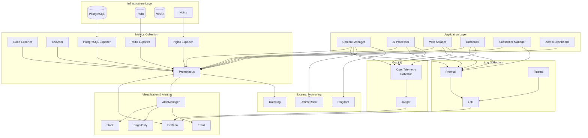

# AquaScene Content Engine - Monitoring and Observability Architecture

## Table of Contents
1. [Observability Overview](#observability-overview)
2. [Monitoring Stack Architecture](#monitoring-stack-architecture)
3. [Metrics Collection and Analysis](#metrics-collection-and-analysis)
4. [Logging Architecture](#logging-architecture)
5. [Distributed Tracing](#distributed-tracing)
6. [Alerting and Notification System](#alerting-and-notification-system)
7. [Performance Monitoring](#performance-monitoring)
8. [Business Metrics and KPIs](#business-metrics-and-kpis)
9. [Observability Best Practices](#observability-best-practices)
10. [Troubleshooting and Debugging](#troubleshooting-and-debugging)

## Observability Overview

The AquaScene Content Engine implements a comprehensive observability strategy based on the three pillars of observability: metrics, logs, and traces. This enables proactive monitoring, rapid incident response, and data-driven optimization.

### Observability Architecture Diagram


### Observability Maturity Model
```yaml
Level 1 - Basic Monitoring:
  - Health checks and uptime monitoring
  - Basic system metrics (CPU, memory, disk)
  - Simple logging to files
  - Manual alerting

Level 2 - Structured Monitoring:
  - Application metrics collection
  - Centralized logging with structured formats
  - Automated alerting rules
  - Basic dashboards

Level 3 - Advanced Observability:
  - Distributed tracing
  - Custom business metrics
  - Anomaly detection
  - SLI/SLO monitoring

Level 4 - Intelligent Observability:
  - AI-powered insights
  - Predictive monitoring
  - Automated remediation
  - Continuous optimization

Current Implementation: Level 3 (Advanced Observability)
Target: Level 4 (Intelligent Observability)
```

## Monitoring Stack Architecture

### Core Monitoring Components
```yaml
Prometheus:
  Version: latest
  Port: 9090
  Retention: 30 days
  Storage: 10GB
  Scrape Interval: 15s
  Evaluation Interval: 15s
  
Grafana:
  Version: latest
  Port: 3000
  Authentication: OAuth + LDAP
  Plugins:
    - redis-datasource
    - postgres-datasource
    - piechart-panel
    - stat-panel
    
Loki:
  Version: latest
  Port: 3100
  Retention: 30 days
  Storage: 50GB
  Max Query Length: 721h
  
Jaeger:
  Version: latest
  Ports:
    - 16686 (UI)
    - 14268 (HTTP)
    - 9411 (Zipkin)
  Storage: Elasticsearch
  Retention: 7 days
```

### Monitoring Architecture Deployment
```yaml
# docker-compose.monitoring.yml
version: '3.8'

services:
  prometheus:
    image: prom/prometheus:latest
    container_name: content-engine-prometheus
    restart: unless-stopped
    command:
      - '--config.file=/etc/prometheus/prometheus.yml'
      - '--storage.tsdb.path=/prometheus'
      - '--storage.tsdb.retention.time=30d'
      - '--storage.tsdb.retention.size=10GB'
      - '--web.console.libraries=/etc/prometheus/console_libraries'
      - '--web.console.templates=/etc/prometheus/consoles'
      - '--web.enable-lifecycle'
      - '--web.enable-admin-api'
      - '--web.enable-remote-write-receiver'
    volumes:
      - ./infrastructure/monitoring/prometheus:/etc/prometheus:ro
      - prometheus_data:/prometheus
    ports:
      - "9090:9090"
    networks:
      - monitoring
      - content-engine
    healthcheck:
      test: ["CMD", "wget", "--quiet", "--tries=1", "--spider", "http://localhost:9090/-/healthy"]
      interval: 30s
      timeout: 10s
      retries: 3

  grafana:
    image: grafana/grafana:latest
    container_name: content-engine-grafana
    restart: unless-stopped
    environment:
      - GF_SECURITY_ADMIN_USER=${GRAFANA_USER:-admin}
      - GF_SECURITY_ADMIN_PASSWORD=${GRAFANA_PASSWORD}
      - GF_INSTALL_PLUGINS=redis-datasource,postgres-datasource
      - GF_FEATURE_TOGGLES_ENABLE=publicDashboards
      - GF_ALERTING_ENABLED=true
      - GF_UNIFIED_ALERTING_ENABLED=true
      - GF_SMTP_ENABLED=true
      - GF_SMTP_HOST=${SMTP_HOST:-localhost:587}
      - GF_SMTP_USER=${SMTP_USER}
      - GF_SMTP_PASSWORD=${SMTP_PASSWORD}
      - GF_SMTP_FROM_ADDRESS=monitoring@aquascene.com
    volumes:
      - grafana_data:/var/lib/grafana
      - ./infrastructure/monitoring/grafana/provisioning:/etc/grafana/provisioning:ro
      - ./infrastructure/monitoring/grafana/dashboards:/var/lib/grafana/dashboards:ro
    ports:
      - "3000:3000"
    networks:
      - monitoring
    depends_on:
      - prometheus
    healthcheck:
      test: ["CMD", "curl", "-f", "http://localhost:3000/api/health"]
      interval: 30s
      timeout: 10s
      retries: 3

  loki:
    image: grafana/loki:latest
    container_name: content-engine-loki
    restart: unless-stopped
    command: -config.file=/etc/loki/local-config.yaml
    volumes:
      - ./infrastructure/logging/loki.yml:/etc/loki/local-config.yaml:ro
      - loki_data:/loki
    ports:
      - "3100:3100"
    networks:
      - monitoring

  promtail:
    image: grafana/promtail:latest
    container_name: content-engine-promtail
    restart: unless-stopped
    command: -config.file=/etc/promtail/config.yml
    volumes:
      - ./infrastructure/logging/promtail.yml:/etc/promtail/config.yml:ro
      - /var/log:/var/log:ro
      - /var/lib/docker/containers:/var/lib/docker/containers:ro
      - /var/run/docker.sock:/var/run/docker.sock:ro
    networks:
      - monitoring
    depends_on:
      - loki

volumes:
  prometheus_data:
  grafana_data:
  loki_data:

networks:
  monitoring:
    driver: bridge
  content-engine:
    external: true
```

## Metrics Collection and Analysis

### Application Metrics Framework
```python
# Metrics collection framework using Prometheus Python client
from prometheus_client import Counter, Histogram, Gauge, Summary, start_http_server
import time
import functools

class MetricsCollector:
    def __init__(self, service_name: str):
        self.service_name = service_name
        
        # Request metrics
        self.request_count = Counter(
            'http_requests_total',
            'Total HTTP requests',
            ['method', 'endpoint', 'status_code', 'service']
        )
        
        self.request_duration = Histogram(
            'http_request_duration_seconds',
            'HTTP request duration',
            ['method', 'endpoint', 'service']
        )
        
        # Database metrics
        self.db_connections = Gauge(
            'database_connections_active',
            'Active database connections',
            ['service', 'database']
        )
        
        self.db_query_duration = Histogram(
            'database_query_duration_seconds',
            'Database query duration',
            ['service', 'query_type', 'table']
        )
        
        # Business metrics
        self.content_generated = Counter(
            'content_generated_total',
            'Total content generated',
            ['service', 'content_type', 'quality']
        )
        
        self.ai_requests = Counter(
            'ai_requests_total',
            'Total AI API requests',
            ['service', 'provider', 'model', 'status']
        )
        
        self.newsletter_sent = Counter(
            'newsletters_sent_total',
            'Total newsletters sent',
            ['service', 'status', 'template']
        )
        
        # System metrics
        self.memory_usage = Gauge(
            'memory_usage_bytes',
            'Memory usage in bytes',
            ['service']
        )
        
        self.cpu_usage = Gauge(
            'cpu_usage_percent',
            'CPU usage percentage',
            ['service']
        )

    def track_request(self, method: str, endpoint: str):
        """Decorator to track HTTP request metrics"""
        def decorator(func):
            @functools.wraps(func)
            async def wrapper(*args, **kwargs):
                start_time = time.time()
                status_code = 200
                
                try:
                    result = await func(*args, **kwargs)
                    return result
                except Exception as e:
                    status_code = getattr(e, 'status_code', 500)
                    raise
                finally:
                    # Record metrics
                    self.request_count.labels(
                        method=method,
                        endpoint=endpoint,
                        status_code=status_code,
                        service=self.service_name
                    ).inc()
                    
                    self.request_duration.labels(
                        method=method,
                        endpoint=endpoint,
                        service=self.service_name
                    ).observe(time.time() - start_time)
                    
            return wrapper
        return decorator
    
    def track_db_query(self, query_type: str, table: str):
        """Decorator to track database query metrics"""
        def decorator(func):
            @functools.wraps(func)
            async def wrapper(*args, **kwargs):
                start_time = time.time()
                
                try:
                    result = await func(*args, **kwargs)
                    return result
                finally:
                    self.db_query_duration.labels(
                        service=self.service_name,
                        query_type=query_type,
                        table=table
                    ).observe(time.time() - start_time)
                    
            return wrapper
        return decorator
    
    def record_content_generated(self, content_type: str, quality: str):
        """Record content generation metric"""
        self.content_generated.labels(
            service=self.service_name,
            content_type=content_type,
            quality=quality
        ).inc()
    
    def record_ai_request(self, provider: str, model: str, status: str):
        """Record AI API request metric"""
        self.ai_requests.labels(
            service=self.service_name,
            provider=provider,
            model=model,
            status=status
        ).inc()

# Usage in FastAPI application
metrics = MetricsCollector("content-manager")

@app.middleware("http")
async def metrics_middleware(request: Request, call_next):
    start_time = time.time()
    response = await call_next(request)
    
    # Record request metrics
    metrics.request_count.labels(
        method=request.method,
        endpoint=request.url.path,
        status_code=response.status_code,
        service="content-manager"
    ).inc()
    
    metrics.request_duration.labels(
        method=request.method,
        endpoint=request.url.path,
        service="content-manager"
    ).observe(time.time() - start_time)
    
    return response

@app.get("/metrics")
async def get_metrics():
    """Expose Prometheus metrics"""
    return Response(
        generate_latest(),
        media_type="text/plain; version=0.0.4; charset=utf-8"
    )
```

### Custom Business Metrics
```python
# Business metrics specific to content engine
class ContentEngineMetrics:
    def __init__(self):
        # Content quality metrics
        self.content_quality_score = Histogram(
            'content_quality_score',
            'Quality score of generated content',
            ['service', 'content_type', 'template'],
            buckets=[0.1, 0.3, 0.5, 0.7, 0.8, 0.9, 0.95, 1.0]
        )
        
        # Engagement metrics
        self.email_open_rate = Gauge(
            'email_open_rate',
            'Newsletter open rate',
            ['template', 'segment']
        )
        
        self.email_click_rate = Gauge(
            'email_click_rate', 
            'Newsletter click rate',
            ['template', 'segment']
        )
        
        # Content generation metrics
        self.generation_time = Histogram(
            'content_generation_duration_seconds',
            'Time to generate content',
            ['provider', 'content_type', 'complexity']
        )
        
        self.generation_cost = Counter(
            'content_generation_cost_dollars',
            'Cost of content generation',
            ['provider', 'model']
        )
        
        # Scraping metrics
        self.pages_scraped = Counter(
            'pages_scraped_total',
            'Total pages scraped',
            ['domain', 'status']
        )
        
        self.scraping_errors = Counter(
            'scraping_errors_total',
            'Total scraping errors',
            ['domain', 'error_type']
        )
        
        # Subscriber metrics
        self.subscribers_total = Gauge(
            'subscribers_total',
            'Total number of subscribers',
            ['status', 'segment']
        )
        
        self.subscription_rate = Counter(
            'subscriptions_total',
            'New subscriptions',
            ['source', 'segment']
        )
        
        self.unsubscribe_rate = Counter(
            'unsubscriptions_total',
            'Unsubscriptions',
            ['reason', 'segment']
        )

    def record_content_quality(self, score: float, content_type: str, template: str):
        self.content_quality_score.labels(
            service="ai-processor",
            content_type=content_type,
            template=template
        ).observe(score)
    
    def update_email_metrics(self, template: str, segment: str, opens: int, clicks: int, sent: int):
        open_rate = opens / sent if sent > 0 else 0
        click_rate = clicks / sent if sent > 0 else 0
        
        self.email_open_rate.labels(template=template, segment=segment).set(open_rate)
        self.email_click_rate.labels(template=template, segment=segment).set(click_rate)
    
    def record_generation_metrics(self, provider: str, model: str, content_type: str, 
                                duration: float, cost: float, complexity: str):
        self.generation_time.labels(
            provider=provider,
            content_type=content_type,
            complexity=complexity
        ).observe(duration)
        
        self.generation_cost.labels(
            provider=provider,
            model=model
        ).inc(cost)
```

### Infrastructure Metrics Configuration
```yaml
# prometheus.yml - Scrape configuration for all services
global:
  scrape_interval: 15s
  evaluation_interval: 15s
  external_labels:
    cluster: 'aquascene-content-engine'
    environment: 'production'

rule_files:
  - "rules/*.yml"

alerting:
  alertmanagers:
    - static_configs:
        - targets:
          - alertmanager:9093

scrape_configs:
  # Application services
  - job_name: 'content-manager'
    static_configs:
      - targets: ['content-manager:8000']
    metrics_path: '/metrics'
    scrape_interval: 30s
    scrape_timeout: 10s

  - job_name: 'ai-processor'
    static_configs:
      - targets: ['ai-processor:8001']
    metrics_path: '/metrics'
    scrape_interval: 30s
    scrape_timeout: 20s  # AI processing metrics may take longer

  - job_name: 'web-scraper'
    static_configs:
      - targets: ['web-scraper:8002']
    metrics_path: '/metrics'
    scrape_interval: 60s  # Less frequent scraping for batch jobs

  # Infrastructure services
  - job_name: 'postgres-exporter'
    static_configs:
      - targets: ['postgres-exporter:9187']
    scrape_interval: 30s

  - job_name: 'redis-exporter'
    static_configs:
      - targets: ['redis-exporter:9121']
    scrape_interval: 30s

  - job_name: 'nginx-exporter'
    static_configs:
      - targets: ['nginx-exporter:9113']
    scrape_interval: 15s

  # System monitoring
  - job_name: 'node-exporter'
    static_configs:
      - targets: ['node-exporter:9100']
    scrape_interval: 15s

  - job_name: 'cadvisor'
    static_configs:
      - targets: ['cadvisor:8080']
    scrape_interval: 15s

  # External service monitoring
  - job_name: 'blackbox-exporter'
    static_configs:
      - targets:
        - http://localhost:8000/health
        - http://localhost:8001/health
        - http://localhost:8002/health
        - http://localhost:8003/health
        - http://localhost:8004/health
    metrics_path: /probe
    params:
      module: [http_2xx]
    relabel_configs:
      - source_labels: [__address__]
        target_label: __param_target
      - source_labels: [__param_target]
        target_label: instance
      - target_label: __address__
        replacement: blackbox-exporter:9115
```

## Logging Architecture

### Structured Logging Implementation
```python
# Structured logging setup using structlog
import structlog
import logging
import sys
import json
from datetime import datetime
from typing import Any, Dict

class CustomJSONRenderer:
    """Custom JSON renderer for structured logs"""
    
    def __call__(self, logger, method_name: str, event_dict: Dict[str, Any]) -> str:
        # Add standard fields
        event_dict["timestamp"] = datetime.utcnow().isoformat()
        event_dict["level"] = method_name.upper()
        event_dict["service"] = event_dict.pop("service", "unknown")
        
        # Extract message
        message = event_dict.pop("event", "")
        event_dict["message"] = message
        
        # Handle exceptions
        if "exception" in event_dict:
            exc_info = event_dict.pop("exception")
            event_dict["error"] = {
                "type": exc_info.__class__.__name__,
                "message": str(exc_info),
                "traceback": structlog.processors.format_exc_info(logger, method_name, {"exc_info": exc_info})
            }
        
        return json.dumps(event_dict, default=str)

def configure_logging():
    """Configure structured logging"""
    
    # Configure structlog
    structlog.configure(
        processors=[
            structlog.stdlib.filter_by_level,
            structlog.stdlib.add_logger_name,
            structlog.stdlib.add_log_level,
            structlog.stdlib.PositionalArgumentsFormatter(),
            structlog.processors.TimeStamper(fmt="iso"),
            structlog.processors.StackInfoRenderer(),
            structlog.processors.format_exc_info,
            structlog.processors.UnicodeDecoder(),
            CustomJSONRenderer(),
        ],
        context_class=dict,
        logger_factory=structlog.stdlib.LoggerFactory(),
        wrapper_class=structlog.stdlib.BoundLogger,
        cache_logger_on_first_use=True,
    )
    
    # Configure standard logging
    handler = logging.StreamHandler(sys.stdout)
    handler.setFormatter(logging.Formatter("%(message)s"))
    
    root_logger = logging.getLogger()
    root_logger.addHandler(handler)
    root_logger.setLevel(logging.INFO)

# Usage in application
logger = structlog.get_logger("content-manager")

class RequestLoggingMiddleware:
    def __init__(self, app):
        self.app = app
    
    async def __call__(self, scope, receive, send):
        if scope["type"] == "http":
            start_time = datetime.utcnow()
            
            # Add request ID to context
            request_id = str(uuid.uuid4())
            structlog.contextvars.bind_contextvars(request_id=request_id)
            
            # Log request
            logger.info(
                "Request started",
                method=scope["method"],
                path=scope["path"],
                query_string=scope["query_string"].decode(),
                client=scope.get("client"),
                request_id=request_id
            )
            
            async def send_wrapper(message):
                if message["type"] == "http.response.start":
                    duration = (datetime.utcnow() - start_time).total_seconds()
                    
                    # Log response
                    logger.info(
                        "Request completed",
                        method=scope["method"],
                        path=scope["path"],
                        status_code=message["status"],
                        duration_seconds=duration,
                        request_id=request_id
                    )
                
                await send(message)
            
            await self.app(scope, receive, send_wrapper)
        else:
            await self.app(scope, receive, send)

# Application-specific logging
class ContentManagerLogger:
    def __init__(self):
        self.logger = structlog.get_logger("content-manager")
    
    def log_content_created(self, content_id: str, content_type: str, user_id: str):
        self.logger.info(
            "Content created",
            event_type="content_created",
            content_id=content_id,
            content_type=content_type,
            user_id=user_id
        )
    
    def log_ai_generation(self, provider: str, model: str, duration: float, 
                         tokens_used: int, cost: float, quality_score: float):
        self.logger.info(
            "AI content generation completed",
            event_type="ai_generation",
            provider=provider,
            model=model,
            duration_seconds=duration,
            tokens_used=tokens_used,
            cost_dollars=cost,
            quality_score=quality_score
        )
    
    def log_error(self, error: Exception, context: Dict[str, Any]):
        self.logger.error(
            "Application error occurred",
            event_type="application_error",
            error_type=error.__class__.__name__,
            error_message=str(error),
            context=context,
            exception=error
        )
```

### Log Aggregation Configuration
```yaml
# promtail.yml - Log collection configuration
server:
  http_listen_port: 9080
  grpc_listen_port: 0

positions:
  filename: /tmp/positions.yaml

clients:
  - url: http://loki:3100/loki/api/v1/push
    timeout: 10s
    backoff_config:
      min_period: 500ms
      max_period: 5m
      max_retries: 10

scrape_configs:
  # Application logs from Docker containers
  - job_name: application-logs
    static_configs:
      - targets:
          - localhost
        labels:
          job: application-logs
          environment: production
          __path__: /var/lib/docker/containers/*/*log
    
    pipeline_stages:
      # Parse Docker log format
      - json:
          expressions:
            output: log
            stream: stream
            attrs: attrs
            time: time
      
      # Extract container information
      - json:
          expressions:
            tag: attrs.tag
          source: attrs
      
      # Extract container name from tag
      - regex:
          expression: (?P<container_name>(?:[^|]*))
          source: tag
      
      # Parse timestamp
      - timestamp:
          source: time
          format: RFC3339Nano
      
      # Parse application JSON logs
      - json:
          expressions:
            level: level
            service: service
            message: message
            request_id: request_id
            event_type: event_type
          source: output
      
      # Set log level label
      - labels:
          level:
          service:
          container_name:
          request_id:
          event_type:
      
      # Filter out noise
      - match:
          selector: '{level="DEBUG"}'
          action: drop
      
      # Format output
      - output:
          source: message

  # System logs
  - job_name: system-logs
    static_configs:
      - targets:
          - localhost
        labels:
          job: system-logs
          __path__: /var/log/*.log
    
    pipeline_stages:
      - match:
          selector: '{job="system-logs"}'
          stages:
          - regex:
              expression: '^(?P<timestamp>\S+\s+\S+\s+\S+)\s+(?P<hostname>\S+)\s+(?P<service>\S+):\s+(?P<message>.*)$'
          - timestamp:
              source: timestamp
              format: Jan 2 15:04:05
          - labels:
              service:
              hostname:

  # Nginx access logs  
  - job_name: nginx-access
    static_configs:
      - targets:
          - localhost
        labels:
          job: nginx-access
          __path__: /var/log/nginx/access.log
    
    pipeline_stages:
      - regex:
          expression: '^(?P<remote_addr>\S+) - (?P<remote_user>\S+) \[(?P<time_local>[^\]]+)\] "(?P<method>\S+) (?P<request_uri>\S+) (?P<protocol>\S+)" (?P<status>\d+) (?P<bytes_sent>\d+) "(?P<http_referer>[^"]*)" "(?P<user_agent>[^"]*)".*$'
      
      - timestamp:
          source: time_local
          format: 02/Jan/2006:15:04:05 -0700
      
      - labels:
          method:
          status:
          remote_addr:
```

### Loki Configuration
```yaml
# loki.yml - Log storage and querying configuration
auth_enabled: false

server:
  http_listen_port: 3100
  grpc_listen_port: 9096

common:
  path_prefix: /loki
  storage:
    filesystem:
      chunks_directory: /loki/chunks
      rules_directory: /loki/rules
  replication_factor: 1
  ring:
    instance_addr: 127.0.0.1
    kvstore:
      store: inmemory

query_range:
  results_cache:
    cache:
      embedded_cache:
        enabled: true
        max_size_mb: 100

schema_config:
  configs:
    - from: 2020-10-24
      store: boltdb-shipper
      object_store: filesystem
      schema: v11
      index:
        prefix: index_
        period: 24h

ruler:
  alertmanager_url: http://alertmanager:9093

# Query limits
limits_config:
  reject_old_samples: true
  reject_old_samples_max_age: 168h
  ingestion_rate_mb: 16
  ingestion_burst_size_mb: 32
  max_query_parallelism: 32
  max_streams_per_user: 10000
  max_line_size: 256000

# Retention and compaction
chunk_store_config:
  max_look_back_period: 720h # 30 days

table_manager:
  retention_deletes_enabled: true
  retention_period: 720h # 30 days
```

## Distributed Tracing

### OpenTelemetry Integration
```python
# OpenTelemetry setup for distributed tracing
from opentelemetry import trace
from opentelemetry.exporter.jaeger.thrift import JaegerExporter
from opentelemetry.instrumentation.fastapi import FastAPIInstrumentor
from opentelemetry.instrumentation.requests import RequestsInstrumentor
from opentelemetry.instrumentation.sqlalchemy import SQLAlchemyInstrumentor
from opentelemetry.instrumentation.redis import RedisInstrumentor
from opentelemetry.sdk.trace import TracerProvider
from opentelemetry.sdk.trace.export import BatchSpanProcessor
from opentelemetry.sdk.resources import Resource

def configure_tracing(service_name: str, jaeger_endpoint: str):
    """Configure OpenTelemetry distributed tracing"""
    
    # Set up resource
    resource = Resource.create({
        "service.name": service_name,
        "service.version": "1.0.0",
        "deployment.environment": os.getenv("ENVIRONMENT", "development")
    })
    
    # Set up tracer provider
    trace.set_tracer_provider(TracerProvider(resource=resource))
    tracer = trace.get_tracer(__name__)
    
    # Set up Jaeger exporter
    jaeger_exporter = JaegerExporter(
        agent_host_name="jaeger",
        agent_port=6831,
        collector_endpoint=jaeger_endpoint,
    )
    
    # Set up span processor
    span_processor = BatchSpanProcessor(jaeger_exporter)
    trace.get_tracer_provider().add_span_processor(span_processor)
    
    return tracer

# Auto-instrument frameworks
def setup_auto_instrumentation():
    """Set up automatic instrumentation"""
    
    # FastAPI instrumentation
    FastAPIInstrumentor.instrument()
    
    # HTTP requests instrumentation
    RequestsInstrumentor.instrument()
    
    # Database instrumentation
    SQLAlchemyInstrumentor.instrument()
    
    # Redis instrumentation
    RedisInstrumentor.instrument()

# Manual tracing for business logic
class TracingService:
    def __init__(self, service_name: str):
        self.tracer = trace.get_tracer(service_name)
        self.service_name = service_name
    
    def trace_content_generation(self, content_type: str, provider: str):
        """Trace content generation process"""
        def decorator(func):
            @functools.wraps(func)
            async def wrapper(*args, **kwargs):
                with self.tracer.start_as_current_span(
                    "content_generation",
                    attributes={
                        "service.name": self.service_name,
                        "content.type": content_type,
                        "ai.provider": provider,
                        "operation": "generate"
                    }
                ) as span:
                    try:
                        result = await func(*args, **kwargs)
                        
                        # Add success attributes
                        span.set_attribute("content.id", result.id)
                        span.set_attribute("content.quality_score", result.quality_score)
                        span.set_attribute("ai.tokens_used", result.tokens_used)
                        span.set_attribute("operation.success", True)
                        
                        return result
                    
                    except Exception as e:
                        # Add error attributes
                        span.set_attribute("operation.success", False)
                        span.set_attribute("error.type", e.__class__.__name__)
                        span.set_attribute("error.message", str(e))
                        span.set_status(trace.Status(trace.StatusCode.ERROR, str(e)))
                        raise
                        
            return wrapper
        return decorator
    
    def trace_database_operation(self, operation: str, table: str):
        """Trace database operations"""
        def decorator(func):
            @functools.wraps(func)
            async def wrapper(*args, **kwargs):
                with self.tracer.start_as_current_span(
                    f"db.{operation}",
                    attributes={
                        "db.operation": operation,
                        "db.table": table,
                        "db.system": "postgresql"
                    }
                ) as span:
                    try:
                        result = await func(*args, **kwargs)
                        span.set_attribute("db.rows_affected", getattr(result, 'rowcount', 0))
                        return result
                    except Exception as e:
                        span.set_status(trace.Status(trace.StatusCode.ERROR, str(e)))
                        raise
                        
            return wrapper
        return decorator

# Usage example
tracer_service = TracingService("content-manager")

class ContentService:
    @tracer_service.trace_content_generation("article", "openai")
    async def generate_article(self, topic: str) -> GeneratedContent:
        # Business logic for article generation
        pass
    
    @tracer_service.trace_database_operation("insert", "generated_content")
    async def save_content(self, content: GeneratedContent) -> GeneratedContent:
        # Database save operation
        pass
```

### Cross-Service Trace Correlation
```python
# Trace context propagation between services
import httpx
from opentelemetry import trace
from opentelemetry.propagate import inject

class ServiceClient:
    def __init__(self, base_url: str, service_name: str):
        self.base_url = base_url
        self.service_name = service_name
        self.client = httpx.AsyncClient()
    
    async def make_request(self, method: str, endpoint: str, **kwargs):
        """Make HTTP request with trace context propagation"""
        
        # Get current span
        current_span = trace.get_current_span()
        
        with trace.get_tracer(__name__).start_as_current_span(
            f"http_request_{self.service_name}",
            attributes={
                "http.method": method,
                "http.url": f"{self.base_url}{endpoint}",
                "service.name": self.service_name
            }
        ) as span:
            # Inject trace context into headers
            headers = kwargs.get("headers", {})
            inject(headers)
            kwargs["headers"] = headers
            
            # Make request
            response = await self.client.request(method, f"{self.base_url}{endpoint}", **kwargs)
            
            # Add response attributes
            span.set_attribute("http.status_code", response.status_code)
            span.set_attribute("http.response_size", len(response.content))
            
            if response.status_code >= 400:
                span.set_status(trace.Status(trace.StatusCode.ERROR, f"HTTP {response.status_code}"))
            
            return response

# Service usage with tracing
class AIProcessorClient(ServiceClient):
    def __init__(self):
        super().__init__("http://ai-processor:8001", "ai-processor")
    
    async def generate_content(self, content_request: dict):
        response = await self.make_request("POST", "/generate", json=content_request)
        return response.json()

# Trace correlation in request handlers
@app.post("/content")
async def create_content(request: ContentCreateRequest):
    with trace.get_tracer(__name__).start_as_current_span("create_content_workflow") as span:
        # Add request attributes
        span.set_attribute("content.type", request.content_type)
        span.set_attribute("user.id", current_user.id)
        
        # Call AI service (trace will be correlated)
        ai_client = AIProcessorClient()
        generated_content = await ai_client.generate_content({
            "content_type": request.content_type,
            "topic": request.topic
        })
        
        # Save to database (trace will be correlated)
        content = await content_service.save_content(generated_content)
        
        span.set_attribute("content.id", content.id)
        return content
```

## Alerting and Notification System

### AlertManager Configuration
```yaml
# alertmanager.yml - Alerting rules and routing
global:
  smtp_smarthost: 'smtp.gmail.com:587'
  smtp_from: 'alerts@aquascene.com'
  smtp_auth_username: 'alerts@aquascene.com'
  smtp_auth_password: '${SMTP_PASSWORD}'

templates:
  - '/etc/alertmanager/templates/*.tmpl'

route:
  group_by: ['alertname', 'cluster', 'service']
  group_wait: 10s
  group_interval: 10s
  repeat_interval: 1h
  receiver: 'default'
  
  routes:
  # Critical alerts go to PagerDuty
  - match:
      severity: critical
    receiver: 'pagerduty-critical'
    continue: true
    
  # High severity alerts go to Slack
  - match:
      severity: high
    receiver: 'slack-alerts'
    
  # Warning alerts go to email
  - match:
      severity: warning
    receiver: 'email-team'
    
  # Database alerts
  - match:
      service: postgres
    receiver: 'database-team'
    
  # AI service alerts
  - match:
      service: ai-processor
    receiver: 'ai-team'

receivers:
- name: 'default'
  email_configs:
  - to: 'ops@aquascene.com'
    subject: '[AquaScene] {{ range .Alerts }}{{ .Annotations.summary }}{{ end }}'
    body: |
      {{ range .Alerts }}
      Alert: {{ .Annotations.summary }}
      Description: {{ .Annotations.description }}
      Service: {{ .Labels.service }}
      Severity: {{ .Labels.severity }}
      
      Details:
      {{ range .Labels.SortedPairs }}
      {{ .Name }}: {{ .Value }}
      {{ end }}
      {{ end }}

- name: 'pagerduty-critical'
  pagerduty_configs:
  - service_key: '${PAGERDUTY_SERVICE_KEY}'
    severity: '{{ .GroupLabels.severity }}'
    description: '{{ range .Alerts }}{{ .Annotations.summary }}{{ end }}'
    details:
      firing: '{{ template "pagerduty.default.instances" . }}'
      resolved: '{{ template "pagerduty.default.instances" . }}'

- name: 'slack-alerts'
  slack_configs:
  - api_url: '${SLACK_WEBHOOK_URL}'
    channel: '#alerts'
    title: '[AquaScene] {{ range .Alerts }}{{ .Annotations.summary }}{{ end }}'
    text: |
      {{ range .Alerts }}
      *Alert:* {{ .Annotations.summary }}
      *Service:* {{ .Labels.service }}
      *Severity:* {{ .Labels.severity }}
      *Description:* {{ .Annotations.description }}
      {{ end }}

- name: 'email-team'
  email_configs:
  - to: 'team@aquascene.com'
    subject: '[AquaScene Warning] {{ range .Alerts }}{{ .Annotations.summary }}{{ end }}'

- name: 'database-team'
  email_configs:
  - to: 'dba@aquascene.com'
    subject: '[Database Alert] {{ range .Alerts }}{{ .Annotations.summary }}{{ end }}'

- name: 'ai-team'
  email_configs:
  - to: 'ai-team@aquascene.com'
    subject: '[AI Service Alert] {{ range .Alerts }}{{ .Annotations.summary }}{{ end }}'

inhibit_rules:
- source_match:
    severity: 'critical'
  target_match:
    severity: 'warning'
  equal: ['alertname', 'service']
```

### Prometheus Alerting Rules
```yaml
# alerts/application.yml - Application-specific alerting rules
groups:
- name: application-alerts
  rules:
  
  # Service availability alerts
  - alert: ServiceDown
    expr: up{job=~"content-manager|ai-processor|web-scraper|distributor|subscriber-manager"} == 0
    for: 1m
    labels:
      severity: critical
    annotations:
      summary: "{{ $labels.job }} service is down"
      description: "{{ $labels.job }} has been down for more than 1 minute"
      runbook_url: "https://wiki.aquascene.com/runbooks/service-down"
  
  # High response time alerts
  - alert: HighResponseTime
    expr: histogram_quantile(0.95, http_request_duration_seconds_bucket) > 2
    for: 5m
    labels:
      severity: warning
    annotations:
      summary: "High response time on {{ $labels.service }}"
      description: "95th percentile response time is {{ $value }}s"
  
  # High error rate alerts
  - alert: HighErrorRate
    expr: rate(http_requests_total{status_code=~"5.."}[5m]) / rate(http_requests_total[5m]) > 0.05
    for: 5m
    labels:
      severity: high
    annotations:
      summary: "High error rate on {{ $labels.service }}"
      description: "Error rate is {{ $value | humanizePercentage }}"
  
  # Database connection alerts
  - alert: DatabaseConnectionsHigh
    expr: database_connections_active / database_connections_max > 0.8
    for: 5m
    labels:
      severity: warning
    annotations:
      summary: "High database connections on {{ $labels.service }}"
      description: "Database connections are at {{ $value | humanizePercentage }} of maximum"
  
  # Memory usage alerts
  - alert: HighMemoryUsage
    expr: memory_usage_bytes / memory_limit_bytes > 0.9
    for: 10m
    labels:
      severity: warning
    annotations:
      summary: "High memory usage on {{ $labels.service }}"
      description: "Memory usage is {{ $value | humanizePercentage }}"
  
  # AI service specific alerts
  - alert: AIGenerationQualityLow
    expr: avg_over_time(content_quality_score[1h]) < 0.7
    for: 30m
    labels:
      severity: warning
    annotations:
      summary: "AI content quality degraded"
      description: "Average content quality score is {{ $value }} (< 0.7)"
  
  - alert: AIProviderDown
    expr: ai_requests_total{status="error"} / ai_requests_total > 0.5
    for: 15m
    labels:
      severity: high
    annotations:
      summary: "AI provider {{ $labels.provider }} having issues"
      description: "Error rate is {{ $value | humanizePercentage }}"
  
  # Newsletter delivery alerts
  - alert: NewsletterDeliveryFailed
    expr: newsletters_sent_total{status="failed"} / newsletters_sent_total > 0.1
    for: 30m
    labels:
      severity: high
    annotations:
      summary: "High newsletter delivery failure rate"
      description: "Delivery failure rate is {{ $value | humanizePercentage }}"
  
  # Scraping alerts
  - alert: ScrapingErrors
    expr: increase(scraping_errors_total[1h]) > 50
    for: 1h
    labels:
      severity: warning
    annotations:
      summary: "High scraping error rate for {{ $labels.domain }}"
      description: "{{ $value }} scraping errors in the last hour"

- name: infrastructure-alerts
  rules:
  
  # System resource alerts
  - alert: HighCPUUsage
    expr: 100 - (avg by(instance) (irate(node_cpu_seconds_total{mode="idle"}[5m])) * 100) > 80
    for: 10m
    labels:
      severity: warning
    annotations:
      summary: "High CPU usage on {{ $labels.instance }}"
      description: "CPU usage is {{ $value }}%"
  
  - alert: HighDiskUsage
    expr: (node_filesystem_size_bytes - node_filesystem_avail_bytes) / node_filesystem_size_bytes > 0.85
    for: 5m
    labels:
      severity: warning
    annotations:
      summary: "High disk usage on {{ $labels.instance }}"
      description: "Disk usage is {{ $value | humanizePercentage }}"
  
  - alert: RedisMemoryHigh
    expr: redis_memory_used_bytes / redis_memory_max_bytes > 0.9
    for: 10m
    labels:
      severity: warning
    annotations:
      summary: "Redis memory usage high"
      description: "Redis memory usage is {{ $value | humanizePercentage }}"
  
  - alert: PostgreSQLReplicationLag
    expr: pg_replication_lag > 10
    for: 5m
    labels:
      severity: warning
    annotations:
      summary: "PostgreSQL replication lag"
      description: "Replication lag is {{ $value }} seconds"
```

This comprehensive monitoring and observability documentation provides the foundation for maintaining visibility into the AquaScene Content Engine's performance, health, and business metrics across all layers of the system.