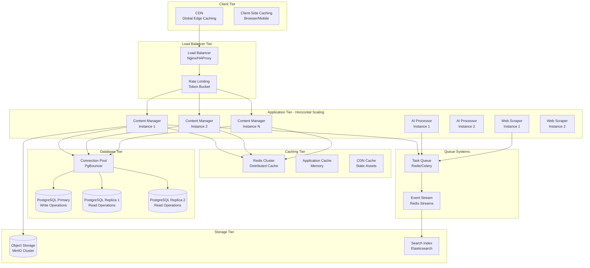

# AquaScene Content Engine - Performance and Scalability Architecture

## Table of Contents
1. [Performance Overview](#performance-overview)
2. [Scalability Architecture](#scalability-architecture)
3. [Application Performance Optimization](#application-performance-optimization)
4. [Database Performance and Scaling](#database-performance-and-scaling)
5. [Caching Strategies](#caching-strategies)
6. [Load Balancing and Traffic Management](#load-balancing-and-traffic-management)
7. [Horizontal Scaling Patterns](#horizontal-scaling-patterns)
8. [Performance Monitoring and Optimization](#performance-monitoring-and-optimization)
9. [Capacity Planning](#capacity-planning)
10. [Performance Testing Strategy](#performance-testing-strategy)

## Performance Overview

The AquaScene Content Engine is designed for high performance and horizontal scalability, supporting growth from hundreds to millions of users while maintaining sub-second response times for critical operations.

### Performance Targets
```yaml
Service Level Objectives (SLOs):

API Response Times:
  P50: < 200ms  (50% of requests)
  P95: < 500ms  (95% of requests)
  P99: < 1s     (99% of requests)
  P99.9: < 2s   (99.9% of requests)

Availability:
  Uptime: 99.9% (8.77 hours downtime/year)
  Error Rate: < 0.1% for all API endpoints

Throughput:
  Content Generation: 100 requests/second
  Newsletter Delivery: 10,000 emails/minute
  Web Scraping: 1,000 pages/hour
  API Requests: 10,000 requests/minute

Scalability Targets:
  Users: Support up to 1M active subscribers
  Content: Process 10K articles/day
  Data: Handle 100GB database with <10ms queries
```

### Performance Architecture Diagram


## Scalability Architecture

### Horizontal Scaling Strategy
```yaml
Service Scaling Patterns:

Stateless Services:
  - All application services designed stateless
  - Session data stored in Redis
  - No local file storage dependencies
  - Easy horizontal scaling with load balancers

Microservice Isolation:
  - Independent scaling per service
  - Resource allocation based on demand
  - Service-specific performance optimizations
  - Fault isolation between services

Auto-Scaling Rules:
  CPU-based:
    - Scale up at 70% CPU utilization
    - Scale down at 30% CPU utilization
    - Minimum 2 instances per service
    - Maximum 20 instances per service
    
  Memory-based:
    - Scale up at 80% memory utilization
    - Scale down at 40% memory utilization
    
  Queue-based:
    - AI Processor: Scale up when queue > 50 jobs
    - Web Scraper: Scale up when queue > 100 URLs
    - Distributor: Scale up when queue > 1000 emails

Database Scaling:
  Read Scaling:
    - Multiple read replicas
    - Read/write splitting
    - Connection pooling
    
  Write Scaling:
    - Connection pooling
    - Batch operations
    - Async processing for non-critical writes
```

### Service-Specific Scaling
```python
# Auto-scaling configuration for Kubernetes HPA
class ServiceScalingConfig:
    """Service-specific scaling configurations"""
    
    CONTENT_MANAGER = {
        'min_replicas': 3,
        'max_replicas': 15,
        'target_cpu': 70,
        'target_memory': 80,
        'scale_up_stabilization': 300,  # 5 minutes
        'scale_down_stabilization': 600  # 10 minutes
    }
    
    AI_PROCESSOR = {
        'min_replicas': 2,
        'max_replicas': 10,
        'target_cpu': 80,  # Higher CPU threshold for AI workloads
        'target_memory': 85,
        'custom_metrics': [
            {
                'name': 'ai_queue_length',
                'target_value': 20,
                'metric_type': 'gauge'
            }
        ]
    }
    
    WEB_SCRAPER = {
        'min_replicas': 1,
        'max_replicas': 5,
        'target_cpu': 60,
        'custom_metrics': [
            {
                'name': 'scraping_queue_length',
                'target_value': 50,
                'metric_type': 'gauge'
            }
        ]
    }

# Dynamic scaling implementation
import asyncio
from kubernetes import client, config
import logging

class AutoScaler:
    def __init__(self):
        config.load_incluster_config()  # For in-cluster deployment
        self.apps_v1 = client.AppsV1Api()
        self.metrics_client = client.CustomObjectsApi()
        
    async def scale_service(self, service_name: str, target_replicas: int):
        """Scale a specific service to target replicas"""
        try:
            # Update deployment replica count
            body = {'spec': {'replicas': target_replicas}}
            
            await asyncio.to_thread(
                self.apps_v1.patch_namespaced_deployment,
                name=f"{service_name}-deployment",
                namespace="aquascene-content-engine",
                body=body
            )
            
            logging.info(f"Scaled {service_name} to {target_replicas} replicas")
            
        except Exception as e:
            logging.error(f"Failed to scale {service_name}: {e}")
    
    async def get_service_metrics(self, service_name: str) -> dict:
        """Get current metrics for a service"""
        try:
            # Get CPU and memory metrics
            cpu_metric = await asyncio.to_thread(
                self.metrics_client.get_namespaced_custom_object,
                group="metrics.k8s.io",
                version="v1beta1",
                namespace="aquascene-content-engine",
                plural="pods",
                name=f"{service_name}-*"
            )
            
            return {
                'cpu_utilization': self.calculate_avg_cpu(cpu_metric),
                'memory_utilization': self.calculate_avg_memory(cpu_metric),
                'replica_count': await self.get_replica_count(service_name)
            }
            
        except Exception as e:
            logging.error(f"Failed to get metrics for {service_name}: {e}")
            return {}
    
    def calculate_scaling_decision(self, service_name: str, metrics: dict) -> int:
        """Calculate target replica count based on metrics"""
        config = getattr(ServiceScalingConfig, service_name.upper().replace('-', '_'))
        current_replicas = metrics.get('replica_count', config['min_replicas'])
        
        cpu_util = metrics.get('cpu_utilization', 0)
        memory_util = metrics.get('memory_utilization', 0)
        
        # Scale up conditions
        if cpu_util > config['target_cpu'] or memory_util > config['target_memory']:
            target_replicas = min(current_replicas + 1, config['max_replicas'])
        
        # Scale down conditions
        elif cpu_util < config['target_cpu'] * 0.5 and memory_util < config['target_memory'] * 0.5:
            target_replicas = max(current_replicas - 1, config['min_replicas'])
        
        else:
            target_replicas = current_replicas
        
        return target_replicas
```

## Application Performance Optimization

### Asynchronous Processing Architecture
```python
# High-performance async implementation
import asyncio
import aiohttp
import aiodns
from typing import List, Dict, Any, Optional
import time
from concurrent.futures import ThreadPoolExecutor
import uvloop  # High-performance event loop

class HighPerformanceService:
    def __init__(self):
        # Use uvloop for better performance
        asyncio.set_event_loop_policy(uvloop.EventLoopPolicy())
        
        # Connection pooling for HTTP clients
        self.http_connector = aiohttp.TCPConnector(
            limit=100,  # Total connection pool size
            limit_per_host=20,  # Per-host connection limit
            keepalive_timeout=30,
            enable_cleanup_closed=True,
            use_dns_cache=True,
            dns_cache_size=1000
        )
        
        self.session = aiohttp.ClientSession(
            connector=self.http_connector,
            timeout=aiohttp.ClientTimeout(total=30, connect=5)
        )
        
        # Thread pool for CPU-bound tasks
        self.thread_pool = ThreadPoolExecutor(max_workers=10)
        
        # Async semaphore for rate limiting
        self.rate_limiter = asyncio.Semaphore(50)  # Max 50 concurrent requests
    
    async def process_batch_requests(self, requests: List[Dict[str, Any]]) -> List[Dict[str, Any]]:
        """Process multiple requests concurrently with optimal batching"""
        
        # Group requests by type for optimal processing
        request_groups = self.group_requests_by_type(requests)
        
        # Process each group concurrently
        tasks = []
        for request_type, group_requests in request_groups.items():
            task = self.process_request_group(request_type, group_requests)
            tasks.append(task)
        
        # Wait for all groups to complete
        results = await asyncio.gather(*tasks, return_exceptions=True)
        
        # Flatten and return results
        flattened_results = []
        for result in results:
            if isinstance(result, list):
                flattened_results.extend(result)
            elif not isinstance(result, Exception):
                flattened_results.append(result)
        
        return flattened_results
    
    async def process_request_group(self, request_type: str, requests: List[Dict[str, Any]]) -> List[Dict[str, Any]]:
        """Process a group of similar requests efficiently"""
        
        if request_type == 'ai_generation':
            return await self.process_ai_requests_batch(requests)
        elif request_type == 'database_query':
            return await self.process_database_batch(requests)
        elif request_type == 'http_request':
            return await self.process_http_requests_batch(requests)
        else:
            return await self.process_generic_requests(requests)
    
    async def process_ai_requests_batch(self, requests: List[Dict[str, Any]]) -> List[Dict[str, Any]]:
        """Optimize AI requests with intelligent batching"""
        
        # Group by provider for optimal batching
        provider_groups = {}
        for req in requests:
            provider = req.get('provider', 'openai')
            if provider not in provider_groups:
                provider_groups[provider] = []
            provider_groups[provider].append(req)
        
        # Process each provider group
        tasks = []
        for provider, group in provider_groups.items():
            # Batch requests to same provider
            batch_size = 5 if provider == 'openai' else 3  # Provider-specific batching
            
            for i in range(0, len(group), batch_size):
                batch = group[i:i + batch_size]
                task = self.process_ai_provider_batch(provider, batch)
                tasks.append(task)
        
        results = await asyncio.gather(*tasks, return_exceptions=True)
        
        # Flatten results
        flattened = []
        for result in results:
            if isinstance(result, list):
                flattened.extend(result)
        
        return flattened
    
    async def process_http_requests_batch(self, requests: List[Dict[str, Any]]) -> List[Dict[str, Any]]:
        """Process HTTP requests with connection reuse and optimal concurrency"""
        
        async def make_request(request: Dict[str, Any]) -> Dict[str, Any]:
            async with self.rate_limiter:
                try:
                    async with self.session.request(
                        method=request['method'],
                        url=request['url'],
                        **request.get('kwargs', {})
                    ) as response:
                        content = await response.text()
                        return {
                            'request_id': request['id'],
                            'status_code': response.status,
                            'content': content,
                            'headers': dict(response.headers)
                        }
                except Exception as e:
                    return {
                        'request_id': request['id'],
                        'error': str(e),
                        'status_code': 500
                    }
        
        # Process requests concurrently
        tasks = [make_request(req) for req in requests]
        results = await asyncio.gather(*tasks, return_exceptions=True)
        
        return [r for r in results if not isinstance(r, Exception)]

# Memory optimization
class MemoryOptimizedProcessor:
    """Memory-efficient processing for large datasets"""
    
    def __init__(self, chunk_size: int = 1000):
        self.chunk_size = chunk_size
        self._memory_tracker = {}
    
    async def process_large_dataset(self, data_source: str, processor_func) -> AsyncGenerator[Any, None]:
        """Process large datasets in chunks to manage memory usage"""
        
        chunk_count = 0
        
        async for chunk in self.get_data_chunks(data_source):
            # Process chunk
            results = await processor_func(chunk)
            
            # Yield results immediately to free memory
            for result in results:
                yield result
            
            # Memory management
            chunk_count += 1
            if chunk_count % 10 == 0:  # Every 10 chunks
                await self.cleanup_memory()
    
    async def get_data_chunks(self, data_source: str) -> AsyncGenerator[List[Any], None]:
        """Get data in manageable chunks"""
        
        if data_source.startswith('postgresql://'):
            async for chunk in self.get_database_chunks(data_source):
                yield chunk
        elif data_source.startswith('redis://'):
            async for chunk in self.get_redis_chunks(data_source):
                yield chunk
        else:
            async for chunk in self.get_file_chunks(data_source):
                yield chunk
    
    async def cleanup_memory(self):
        """Force garbage collection and memory cleanup"""
        import gc
        gc.collect()
        
        # Log memory usage
        import psutil
        process = psutil.Process()
        memory_info = process.memory_info()
        
        logger.info(f"Memory usage: {memory_info.rss / 1024 / 1024:.1f} MB")
```

### Response Time Optimization
```python
# Response time optimization techniques
import functools
import pickle
from typing import Callable, Any
import hashlib
import time

class ResponseTimeOptimizer:
    """Various techniques to optimize response times"""
    
    def __init__(self, cache_client=None):
        self.cache_client = cache_client
        self.local_cache = {}
        self.cache_stats = {'hits': 0, 'misses': 0}
    
    def memoize(self, ttl: int = 300):
        """Memoization decorator with TTL"""
        def decorator(func: Callable) -> Callable:
            @functools.wraps(func)
            async def wrapper(*args, **kwargs):
                # Generate cache key
                cache_key = self.generate_cache_key(func.__name__, args, kwargs)
                
                # Check local cache first
                if cache_key in self.local_cache:
                    cached_data, timestamp = self.local_cache[cache_key]
                    if time.time() - timestamp < ttl:
                        self.cache_stats['hits'] += 1
                        return cached_data
                
                # Check Redis cache
                if self.cache_client:
                    cached_result = await self.cache_client.get(cache_key)
                    if cached_result:
                        result = pickle.loads(cached_result)
                        self.local_cache[cache_key] = (result, time.time())
                        self.cache_stats['hits'] += 1
                        return result
                
                # Execute function
                self.cache_stats['misses'] += 1
                result = await func(*args, **kwargs)
                
                # Cache result
                current_time = time.time()
                self.local_cache[cache_key] = (result, current_time)
                
                if self.cache_client:
                    serialized = pickle.dumps(result)
                    await self.cache_client.setex(cache_key, ttl, serialized)
                
                return result
            
            return wrapper
        return decorator
    
    def background_task(self, func: Callable) -> Callable:
        """Decorator to run non-critical tasks in background"""
        @functools.wraps(func)
        async def wrapper(*args, **kwargs):
            # Return immediately, run task in background
            loop = asyncio.get_event_loop()
            loop.create_task(func(*args, **kwargs))
            return {"status": "queued", "message": "Task queued for background processing"}
        
        return wrapper
    
    def lazy_load(self, load_func: Callable):
        """Lazy loading decorator for expensive operations"""
        def decorator(func: Callable) -> Callable:
            _loaded_data = None
            _load_time = 0
            _load_lock = asyncio.Lock()
            
            @functools.wraps(func)
            async def wrapper(*args, **kwargs):
                nonlocal _loaded_data, _load_time
                
                current_time = time.time()
                
                # Check if data needs refresh (5 minute TTL)
                if _loaded_data is None or current_time - _load_time > 300:
                    async with _load_lock:
                        # Double-check after acquiring lock
                        if _loaded_data is None or current_time - _load_time > 300:
                            _loaded_data = await load_func()
                            _load_time = current_time
                
                # Use loaded data in main function
                return await func(_loaded_data, *args, **kwargs)
            
            return wrapper
        return decorator
    
    def generate_cache_key(self, func_name: str, args: tuple, kwargs: dict) -> str:
        """Generate deterministic cache key"""
        key_data = f"{func_name}:{str(args)}:{str(sorted(kwargs.items()))}"
        return hashlib.md5(key_data.encode()).hexdigest()

# Usage examples
optimizer = ResponseTimeOptimizer(cache_client=redis_client)

class ContentService:
    
    @optimizer.memoize(ttl=600)  # Cache for 10 minutes
    async def get_popular_content(self, content_type: str, limit: int = 10):
        """Get popular content with caching"""
        
        # Expensive query
        query = """
        SELECT c.*, cm.view_count
        FROM generated_content c
        JOIN content_metrics cm ON c.id = cm.content_id
        WHERE c.content_type = %s AND c.status = 'published'
        ORDER BY cm.view_count DESC
        LIMIT %s
        """
        
        results = await database.fetch_all(query, [content_type, limit])
        return [dict(row) for row in results]
    
    @optimizer.background_task
    async def update_content_analytics(self, content_id: str):
        """Update analytics in background"""
        
        # Heavy analytics processing
        await self.calculate_engagement_score(content_id)
        await self.update_trending_score(content_id)
        await self.refresh_recommendation_cache(content_id)
    
    @optimizer.lazy_load(lambda: load_ai_models())
    async def generate_content_with_ai(self, ai_models, topic: str, content_type: str):
        """Generate content using lazy-loaded AI models"""
        
        # AI models are loaded once and reused
        model = ai_models.get_best_model(content_type)
        return await model.generate(topic)
```

## Database Performance and Scaling

### Query Optimization
```sql
-- Performance-optimized queries with proper indexing

-- 1. Content search with full-text search optimization
CREATE INDEX CONCURRENTLY idx_content_search 
ON generated_content USING gin(to_tsvector('english', title || ' ' || content));

-- Optimized search query
EXPLAIN (ANALYZE, BUFFERS, FORMAT JSON)
SELECT 
    id, title, content_type, quality_score, created_at
FROM generated_content
WHERE 
    status = 'published'
    AND to_tsvector('english', title || ' ' || content) @@ plainto_tsquery('aquascaping plants')
    AND quality_score >= 0.7
ORDER BY 
    ts_rank(to_tsvector('english', title || ' ' || content), plainto_tsquery('aquascaping plants')) DESC,
    created_at DESC
LIMIT 20;

-- 2. Performance analytics with optimized aggregations
CREATE INDEX CONCURRENTLY idx_content_metrics_performance 
ON content_metrics (content_id, metric_type, date_bucket, metric_value);

-- Optimized analytics query
WITH content_performance AS (
    SELECT 
        cm.content_id,
        SUM(CASE WHEN cm.metric_name = 'page_views' THEN cm.metric_value ELSE 0 END) as total_views,
        SUM(CASE WHEN cm.metric_name = 'social_shares' THEN cm.metric_value ELSE 0 END) as total_shares,
        AVG(CASE WHEN cm.metric_name = 'engagement_time' THEN cm.metric_value ELSE NULL END) as avg_engagement
    FROM content_metrics cm
    WHERE 
        cm.date_bucket >= CURRENT_DATE - INTERVAL '30 days'
        AND cm.metric_type = 'engagement'
    GROUP BY cm.content_id
),
ranked_content AS (
    SELECT 
        gc.id, gc.title, gc.content_type,
        cp.total_views, cp.total_shares, cp.avg_engagement,
        ROW_NUMBER() OVER (ORDER BY cp.total_views DESC) as view_rank,
        ROW_NUMBER() OVER (ORDER BY cp.total_shares DESC) as share_rank
    FROM generated_content gc
    JOIN content_performance cp ON gc.id = cp.content_id
    WHERE gc.status = 'published'
)
SELECT * FROM ranked_content
WHERE view_rank <= 100 OR share_rank <= 100
ORDER BY total_views DESC;

-- 3. Subscriber segmentation with efficient filtering
CREATE INDEX CONCURRENTLY idx_subscribers_segmentation 
ON subscribers (status, subscription_date, country, language);

CREATE INDEX CONCURRENTLY idx_subscribers_tags 
ON subscribers USING gin(tags);

-- Optimized segmentation query
SELECT 
    COUNT(*) as subscriber_count,
    country,
    language,
    date_trunc('month', subscription_date) as cohort_month
FROM subscribers
WHERE 
    status = 'active'
    AND subscription_date >= CURRENT_DATE - INTERVAL '12 months'
    AND tags && ARRAY['plant-care', 'equipment'] -- Array overlap operator
GROUP BY country, language, cohort_month
ORDER BY subscriber_count DESC;
```

### Connection Pool Optimization
```python
# Advanced database connection pooling
from sqlalchemy.pool import QueuePool, StaticPool
from sqlalchemy import create_engine, event
import logging
import time

class OptimizedConnectionPool:
    def __init__(self, database_url: str, environment: str = 'production'):
        self.database_url = database_url
        self.environment = environment
        self.engine = self._create_optimized_engine()
        self._setup_connection_events()
    
    def _create_optimized_engine(self):
        """Create optimized SQLAlchemy engine"""
        
        pool_config = self._get_pool_config()
        
        engine = create_engine(
            self.database_url,
            
            # Pool configuration
            poolclass=QueuePool,
            **pool_config,
            
            # Connection configuration
            connect_args={
                "application_name": "aquascene-content-engine",
                "connect_timeout": 10,
                "server_settings": {
                    "jit": "off",  # Disable JIT for consistent performance
                    "shared_preload_libraries": "pg_stat_statements",
                },
            },
            
            # Performance settings
            echo=False,  # Disable SQL logging in production
            echo_pool=self.environment == 'development',
            hide_parameters=True,  # Security: hide parameters in logs
            
            # Execution settings
            execution_options={
                "isolation_level": "READ_COMMITTED",
                "autocommit": False
            }
        )
        
        return engine
    
    def _get_pool_config(self) -> dict:
        """Get environment-specific pool configuration"""
        
        if self.environment == 'development':
            return {
                'pool_size': 5,
                'max_overflow': 10,
                'pool_timeout': 30,
                'pool_recycle': 3600,
                'pool_pre_ping': True
            }
        elif self.environment == 'staging':
            return {
                'pool_size': 15,
                'max_overflow': 25,
                'pool_timeout': 30,
                'pool_recycle': 3600,
                'pool_pre_ping': True
            }
        else:  # production
            return {
                'pool_size': 25,
                'max_overflow': 50,
                'pool_timeout': 30,
                'pool_recycle': 3600,
                'pool_pre_ping': True
            }
    
    def _setup_connection_events(self):
        """Setup connection event listeners for monitoring and optimization"""
        
        @event.listens_for(self.engine, "connect")
        def receive_connect(dbapi_connection, connection_record):
            """Optimize connection settings on connect"""
            
            with dbapi_connection.cursor() as cursor:
                # Set connection-specific optimizations
                cursor.execute("SET statement_timeout = '60s'")
                cursor.execute("SET lock_timeout = '10s'")
                cursor.execute("SET idle_in_transaction_session_timeout = '300s'")
                cursor.execute("SET work_mem = '64MB'")  # Increase work_mem for complex queries
                
            connection_record.info['connect_time'] = time.time()
        
        @event.listens_for(self.engine, "checkout")
        def receive_checkout(dbapi_connection, connection_record, connection_proxy):
            """Monitor connection checkout"""
            connection_record.info['checkout_time'] = time.time()
        
        @event.listens_for(self.engine, "checkin")
        def receive_checkin(dbapi_connection, connection_record):
            """Monitor connection checkin and log slow connections"""
            
            checkout_time = connection_record.info.get('checkout_time')
            if checkout_time:
                usage_time = time.time() - checkout_time
                if usage_time > 30:  # Log connections held > 30 seconds
                    logging.warning(f"Long-running connection: {usage_time:.2f}s")

# Read/Write splitting for better performance
class ReadWriteConnectionManager:
    def __init__(self, write_url: str, read_urls: List[str]):
        self.write_engine = create_optimized_engine(write_url, 'write')
        self.read_engines = [create_optimized_engine(url, 'read') for url in read_urls]
        self.read_engine_index = 0
    
    def get_write_connection(self):
        """Get connection for write operations"""
        return self.write_engine.connect()
    
    def get_read_connection(self):
        """Get connection for read operations with load balancing"""
        engine = self.read_engines[self.read_engine_index]
        self.read_engine_index = (self.read_engine_index + 1) % len(self.read_engines)
        return engine.connect()
    
    async def execute_read_query(self, query: str, params: dict = None):
        """Execute read query with automatic retry on different replicas"""
        
        last_exception = None
        
        for attempt in range(len(self.read_engines)):
            try:
                conn = self.get_read_connection()
                result = await conn.execute(query, params or {})
                return result
            except Exception as e:
                last_exception = e
                logging.warning(f"Read query failed on attempt {attempt + 1}: {e}")
        
        # If all read replicas fail, try write connection as fallback
        try:
            conn = self.get_write_connection()
            result = await conn.execute(query, params or {})
            logging.warning("Using write connection for read query after replica failures")
            return result
        except Exception:
            raise last_exception
```

### Database Query Performance Monitoring
```python
# Query performance monitoring and optimization
import time
import psutil
from functools import wraps
from typing import Dict, Any, List
import asyncpg

class QueryPerformanceMonitor:
    def __init__(self):
        self.query_stats = {}
        self.slow_query_threshold = 1.0  # 1 second
        self.alert_callback = None
    
    def monitor_query(self, query_name: str = None):
        """Decorator to monitor query performance"""
        def decorator(func):
            @wraps(func)
            async def wrapper(*args, **kwargs):
                start_time = time.time()
                query_key = query_name or func.__name__
                
                try:
                    result = await func(*args, **kwargs)
                    
                    # Record successful execution
                    execution_time = time.time() - start_time
                    self._record_query_stats(query_key, execution_time, True)
                    
                    # Alert on slow queries
                    if execution_time > self.slow_query_threshold:
                        await self._handle_slow_query(query_key, execution_time, args, kwargs)
                    
                    return result
                    
                except Exception as e:
                    # Record failed execution
                    execution_time = time.time() - start_time
                    self._record_query_stats(query_key, execution_time, False, str(e))
                    raise
            
            return wrapper
        return decorator
    
    def _record_query_stats(self, query_key: str, execution_time: float, 
                           success: bool, error: str = None):
        """Record query execution statistics"""
        
        if query_key not in self.query_stats:
            self.query_stats[query_key] = {
                'count': 0,
                'total_time': 0,
                'success_count': 0,
                'error_count': 0,
                'min_time': float('inf'),
                'max_time': 0,
                'recent_errors': []
            }
        
        stats = self.query_stats[query_key]
        stats['count'] += 1
        stats['total_time'] += execution_time
        stats['min_time'] = min(stats['min_time'], execution_time)
        stats['max_time'] = max(stats['max_time'], execution_time)
        
        if success:
            stats['success_count'] += 1
        else:
            stats['error_count'] += 1
            stats['recent_errors'].append({
                'timestamp': time.time(),
                'error': error
            })
            # Keep only recent errors
            if len(stats['recent_errors']) > 10:
                stats['recent_errors'] = stats['recent_errors'][-10:]
    
    async def _handle_slow_query(self, query_key: str, execution_time: float, 
                                args: tuple, kwargs: dict):
        """Handle slow query detection"""
        
        logging.warning(f"Slow query detected: {query_key} took {execution_time:.2f}s")
        
        # Collect system metrics
        system_metrics = {
            'cpu_percent': psutil.cpu_percent(),
            'memory_percent': psutil.virtual_memory().percent,
            'disk_io': psutil.disk_io_counters()._asdict() if psutil.disk_io_counters() else None
        }
        
        slow_query_event = {
            'query_key': query_key,
            'execution_time': execution_time,
            'timestamp': time.time(),
            'system_metrics': system_metrics,
            'args_count': len(args),
            'kwargs_keys': list(kwargs.keys()) if kwargs else []
        }
        
        # Call alert callback if configured
        if self.alert_callback:
            await self.alert_callback(slow_query_event)
    
    def get_performance_summary(self) -> Dict[str, Any]:
        """Get performance summary for all monitored queries"""
        
        summary = {}
        for query_key, stats in self.query_stats.items():
            avg_time = stats['total_time'] / stats['count'] if stats['count'] > 0 else 0
            success_rate = stats['success_count'] / stats['count'] if stats['count'] > 0 else 0
            
            summary[query_key] = {
                'total_executions': stats['count'],
                'average_time': round(avg_time, 3),
                'min_time': round(stats['min_time'], 3),
                'max_time': round(stats['max_time'], 3),
                'success_rate': round(success_rate, 3),
                'error_count': stats['error_count']
            }
        
        return summary

# Usage in database service
monitor = QueryPerformanceMonitor()

class OptimizedDatabaseService:
    
    @monitor.monitor_query("get_content_by_filters")
    async def get_content_by_filters(self, filters: Dict[str, Any]) -> List[Dict[str, Any]]:
        """Optimized content query with monitoring"""
        
        # Build efficient query
        query_parts = ["SELECT id, title, content_type, quality_score, created_at FROM generated_content"]
        where_conditions = ["status = $1"]
        params = ['published']
        
        # Add filters efficiently
        param_index = 2
        if filters.get('content_type'):
            where_conditions.append(f"content_type = ${param_index}")
            params.append(filters['content_type'])
            param_index += 1
        
        if filters.get('min_quality_score'):
            where_conditions.append(f"quality_score >= ${param_index}")
            params.append(filters['min_quality_score'])
            param_index += 1
        
        # Build final query
        query = " ".join([
            query_parts[0],
            "WHERE " + " AND ".join(where_conditions),
            "ORDER BY created_at DESC",
            f"LIMIT ${param_index}"
        ])
        params.append(filters.get('limit', 20))
        
        # Execute with connection pool
        async with self.connection_pool.acquire() as conn:
            rows = await conn.fetch(query, *params)
            return [dict(row) for row in rows]
    
    @monitor.monitor_query("update_content_metrics")
    async def update_content_metrics(self, content_id: str, metrics: Dict[str, float]):
        """Batch update content metrics"""
        
        # Use UPSERT for efficiency
        query = """
        INSERT INTO content_metrics (content_id, metric_type, metric_name, metric_value, date_bucket)
        VALUES ($1, $2, $3, $4, CURRENT_DATE)
        ON CONFLICT (content_id, metric_type, metric_name, date_bucket)
        DO UPDATE SET 
            metric_value = content_metrics.metric_value + EXCLUDED.metric_value,
            recorded_at = NOW()
        """
        
        async with self.connection_pool.acquire() as conn:
            async with conn.transaction():
                for metric_name, metric_value in metrics.items():
                    await conn.execute(query, content_id, 'engagement', metric_name, metric_value)
```

## Caching Strategies

### Multi-Level Caching Architecture
```python
# Comprehensive caching strategy
import json
import pickle
import hashlib
from typing import Any, Optional, Dict, List
from datetime import datetime, timedelta
import asyncio
import redis.asyncio as redis

class MultiLevelCache:
    """Multi-level caching with L1 (memory), L2 (Redis), and L3 (database) layers"""
    
    def __init__(self, redis_client: redis.Redis):
        self.redis_client = redis_client
        self.memory_cache = {}  # L1 cache
        self.cache_stats = {
            'l1_hits': 0, 'l2_hits': 0, 'l3_hits': 0,
            'misses': 0, 'writes': 0
        }
        
        # Cache configuration per data type
        self.cache_configs = {
            'content': {'ttl': 3600, 'l1_size': 1000},  # 1 hour, 1000 items in memory
            'user_sessions': {'ttl': 1800, 'l1_size': 5000},  # 30 minutes, 5000 sessions
            'api_responses': {'ttl': 300, 'l1_size': 2000},  # 5 minutes, 2000 responses
            'database_queries': {'ttl': 600, 'l1_size': 500}  # 10 minutes, 500 queries
        }
    
    async def get(self, key: str, data_type: str = 'default') -> Optional[Any]:
        """Get value from cache with fallthrough to all levels"""
        
        cache_key = self._generate_cache_key(key, data_type)
        
        # L1 Cache (Memory) - Fastest
        if cache_key in self.memory_cache:
            item, timestamp = self.memory_cache[cache_key]
            if not self._is_expired(timestamp, data_type):
                self.cache_stats['l1_hits'] += 1
                return item
            else:
                del self.memory_cache[cache_key]
        
        # L2 Cache (Redis) - Fast
        try:
            cached_data = await self.redis_client.get(cache_key)
            if cached_data:
                item = pickle.loads(cached_data)
                
                # Promote to L1 cache
                self._store_in_l1(cache_key, item, data_type)
                self.cache_stats['l2_hits'] += 1
                return item
                
        except Exception as e:
            logger.warning(f"Redis cache error: {e}")
        
        # Cache miss
        self.cache_stats['misses'] += 1
        return None
    
    async def set(self, key: str, value: Any, data_type: str = 'default', ttl: Optional[int] = None) -> bool:
        """Set value in all cache levels"""
        
        cache_key = self._generate_cache_key(key, data_type)
        config = self.cache_configs.get(data_type, self.cache_configs['content'])
        cache_ttl = ttl or config['ttl']
        
        try:
            # Store in L1 (Memory)
            self._store_in_l1(cache_key, value, data_type)
            
            # Store in L2 (Redis)
            serialized_value = pickle.dumps(value)
            await self.redis_client.setex(cache_key, cache_ttl, serialized_value)
            
            self.cache_stats['writes'] += 1
            return True
            
        except Exception as e:
            logger.error(f"Cache write error: {e}")
            return False
    
    def _store_in_l1(self, cache_key: str, value: Any, data_type: str):
        """Store item in L1 cache with size management"""
        
        config = self.cache_configs.get(data_type, self.cache_configs['content'])
        current_time = datetime.utcnow()
        
        # Add to memory cache
        self.memory_cache[cache_key] = (value, current_time)
        
        # Manage L1 cache size
        if len(self.memory_cache) > config['l1_size']:
            # Remove oldest entries (LRU)
            sorted_keys = sorted(
                self.memory_cache.keys(),
                key=lambda k: self.memory_cache[k][1]
            )
            
            keys_to_remove = sorted_keys[:len(sorted_keys) - config['l1_size']]
            for key_to_remove in keys_to_remove:
                del self.memory_cache[key_to_remove]
    
    def _generate_cache_key(self, key: str, data_type: str) -> str:
        """Generate namespaced cache key"""
        return f"aquascene:{data_type}:{hashlib.md5(key.encode()).hexdigest()}"
    
    def _is_expired(self, timestamp: datetime, data_type: str) -> bool:
        """Check if cache entry is expired"""
        config = self.cache_configs.get(data_type, self.cache_configs['content'])
        return datetime.utcnow() - timestamp > timedelta(seconds=config['ttl'])
    
    async def invalidate(self, pattern: str) -> int:
        """Invalidate cache entries matching pattern"""
        
        # Invalidate L1 cache
        l1_removed = 0
        keys_to_remove = [k for k in self.memory_cache.keys() if pattern in k]
        for key in keys_to_remove:
            del self.memory_cache[key]
            l1_removed += 1
        
        # Invalidate L2 cache
        try:
            redis_keys = await self.redis_client.keys(f"*{pattern}*")
            if redis_keys:
                l2_removed = await self.redis_client.delete(*redis_keys)
            else:
                l2_removed = 0
        except Exception as e:
            logger.error(f"Redis invalidation error: {e}")
            l2_removed = 0
        
        return l1_removed + l2_removed
    
    def get_stats(self) -> Dict[str, Any]:
        """Get cache performance statistics"""
        total_requests = sum(self.cache_stats.values()) - self.cache_stats['writes']
        
        if total_requests > 0:
            l1_hit_rate = self.cache_stats['l1_hits'] / total_requests
            l2_hit_rate = self.cache_stats['l2_hits'] / total_requests
            miss_rate = self.cache_stats['misses'] / total_requests
        else:
            l1_hit_rate = l2_hit_rate = miss_rate = 0
        
        return {
            'total_requests': total_requests,
            'l1_hit_rate': round(l1_hit_rate, 3),
            'l2_hit_rate': round(l2_hit_rate, 3),
            'miss_rate': round(miss_rate, 3),
            'l1_cache_size': len(self.memory_cache),
            'writes': self.cache_stats['writes']
        }

# Cache-aware service implementation
class CachedContentService:
    def __init__(self, cache: MultiLevelCache, database_service):
        self.cache = cache
        self.database_service = database_service
    
    async def get_content_by_id(self, content_id: str) -> Optional[Dict[str, Any]]:
        """Get content with caching"""
        
        # Try cache first
        cached_content = await self.cache.get(f"content:{content_id}", 'content')
        if cached_content:
            return cached_content
        
        # Fetch from database
        content = await self.database_service.get_content_by_id(content_id)
        if content:
            # Cache for future requests
            await self.cache.set(f"content:{content_id}", content, 'content')
        
        return content
    
    async def search_content(self, query: str, filters: Dict[str, Any]) -> List[Dict[str, Any]]:
        """Search content with intelligent caching"""
        
        # Generate cache key from query and filters
        search_key = f"search:{hashlib.md5(f'{query}:{str(sorted(filters.items()))}'.encode()).hexdigest()}"
        
        # Check cache
        cached_results = await self.cache.get(search_key, 'database_queries')
        if cached_results:
            return cached_results
        
        # Execute search
        results = await self.database_service.search_content(query, filters)
        
        # Cache results (shorter TTL for search results)
        await self.cache.set(search_key, results, 'database_queries', ttl=300)
        
        return results
    
    async def update_content(self, content_id: str, updates: Dict[str, Any]) -> bool:
        """Update content and invalidate cache"""
        
        # Update in database
        success = await self.database_service.update_content(content_id, updates)
        
        if success:
            # Invalidate related cache entries
            await self.cache.invalidate(f"content:{content_id}")
            await self.cache.invalidate("search:")  # Invalidate all search caches
        
        return success
```

This comprehensive performance and scalability documentation provides the technical foundation for building a high-performance, horizontally scalable content engine that can handle significant growth while maintaining excellent user experience.