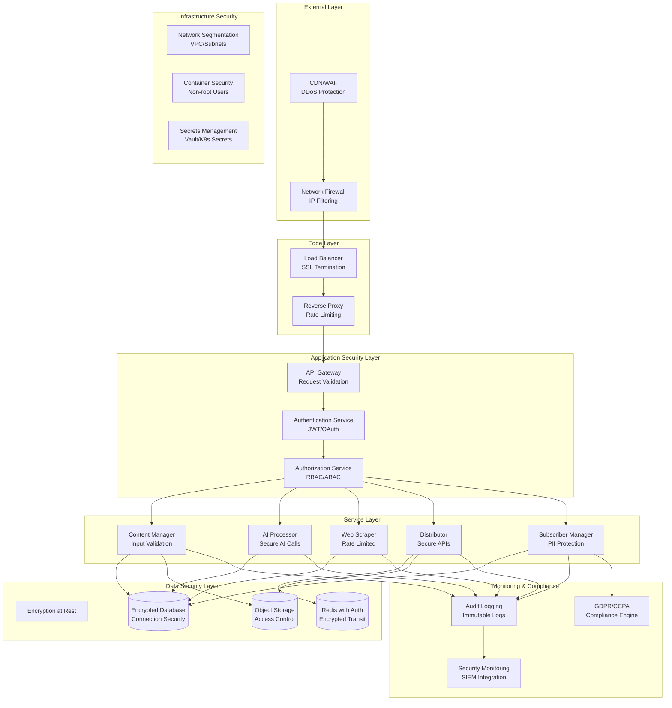

# AquaScene Content Engine - Security Architecture

## Table of Contents
1. [Security Overview](#security-overview)
2. [Security Architecture Layers](#security-architecture-layers)
3. [Authentication and Authorization](#authentication-and-authorization)
4. [Network Security](#network-security)
5. [Data Protection and Encryption](#data-protection-and-encryption)
6. [API Security](#api-security)
7. [Container and Infrastructure Security](#container-and-infrastructure-security)
8. [Secrets Management](#secrets-management)
9. [Compliance and Privacy](#compliance-and-privacy)
10. [Security Monitoring and Incident Response](#security-monitoring-and-incident-response)

## Security Overview

The AquaScene Content Engine implements a comprehensive security architecture based on defense-in-depth principles, zero-trust networking, and industry-standard security practices. Security is embedded at every layer of the system architecture.

### Security Architecture Diagram


### Security Principles
```yaml
Defense in Depth:
  - Multiple security layers with no single point of failure
  - Each layer provides independent protection
  - Layered security controls from network to application

Zero Trust Architecture:
  - Never trust, always verify
  - Least privilege access principle
  - Continuous verification of all access requests

Security by Design:
  - Security embedded from architecture phase
  - Threat modeling for each component
  - Security requirements in all user stories

Continuous Security:
  - Automated security testing in CI/CD
  - Real-time security monitoring
  - Regular security assessments and updates

Privacy by Design:
  - Data minimization principles
  - Purpose limitation for data collection
  - Built-in privacy controls and user rights
```

## Security Architecture Layers

### Layer 1: Network Perimeter Security
```yaml
External Firewall:
  - Cloud WAF (AWS WAF / Cloudflare)
  - DDoS protection and traffic filtering
  - Geographic IP blocking
  - Rate limiting by IP and user agent
  
Network Security Groups:
  - Ingress rules for HTTP/HTTPS only
  - Egress rules for required external services
  - Inter-service communication restrictions
  - Database access limited to application tier

VPC Configuration:
  - Private subnets for databases and internal services
  - Public subnets only for load balancers
  - NAT gateways for outbound internet access
  - VPC flow logs for network monitoring
```

### Layer 2: Transport Layer Security
```yaml
SSL/TLS Configuration:
  - TLS 1.3 minimum for all connections
  - Perfect Forward Secrecy (PFS)
  - HSTS headers for HTTPS enforcement
  - Certificate pinning for critical connections
  
Internal Communication:
  - mTLS for service-to-service communication
  - Certificate-based authentication
  - Encrypted database connections
  - Redis AUTH and TLS encryption
```

### Layer 3: Application Layer Security
```yaml
Input Validation:
  - Schema validation for all API inputs
  - SQL injection prevention
  - XSS protection with output encoding
  - CSRF protection with tokens
  
Output Security:
  - Content Security Policy (CSP) headers
  - X-Frame-Options for clickjacking protection
  - Secure JSON serialization
  - Response data sanitization
```

## Authentication and Authorization

### JWT-Based Authentication Architecture
```python
# JWT Authentication Implementation
import jwt
import bcrypt
from datetime import datetime, timedelta
from typing import Optional, Dict, Any
from cryptography.hazmat.primitives import hashes
from cryptography.hazmat.primitives.kdf.pbkdf2 import PBKDF2HMAC
import secrets

class AuthenticationService:
    def __init__(self, secret_key: str, algorithm: str = "HS256"):
        self.secret_key = secret_key
        self.algorithm = algorithm
        self.token_expiry = timedelta(hours=1)
        self.refresh_token_expiry = timedelta(days=30)
        
    def hash_password(self, password: str) -> str:
        """Hash password using bcrypt with salt"""
        salt = bcrypt.gensalt(rounds=12)
        return bcrypt.hashpw(password.encode('utf-8'), salt).decode('utf-8')
    
    def verify_password(self, password: str, hashed_password: str) -> bool:
        """Verify password against hash"""
        return bcrypt.checkpw(
            password.encode('utf-8'), 
            hashed_password.encode('utf-8')
        )
    
    def generate_tokens(self, user_id: str, roles: list, permissions: list) -> Dict[str, str]:
        """Generate access and refresh tokens"""
        
        # Access token payload
        access_payload = {
            'sub': user_id,
            'iat': datetime.utcnow(),
            'exp': datetime.utcnow() + self.token_expiry,
            'aud': 'aquascene-content-engine',
            'iss': 'aquascene-auth',
            'type': 'access',
            'roles': roles,
            'permissions': permissions,
            'session_id': secrets.token_urlsafe(32)
        }
        
        # Refresh token payload
        refresh_payload = {
            'sub': user_id,
            'iat': datetime.utcnow(),
            'exp': datetime.utcnow() + self.refresh_token_expiry,
            'type': 'refresh',
            'session_id': access_payload['session_id']
        }
        
        # Generate tokens
        access_token = jwt.encode(access_payload, self.secret_key, algorithm=self.algorithm)
        refresh_token = jwt.encode(refresh_payload, self.secret_key, algorithm=self.algorithm)
        
        return {
            'access_token': access_token,
            'refresh_token': refresh_token,
            'token_type': 'bearer',
            'expires_in': int(self.token_expiry.total_seconds())
        }
    
    def verify_token(self, token: str) -> Optional[Dict[str, Any]]:
        """Verify and decode JWT token"""
        try:
            payload = jwt.decode(
                token, 
                self.secret_key, 
                algorithms=[self.algorithm],
                audience='aquascene-content-engine',
                issuer='aquascene-auth'
            )
            
            # Check if token is expired
            if datetime.utcfromtimestamp(payload['exp']) < datetime.utcnow():
                return None
                
            return payload
            
        except jwt.InvalidTokenError:
            return None
    
    def refresh_access_token(self, refresh_token: str) -> Optional[Dict[str, str]]:
        """Generate new access token from refresh token"""
        
        payload = self.verify_token(refresh_token)
        if not payload or payload.get('type') != 'refresh':
            return None
        
        # Get user details to generate new access token
        user = self.get_user_by_id(payload['sub'])
        if not user:
            return None
        
        return self.generate_tokens(user.id, user.roles, user.permissions)

class AuthorizationService:
    """Role-Based Access Control (RBAC) with Attribute-Based Access Control (ABAC)"""
    
    def __init__(self):
        self.permission_cache = {}
        self.role_hierarchy = {
            'super_admin': ['admin', 'content_editor', 'content_reviewer', 'viewer'],
            'admin': ['content_editor', 'content_reviewer', 'viewer'],
            'content_editor': ['content_reviewer', 'viewer'],
            'content_reviewer': ['viewer']
        }
    
    def check_permission(self, user_roles: list, user_permissions: list, 
                        required_permission: str, context: Dict[str, Any] = None) -> bool:
        """Check if user has required permission"""
        
        # Direct permission check
        if required_permission in user_permissions:
            return True
        
        # Role-based permission check
        for role in user_roles:
            role_permissions = self.get_role_permissions(role)
            if required_permission in role_permissions:
                return True
        
        # Attribute-based checks (context-dependent)
        if context:
            return self.check_contextual_permission(
                user_roles, user_permissions, required_permission, context
            )
        
        return False
    
    def check_contextual_permission(self, user_roles: list, user_permissions: list,
                                  required_permission: str, context: Dict[str, Any]) -> bool:
        """Context-dependent authorization checks"""
        
        # Resource ownership checks
        if context.get('resource_owner_id') and context.get('user_id'):
            if context['resource_owner_id'] == context['user_id']:
                # Users can always access their own resources
                if required_permission.endswith(':read') or required_permission.endswith(':write'):
                    return True
        
        # Time-based access control
        if context.get('time_restricted'):
            current_hour = datetime.utcnow().hour
            if current_hour < 9 or current_hour > 17:  # Outside business hours
                return 'admin' in user_roles
        
        # Location-based access control
        if context.get('ip_address'):
            if self.is_suspicious_location(context['ip_address']):
                return 'super_admin' in user_roles
        
        return False
    
    def get_role_permissions(self, role: str) -> list:
        """Get permissions for a specific role"""
        
        role_permissions = {
            'super_admin': ['*'],
            'admin': [
                'content:*', 'subscribers:*', 'newsletters:*',
                'analytics:read', 'system:read', 'users:manage'
            ],
            'content_editor': [
                'content:read', 'content:write', 'content:approve',
                'templates:read', 'analytics:read'
            ],
            'content_reviewer': [
                'content:read', 'content:approve', 'content:reject',
                'analytics:read'
            ],
            'newsletter_manager': [
                'newsletters:*', 'subscribers:read', 'content:read',
                'templates:read'
            ],
            'viewer': [
                'content:read', 'newsletters:read', 'analytics:read'
            ]
        }
        
        return role_permissions.get(role, [])

# FastAPI Dependency for Authentication and Authorization
from fastapi import Depends, HTTPException, Request
from fastapi.security import HTTPBearer, HTTPAuthorizationCredentials

security = HTTPBearer()

async def get_current_user(
    credentials: HTTPAuthorizationCredentials = Depends(security),
    auth_service: AuthenticationService = Depends(get_auth_service)
) -> Dict[str, Any]:
    """Extract and validate current user from JWT token"""
    
    payload = auth_service.verify_token(credentials.credentials)
    if not payload:
        raise HTTPException(
            status_code=401,
            detail="Invalid or expired token",
            headers={"WWW-Authenticate": "Bearer"},
        )
    
    return payload

def require_permission(permission: str):
    """Decorator to require specific permission for endpoint access"""
    
    def permission_checker(
        current_user: Dict[str, Any] = Depends(get_current_user),
        request: Request = None,
        authz_service: AuthorizationService = Depends(get_authz_service)
    ):
        # Build authorization context
        context = {
            'user_id': current_user['sub'],
            'ip_address': request.client.host if request else None,
            'user_agent': request.headers.get('user-agent') if request else None,
            'endpoint': request.url.path if request else None
        }
        
        # Check permission
        has_permission = authz_service.check_permission(
            user_roles=current_user.get('roles', []),
            user_permissions=current_user.get('permissions', []),
            required_permission=permission,
            context=context
        )
        
        if not has_permission:
            raise HTTPException(
                status_code=403,
                detail=f"Insufficient permissions. Required: {permission}"
            )
        
        return current_user
    
    return permission_checker

# Usage in API endpoints
@app.post("/content")
async def create_content(
    content_data: ContentCreateRequest,
    current_user: Dict[str, Any] = Depends(require_permission("content:write"))
):
    # User has been authenticated and authorized
    return await content_service.create_content(content_data, created_by=current_user['sub'])
```

### Multi-Factor Authentication (MFA)
```python
import pyotp
import qrcode
from io import BytesIO
import base64

class MFAService:
    def __init__(self):
        self.issuer_name = "AquaScene Content Engine"
    
    def generate_secret(self) -> str:
        """Generate a new TOTP secret for user"""
        return pyotp.random_base32()
    
    def generate_qr_code(self, user_email: str, secret: str) -> str:
        """Generate QR code for TOTP setup"""
        
        totp = pyotp.TOTP(secret)
        provisioning_uri = totp.provisioning_uri(
            name=user_email,
            issuer_name=self.issuer_name
        )
        
        # Generate QR code
        qr = qrcode.QRCode(version=1, box_size=10, border=5)
        qr.add_data(provisioning_uri)
        qr.make(fit=True)
        
        # Convert to base64 image
        img = qr.make_image(fill_color="black", back_color="white")
        buffer = BytesIO()
        img.save(buffer, format="PNG")
        buffer.seek(0)
        
        return base64.b64encode(buffer.getvalue()).decode()
    
    def verify_totp_token(self, secret: str, token: str, window: int = 1) -> bool:
        """Verify TOTP token with configurable time window"""
        
        totp = pyotp.TOTP(secret)
        return totp.verify(token, valid_window=window)
    
    def generate_backup_codes(self, count: int = 10) -> list:
        """Generate backup codes for account recovery"""
        
        backup_codes = []
        for _ in range(count):
            # Generate 8-character alphanumeric code
            code = secrets.token_urlsafe(6)[:8].upper()
            backup_codes.append(code)
        
        return backup_codes

# MFA-enabled authentication flow
class MFAAuthenticationService(AuthenticationService):
    def __init__(self, *args, **kwargs):
        super().__init__(*args, **kwargs)
        self.mfa_service = MFAService()
    
    def authenticate_with_mfa(self, username: str, password: str, mfa_token: str = None) -> Dict[str, Any]:
        """Authenticate user with optional MFA"""
        
        # Step 1: Verify username and password
        user = self.verify_user_credentials(username, password)
        if not user:
            raise AuthenticationError("Invalid credentials")
        
        # Step 2: Check if MFA is required
        if user.mfa_enabled:
            if not mfa_token:
                return {
                    'status': 'mfa_required',
                    'mfa_methods': user.mfa_methods,
                    'temp_token': self.generate_temp_token(user.id)
                }
            
            # Verify MFA token
            if not self.verify_mfa_token(user, mfa_token):
                raise AuthenticationError("Invalid MFA token")
        
        # Step 3: Generate full access tokens
        return self.generate_tokens(user.id, user.roles, user.permissions)
    
    def verify_mfa_token(self, user, token: str) -> bool:
        """Verify MFA token (TOTP or backup code)"""
        
        # Try TOTP first
        if user.totp_secret and self.mfa_service.verify_totp_token(user.totp_secret, token):
            return True
        
        # Try backup codes
        if token.upper() in user.backup_codes:
            # Remove used backup code
            user.backup_codes.remove(token.upper())
            self.save_user(user)
            return True
        
        return False
```

## Network Security

### Network Segmentation Architecture
```yaml
# Network topology for security isolation
Production Network Segments:

DMZ (Demilitarized Zone):
  CIDR: 10.0.1.0/24
  Components:
    - Load Balancers
    - Reverse Proxies
    - WAF instances
  Access: Internet-facing with restricted ingress

Application Tier:
  CIDR: 10.0.10.0/24
  Components:
    - Microservice containers
    - Admin dashboard
  Access: Internal only, accessible from DMZ

Data Tier:
  CIDR: 10.0.20.0/24
  Components:
    - PostgreSQL databases
    - Redis clusters
    - Object storage
  Access: Application tier only

Management Tier:
  CIDR: 10.0.30.0/24
  Components:
    - Monitoring services
    - Logging infrastructure
    - Backup services
  Access: Admin access only

Security Controls:
  - Network ACLs between all tiers
  - Security groups for each service
  - WAF rules for application protection
  - DDoS protection at edge
```

### Container Network Security
```yaml
# Docker network security configuration
networks:
  frontend:
    driver: bridge
    driver_opts:
      com.docker.network.bridge.enable_icc: "false"
    ipam:
      config:
        - subnet: 172.20.1.0/24
  
  backend:
    driver: bridge
    driver_opts:
      com.docker.network.bridge.enable_icc: "false"
    ipam:
      config:
        - subnet: 172.20.2.0/24
    internal: true  # No external access

  database:
    driver: bridge
    driver_opts:
      com.docker.network.bridge.enable_icc: "false"
    ipam:
      config:
        - subnet: 172.20.3.0/24
    internal: true  # No external access

# Service network assignments
services:
  nginx:
    networks:
      - frontend
  
  content-manager:
    networks:
      - frontend
      - backend
  
  postgres:
    networks:
      - database
```

### Firewall Rules and Security Groups
```yaml
# AWS Security Group example
WebTierSecurityGroup:
  Type: AWS::EC2::SecurityGroup
  Properties:
    GroupDescription: Security group for web tier
    VpcId: !Ref VPC
    SecurityGroupIngress:
      - IpProtocol: tcp
        FromPort: 80
        ToPort: 80
        SourceSecurityGroupId: !Ref LoadBalancerSecurityGroup
      - IpProtocol: tcp
        FromPort: 443
        ToPort: 443
        SourceSecurityGroupId: !Ref LoadBalancerSecurityGroup
    SecurityGroupEgress:
      - IpProtocol: tcp
        FromPort: 5432
        ToPort: 5432
        DestinationSecurityGroupId: !Ref DatabaseSecurityGroup
      - IpProtocol: tcp
        FromPort: 6379
        ToPort: 6379
        DestinationSecurityGroupId: !Ref CacheSecurityGroup

DatabaseSecurityGroup:
  Type: AWS::EC2::SecurityGroup
  Properties:
    GroupDescription: Security group for database tier
    VpcId: !Ref VPC
    SecurityGroupIngress:
      - IpProtocol: tcp
        FromPort: 5432
        ToPort: 5432
        SourceSecurityGroupId: !Ref WebTierSecurityGroup
    SecurityGroupEgress: []  # No outbound access needed
```

## Data Protection and Encryption

### Encryption at Rest Implementation
```python
# Data encryption utilities
from cryptography.fernet import Fernet
from cryptography.hazmat.primitives import hashes
from cryptography.hazmat.primitives.kdf.pbkdf2 import PBKDF2HMAC
import os
import base64

class DataEncryption:
    def __init__(self, master_key: str):
        self.master_key = master_key.encode()
        self.fernet = self._get_fernet_key()
    
    def _get_fernet_key(self) -> Fernet:
        """Derive Fernet key from master key"""
        kdf = PBKDF2HMAC(
            algorithm=hashes.SHA256(),
            length=32,
            salt=b'aquascene_salt',  # Use proper salt in production
            iterations=100000,
        )
        key = base64.urlsafe_b64encode(kdf.derive(self.master_key))
        return Fernet(key)
    
    def encrypt_field(self, plaintext: str) -> str:
        """Encrypt sensitive field data"""
        if not plaintext:
            return plaintext
        return self.fernet.encrypt(plaintext.encode()).decode()
    
    def decrypt_field(self, ciphertext: str) -> str:
        """Decrypt sensitive field data"""
        if not ciphertext:
            return ciphertext
        return self.fernet.decrypt(ciphertext.encode()).decode()

# Database model with field-level encryption
class EncryptedSubscriber(BaseModel):
    id: UUID
    email: str  # Not encrypted (needed for queries)
    first_name_encrypted: Optional[str] = None
    last_name_encrypted: Optional[str] = None
    phone_encrypted: Optional[str] = None
    
    @property
    def first_name(self) -> Optional[str]:
        if self.first_name_encrypted:
            return encryption.decrypt_field(self.first_name_encrypted)
        return None
    
    @first_name.setter
    def first_name(self, value: Optional[str]):
        if value:
            self.first_name_encrypted = encryption.encrypt_field(value)
        else:
            self.first_name_encrypted = None
    
    @property
    def last_name(self) -> Optional[str]:
        if self.last_name_encrypted:
            return encryption.decrypt_field(self.last_name_encrypted)
        return None
    
    @last_name.setter
    def last_name(self, value: Optional[str]):
        if value:
            self.last_name_encrypted = encryption.encrypt_field(value)
        else:
            self.last_name_encrypted = None

# SQLAlchemy encryption column type
from sqlalchemy_utils import EncryptedType
from sqlalchemy_utils.types.encrypted.encrypted_type import AesEngine

class SubscriberModel(db.Model):
    __tablename__ = 'subscribers'
    
    id = db.Column(UUID(as_uuid=True), primary_key=True, default=uuid.uuid4)
    email = db.Column(db.String(255), unique=True, nullable=False)
    
    # Encrypted columns
    first_name = db.Column(EncryptedType(db.String(100), secret_key, AesEngine, 'pkcs5'))
    last_name = db.Column(EncryptedType(db.String(100), secret_key, AesEngine, 'pkcs5'))
    phone = db.Column(EncryptedType(db.String(50), secret_key, AesEngine, 'pkcs5'))
    
    # Searchable hash of sensitive fields (for GDPR compliance)
    email_hash = db.Column(db.String(64), index=True)
    phone_hash = db.Column(db.String(64), index=True)
```

### Database Connection Security
```python
# Secure database connection configuration
DATABASE_CONFIG = {
    'host': os.getenv('DB_HOST'),
    'port': int(os.getenv('DB_PORT', 5432)),
    'database': os.getenv('DB_NAME'),
    'user': os.getenv('DB_USER'),
    'password': os.getenv('DB_PASSWORD'),
    
    # SSL Configuration
    'sslmode': 'require',
    'sslcert': '/etc/ssl/certs/client-cert.pem',
    'sslkey': '/etc/ssl/private/client-key.pem',
    'sslrootcert': '/etc/ssl/certs/ca-cert.pem',
    
    # Connection security
    'connect_timeout': 10,
    'application_name': 'aquascene-content-engine',
    
    # Connection pooling with security
    'pool_size': 10,
    'max_overflow': 0,
    'pool_pre_ping': True,
    'pool_recycle': 3600,  # Recycle connections every hour
}

# SQLAlchemy engine with security settings
from sqlalchemy import create_engine
from sqlalchemy.pool import QueuePool

def create_secure_engine():
    connection_string = (
        f"postgresql://{DATABASE_CONFIG['user']}:{DATABASE_CONFIG['password']}"
        f"@{DATABASE_CONFIG['host']}:{DATABASE_CONFIG['port']}"
        f"/{DATABASE_CONFIG['database']}"
        f"?sslmode={DATABASE_CONFIG['sslmode']}"
        f"&application_name={DATABASE_CONFIG['application_name']}"
    )
    
    return create_engine(
        connection_string,
        poolclass=QueuePool,
        pool_size=DATABASE_CONFIG['pool_size'],
        max_overflow=DATABASE_CONFIG['max_overflow'],
        pool_pre_ping=DATABASE_CONFIG['pool_pre_ping'],
        pool_recycle=DATABASE_CONFIG['pool_recycle'],
        echo=False,  # Disable SQL logging in production
        hide_parameters=True,  # Hide sensitive parameters in logs
    )
```

## API Security

### Input Validation and Sanitization
```python
# Comprehensive input validation
from pydantic import BaseModel, validator, Field
from typing import List, Optional
import re
import bleach
from html import escape

class SecureContentRequest(BaseModel):
    title: str = Field(..., min_length=1, max_length=255)
    content: str = Field(..., min_length=50, max_length=50000)
    content_type: str = Field(..., regex=r'^(article|newsletter|social_post|guide)$')
    tags: List[str] = Field(default_factory=list, max_items=10)
    
    @validator('title')
    def validate_title(cls, v):
        # Remove potentially dangerous characters
        v = re.sub(r'[<>"\']', '', v.strip())
        if not v:
            raise ValueError('Title cannot be empty after sanitization')
        return v
    
    @validator('content')
    def sanitize_content(cls, v):
        # Allow specific HTML tags only
        allowed_tags = ['p', 'br', 'strong', 'em', 'ul', 'ol', 'li', 'a', 'img']
        allowed_attributes = {
            'a': ['href', 'title'],
            'img': ['src', 'alt', 'title', 'width', 'height']
        }
        
        # Sanitize HTML content
        clean_content = bleach.clean(
            v,
            tags=allowed_tags,
            attributes=allowed_attributes,
            protocols=['http', 'https', 'mailto'],
            strip=True
        )
        
        return clean_content
    
    @validator('tags')
    def validate_tags(cls, v):
        validated_tags = []
        for tag in v:
            # Remove special characters and limit length
            clean_tag = re.sub(r'[^\w\s-]', '', tag.strip())[:50]
            if clean_tag:
                validated_tags.append(clean_tag)
        return validated_tags[:10]  # Limit to 10 tags

# SQL injection prevention with parameterized queries
class SecureRepository:
    def __init__(self, db_session):
        self.db = db_session
    
    async def get_content_by_filters(self, filters: Dict[str, Any]) -> List[Content]:
        """Secure query with parameterized filters"""
        
        query = """
        SELECT id, title, content, content_type, created_at
        FROM generated_content
        WHERE status = :status
        """
        params = {'status': 'published'}
        
        # Build WHERE clause securely
        if filters.get('content_type'):
            query += " AND content_type = :content_type"
            params['content_type'] = filters['content_type']
        
        if filters.get('created_after'):
            query += " AND created_at >= :created_after"
            params['created_after'] = filters['created_after']
        
        if filters.get('search_term'):
            # Use full-text search to prevent injection
            query += " AND to_tsvector('english', title || ' ' || content) @@ plainto_tsquery(:search_term)"
            params['search_term'] = filters['search_term']
        
        # Execute with parameters
        result = await self.db.execute(query, params)
        return result.fetchall()

# Rate limiting implementation
from functools import wraps
import time
import asyncio
from collections import defaultdict

class RateLimiter:
    def __init__(self):
        self.requests = defaultdict(list)
        self.lock = asyncio.Lock()
    
    async def is_allowed(self, key: str, limit: int, window: int) -> bool:
        """Check if request is within rate limit"""
        async with self.lock:
            now = time.time()
            
            # Clean old requests
            self.requests[key] = [
                req_time for req_time in self.requests[key]
                if now - req_time < window
            ]
            
            # Check if under limit
            if len(self.requests[key]) >= limit:
                return False
            
            # Add current request
            self.requests[key].append(now)
            return True

rate_limiter = RateLimiter()

def rate_limit(requests_per_minute: int):
    """Rate limiting decorator"""
    def decorator(func):
        @wraps(func)
        async def wrapper(request: Request, *args, **kwargs):
            # Use IP address and user ID as key
            client_ip = request.client.host
            user_id = getattr(request.state, 'user_id', 'anonymous')
            rate_key = f"{client_ip}:{user_id}"
            
            # Check rate limit
            if not await rate_limiter.is_allowed(rate_key, requests_per_minute, 60):
                raise HTTPException(
                    status_code=429,
                    detail="Rate limit exceeded",
                    headers={"Retry-After": "60"}
                )
            
            return await func(request, *args, **kwargs)
        return wrapper
    return decorator

# Usage in API endpoints
@app.post("/content")
@rate_limit(10)  # 10 requests per minute
async def create_content(
    content_data: SecureContentRequest,
    request: Request,
    current_user: Dict[str, Any] = Depends(require_permission("content:write"))
):
    # Request has been validated and rate limited
    return await content_service.create_content(content_data, current_user['sub'])
```

### CORS and Security Headers
```python
# Security headers middleware
from fastapi.middleware.cors import CORSMiddleware
from fastapi import FastAPI, Response

def add_security_headers(app: FastAPI):
    """Add comprehensive security headers"""
    
    @app.middleware("http")
    async def security_headers_middleware(request, call_next):
        response = await call_next(request)
        
        # Security headers
        security_headers = {
            # XSS Protection
            "X-XSS-Protection": "1; mode=block",
            
            # Content Type Options
            "X-Content-Type-Options": "nosniff",
            
            # Frame Options (Clickjacking protection)
            "X-Frame-Options": "SAMEORIGIN",
            
            # Content Security Policy
            "Content-Security-Policy": (
                "default-src 'self'; "
                "script-src 'self' 'unsafe-inline' 'unsafe-eval'; "
                "style-src 'self' 'unsafe-inline'; "
                "img-src 'self' data: https:; "
                "font-src 'self' https://fonts.gstatic.com; "
                "connect-src 'self' https://api.openai.com https://api.anthropic.com; "
                "frame-ancestors 'self'"
            ),
            
            # HSTS (HTTPS Strict Transport Security)
            "Strict-Transport-Security": "max-age=31536000; includeSubDomains",
            
            # Referrer Policy
            "Referrer-Policy": "strict-origin-when-cross-origin",
            
            # Permissions Policy
            "Permissions-Policy": "geolocation=(), microphone=(), camera=()",
            
            # Server header removal
            "Server": ""
        }
        
        for header, value in security_headers.items():
            response.headers[header] = value
        
        return response

# CORS configuration
def configure_cors(app: FastAPI):
    """Configure CORS with security considerations"""
    
    allowed_origins = [
        "http://localhost:3000",  # Development
        "https://admin.aquascene.com",  # Production admin
        "https://app.aquascene.com"  # Production app
    ]
    
    app.add_middleware(
        CORSMiddleware,
        allow_origins=allowed_origins,
        allow_credentials=True,
        allow_methods=["GET", "POST", "PUT", "DELETE"],
        allow_headers=[
            "Accept",
            "Accept-Language",
            "Content-Language",
            "Content-Type",
            "Authorization"
        ],
        max_age=600,  # Cache preflight requests for 10 minutes
    )
```

## Container and Infrastructure Security

### Secure Container Configuration
```dockerfile
# Security-hardened Dockerfile
FROM python:3.11-slim as base

# Security: Use specific version and verify checksum
FROM python:3.11.6-slim@sha256:abc123... as base

# Security: Create non-root user
RUN groupadd -r appuser && \
    useradd -r -g appuser -s /bin/false -c "App user" appuser

# Security: Update system packages and remove package cache
RUN apt-get update && \
    apt-get upgrade -y && \
    apt-get install -y --no-install-recommends \
        curl \
        ca-certificates && \
    apt-get clean && \
    rm -rf /var/lib/apt/lists/* /tmp/* /var/tmp/*

# Security: Set secure file permissions
WORKDIR /app
COPY --chown=appuser:appuser requirements.txt .

# Security: Install Python dependencies as non-root
USER appuser
RUN pip install --user --no-cache-dir -r requirements.txt

# Security: Copy application code with proper ownership
COPY --chown=appuser:appuser src/ ./src/

# Security: Remove write permissions from application directory
USER root
RUN chmod -R 555 /app/src
USER appuser

# Security: Use specific port and non-root user
EXPOSE 8000
USER appuser

# Security: Use specific entrypoint
ENTRYPOINT ["python", "-m", "src.main"]

# Security: Health check with timeout
HEALTHCHECK --interval=30s --timeout=10s --start-period=40s --retries=3 \
    CMD curl -f http://localhost:8000/health || exit 1
```

### Container Runtime Security
```yaml
# Docker Compose security configuration
services:
  content-manager:
    build: ./services/content-manager
    
    # Security: Run as non-root user
    user: "10001:10001"
    
    # Security: Read-only root filesystem
    read_only: true
    
    # Security: Temporary filesystem for writable areas
    tmpfs:
      - /tmp:size=100M,mode=1777
      - /var/run:size=10M,mode=755
    
    # Security: Drop all capabilities and add only required ones
    cap_drop:
      - ALL
    cap_add:
      - NET_BIND_SERVICE  # Only if binding to ports < 1024
    
    # Security: Disable new privileges
    security_opt:
      - no-new-privileges:true
    
    # Security: Resource limits to prevent DoS
    deploy:
      resources:
        limits:
          memory: 1G
          cpus: '1.0'
          pids: 100  # Limit number of processes
        reservations:
          memory: 256M
          cpus: '0.25'
    
    # Security: Environment variable restrictions
    environment:
      - PYTHONPATH=/app
      - PYTHONDONTWRITEBYTECODE=1  # Prevent .pyc files
      - PYTHONUNBUFFERED=1
    
    # Security: Restart policy
    restart: unless-stopped
    
    # Security: Logging configuration
    logging:
      driver: "json-file"
      options:
        max-size: "10m"
        max-file: "3"
```

### Kubernetes Security Policies
```yaml
# Pod Security Policy
apiVersion: policy/v1beta1
kind: PodSecurityPolicy
metadata:
  name: aquascene-psp
spec:
  privileged: false
  allowPrivilegeEscalation: false
  requiredDropCapabilities:
    - ALL
  volumes:
    - 'configMap'
    - 'emptyDir'
    - 'projected'
    - 'secret'
    - 'downwardAPI'
    - 'persistentVolumeClaim'
  hostNetwork: false
  hostIPC: false
  hostPID: false
  runAsUser:
    rule: 'MustRunAsNonRoot'
  seLinux:
    rule: 'RunAsAny'
  fsGroup:
    rule: 'RunAsAny'
  readOnlyRootFilesystem: true

---
# Network Policy for service isolation
apiVersion: networking.k8s.io/v1
kind: NetworkPolicy
metadata:
  name: content-manager-netpol
spec:
  podSelector:
    matchLabels:
      app: content-manager
  policyTypes:
  - Ingress
  - Egress
  ingress:
  - from:
    - podSelector:
        matchLabels:
          app: nginx-ingress
    ports:
    - protocol: TCP
      port: 8000
  egress:
  - to:
    - podSelector:
        matchLabels:
          app: postgres
    ports:
    - protocol: TCP
      port: 5432
  - to:
    - podSelector:
        matchLabels:
          app: redis
    ports:
    - protocol: TCP
      port: 6379
```

## Secrets Management

### HashiCorp Vault Integration
```python
# Vault secrets management
import hvac
from typing import Dict, Any, Optional
import os

class SecretsManager:
    def __init__(self, vault_url: str, vault_token: str):
        self.client = hvac.Client(url=vault_url, token=vault_token)
        self.kv_mount = "aquascene"
        
        if not self.client.is_authenticated():
            raise Exception("Vault authentication failed")
    
    def get_secret(self, path: str) -> Optional[Dict[str, Any]]:
        """Retrieve secret from Vault KV store"""
        try:
            response = self.client.secrets.kv.v2.read_secret_version(
                path=path,
                mount_point=self.kv_mount
            )
            return response['data']['data']
        except Exception as e:
            logger.error(f"Failed to retrieve secret {path}: {e}")
            return None
    
    def get_database_credentials(self) -> Dict[str, str]:
        """Get database credentials from Vault"""
        db_config = self.get_secret("database/postgres")
        if not db_config:
            raise Exception("Database credentials not found in Vault")
        
        return {
            'host': db_config['host'],
            'port': db_config['port'],
            'database': db_config['database'],
            'username': db_config['username'],
            'password': db_config['password']
        }
    
    def get_api_keys(self) -> Dict[str, str]:
        """Get external API keys from Vault"""
        api_keys = self.get_secret("api-keys/external")
        if not api_keys:
            raise Exception("API keys not found in Vault")
        
        return api_keys
    
    def rotate_secret(self, path: str, new_secret: Dict[str, Any]):
        """Store rotated secret in Vault"""
        try:
            self.client.secrets.kv.v2.create_or_update_secret(
                path=path,
                secret=new_secret,
                mount_point=self.kv_mount
            )
            logger.info(f"Secret rotated successfully: {path}")
        except Exception as e:
            logger.error(f"Failed to rotate secret {path}: {e}")
            raise

# Environment-based secrets loading
def load_secrets():
    """Load secrets based on environment"""
    environment = os.getenv('ENVIRONMENT', 'development')
    
    if environment == 'development':
        # Use environment variables for development
        return {
            'database': {
                'host': os.getenv('DB_HOST', 'localhost'),
                'port': int(os.getenv('DB_PORT', 5432)),
                'database': os.getenv('DB_NAME', 'content_engine'),
                'username': os.getenv('DB_USER', 'postgres'),
                'password': os.getenv('DB_PASSWORD')
            },
            'api_keys': {
                'openai': os.getenv('OPENAI_API_KEY'),
                'anthropic': os.getenv('ANTHROPIC_API_KEY'),
                'sendgrid': os.getenv('SENDGRID_API_KEY')
            }
        }
    else:
        # Use Vault for production
        vault_url = os.getenv('VAULT_URL')
        vault_token = os.getenv('VAULT_TOKEN')
        
        secrets_manager = SecretsManager(vault_url, vault_token)
        
        return {
            'database': secrets_manager.get_database_credentials(),
            'api_keys': secrets_manager.get_api_keys()
        }

# Kubernetes Secret integration
def create_kubernetes_secrets():
    """Create Kubernetes secrets from Vault"""
    
    vault_secrets = load_secrets()
    
    k8s_secrets = {
        'database-secrets': {
            'host': vault_secrets['database']['host'],
            'port': str(vault_secrets['database']['port']),
            'database': vault_secrets['database']['database'],
            'username': vault_secrets['database']['username'],
            'password': vault_secrets['database']['password'],
            'url': f"postgresql://{vault_secrets['database']['username']}:{vault_secrets['database']['password']}@{vault_secrets['database']['host']}:{vault_secrets['database']['port']}/{vault_secrets['database']['database']}"
        },
        'api-keys': vault_secrets['api_keys']
    }
    
    return k8s_secrets
```

## Compliance and Privacy

### GDPR Compliance Implementation
```python
# GDPR compliance service
from enum import Enum
from datetime import datetime, timedelta
from typing import List, Dict, Any, Optional

class DataProcessingPurpose(Enum):
    NEWSLETTER_DELIVERY = "newsletter_delivery"
    CONTENT_PERSONALIZATION = "content_personalization"
    ANALYTICS = "analytics"
    MARKETING = "marketing"
    SYSTEM_ADMINISTRATION = "system_administration"

class ConsentType(Enum):
    NECESSARY = "necessary"  # Required for service
    FUNCTIONAL = "functional"  # Improves functionality
    ANALYTICS = "analytics"  # Usage analytics
    MARKETING = "marketing"  # Marketing communications

class GDPRService:
    def __init__(self, db_session, encryption_service):
        self.db = db_session
        self.encryption = encryption_service
    
    def record_consent(self, user_id: str, consent_type: ConsentType, 
                      granted: bool, purpose: str, legal_basis: str,
                      ip_address: str = None, user_agent: str = None) -> str:
        """Record user consent for GDPR compliance"""
        
        consent_record = ConsentRecord(
            id=str(uuid.uuid4()),
            user_id=user_id,
            consent_type=consent_type.value,
            granted=granted,
            purpose=purpose,
            legal_basis=legal_basis,
            ip_address=ip_address,
            user_agent=user_agent,
            recorded_at=datetime.utcnow(),
            expires_at=datetime.utcnow() + timedelta(days=365)  # Consent expires after 1 year
        )
        
        self.db.add(consent_record)
        self.db.commit()
        
        logger.info(f"Consent recorded for user {user_id}: {consent_type.value} = {granted}")
        return consent_record.id
    
    def get_user_consents(self, user_id: str) -> Dict[str, bool]:
        """Get current consent status for user"""
        
        current_time = datetime.utcnow()
        consents = self.db.query(ConsentRecord).filter(
            ConsentRecord.user_id == user_id,
            ConsentRecord.expires_at > current_time
        ).order_by(ConsentRecord.recorded_at.desc()).all()
        
        # Get latest consent for each type
        consent_status = {}
        processed_types = set()
        
        for consent in consents:
            if consent.consent_type not in processed_types:
                consent_status[consent.consent_type] = consent.granted
                processed_types.add(consent.consent_type)
        
        return consent_status
    
    def export_user_data(self, user_id: str) -> Dict[str, Any]:
        """Export all user data for GDPR Article 20 (Data Portability)"""
        
        # Collect data from all tables
        user_data = {
            'export_date': datetime.utcnow().isoformat(),
            'user_id': user_id,
            'data_categories': {}
        }
        
        # Profile data
        subscriber = self.db.query(Subscriber).filter(Subscriber.id == user_id).first()
        if subscriber:
            user_data['data_categories']['profile'] = {
                'email': subscriber.email,
                'first_name': self.encryption.decrypt_field(subscriber.first_name_encrypted),
                'last_name': self.encryption.decrypt_field(subscriber.last_name_encrypted),
                'phone': self.encryption.decrypt_field(subscriber.phone_encrypted),
                'subscription_date': subscriber.subscription_date.isoformat(),
                'preferences': subscriber.preferences
            }
        
        # Consent records
        consent_records = self.db.query(ConsentRecord).filter(
            ConsentRecord.user_id == user_id
        ).all()
        
        user_data['data_categories']['consents'] = [
            {
                'consent_type': record.consent_type,
                'granted': record.granted,
                'purpose': record.purpose,
                'recorded_at': record.recorded_at.isoformat(),
                'legal_basis': record.legal_basis
            }
            for record in consent_records
        ]
        
        # Interaction data
        email_interactions = self.db.query(EmailInteraction).filter(
            EmailInteraction.user_id == user_id
        ).all()
        
        user_data['data_categories']['email_interactions'] = [
            {
                'newsletter_id': interaction.newsletter_id,
                'action': interaction.action,
                'timestamp': interaction.timestamp.isoformat()
            }
            for interaction in email_interactions
        ]
        
        # Content preferences
        content_preferences = self.db.query(ContentPreference).filter(
            ContentPreference.user_id == user_id
        ).all()
        
        user_data['data_categories']['content_preferences'] = [
            {
                'content_type': pref.content_type,
                'preference_score': pref.preference_score,
                'updated_at': pref.updated_at.isoformat()
            }
            for pref in content_preferences
        ]
        
        return user_data
    
    def delete_user_data(self, user_id: str, deletion_reason: str) -> Dict[str, Any]:
        """Delete all user data for GDPR Article 17 (Right to be Forgotten)"""
        
        deletion_log = {
            'user_id': user_id,
            'deletion_reason': deletion_reason,
            'deletion_date': datetime.utcnow().isoformat(),
            'deleted_records': {}
        }
        
        # Delete from all related tables
        tables_to_clean = [
            ('subscribers', Subscriber),
            ('subscription_preferences', SubscriptionPreference),
            ('consent_records', ConsentRecord),
            ('email_interactions', EmailInteraction),
            ('content_preferences', ContentPreference),
            ('subscriber_segment_memberships', SubscriberSegmentMembership)
        ]
        
        for table_name, model_class in tables_to_clean:
            deleted_count = self.db.query(model_class).filter(
                model_class.user_id == user_id
            ).delete()
            
            deletion_log['deleted_records'][table_name] = deleted_count
            logger.info(f"Deleted {deleted_count} records from {table_name} for user {user_id}")
        
        # Anonymize related data that cannot be deleted (for business records)
        self.anonymize_user_references(user_id)
        
        self.db.commit()
        
        # Log deletion for audit trail
        audit_log = AuditLog(
            table_name='gdpr_deletion',
            record_id=user_id,
            action='delete',
            old_data=deletion_log,
            changed_by='system',
            changed_at=datetime.utcnow()
        )
        self.db.add(audit_log)
        self.db.commit()
        
        return deletion_log
    
    def anonymize_user_references(self, user_id: str):
        """Anonymize user references in business-critical records"""
        
        # Newsletter delivery logs (keep for business analytics but anonymize)
        self.db.query(NewsletterDeliveryLog).filter(
            NewsletterDeliveryLog.recipient_id == user_id
        ).update({
            'recipient_id': 'anonymized',
            'recipient_email': 'anonymized@deleted.user'
        })
        
        # Content interaction logs
        self.db.query(ContentInteractionLog).filter(
            ContentInteractionLog.user_id == user_id
        ).update({
            'user_id': 'anonymized'
        })
    
    def check_data_retention(self):
        """Check and enforce data retention policies"""
        
        current_time = datetime.utcnow()
        
        # Delete expired consent records
        expired_consents = self.db.query(ConsentRecord).filter(
            ConsentRecord.expires_at < current_time
        ).delete()
        
        logger.info(f"Deleted {expired_consents} expired consent records")
        
        # Archive old interaction logs
        archive_date = current_time - timedelta(days=1095)  # 3 years
        old_interactions = self.db.query(EmailInteraction).filter(
            EmailInteraction.timestamp < archive_date
        ).count()
        
        if old_interactions > 0:
            # Move to archive table or delete based on policy
            logger.info(f"Found {old_interactions} interaction records for archival")
        
        self.db.commit()
```

This comprehensive security architecture documentation provides a robust framework for protecting the AquaScene Content Engine across all layers of the system, ensuring data protection, compliance with privacy regulations, and defense against common security threats.