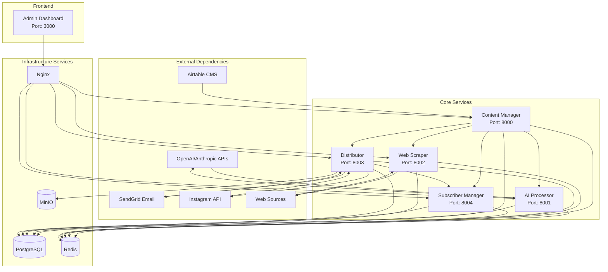

# AquaScene Content Engine - Service Architecture

## Table of Contents
1. [Service Overview](#service-overview)
2. [Content Manager Service](#content-manager-service)
3. [AI Processor Service](#ai-processor-service)
4. [Web Scraper Service](#web-scraper-service)
5. [Distributor Service](#distributor-service)
6. [Subscriber Manager Service](#subscriber-manager-service)
7. [Admin Dashboard](#admin-dashboard)
8. [Service Communication Patterns](#service-communication-patterns)
9. [Design Patterns Implementation](#design-patterns-implementation)

## Service Overview

The AquaScene Content Engine implements a microservices architecture with five core services, each responsible for specific domain functionality. Services are containerized using Docker and communicate via REST APIs and asynchronous messaging through Redis.

### Service Dependency Map


## Content Manager Service

### Service Overview
The Content Manager serves as the central API gateway and orchestrator for the entire content pipeline. It manages content lifecycle, workflow coordination, and serves as the primary interface for the Admin Dashboard.

### Technical Architecture
```yaml
Technology Stack:
  Runtime: Python 3.11
  Framework: FastAPI 0.104+
  ORM: SQLAlchemy 2.0
  Database: PostgreSQL 15
  Cache: Redis 7
  Authentication: JWT
  Documentation: OpenAPI 3.0

Port: 8000
Container: content-engine-api
Health Check: /health
Metrics: /metrics (Prometheus)
```

### Core Responsibilities
1. **API Gateway Functions**
   - Request routing and load balancing
   - Authentication and authorization
   - Rate limiting and request validation
   - Response caching and compression

2. **Content Lifecycle Management**
   - Content CRUD operations
   - Workflow state management
   - Content versioning and history
   - Metadata management and tagging

3. **Service Orchestration**
   - Inter-service communication coordination
   - Async job scheduling and monitoring
   - Event publishing and subscription
   - Error handling and retry logic

### API Endpoints Structure
```yaml
Core Content API:
  GET    /api/v1/content              # List content with filtering
  POST   /api/v1/content              # Create new content
  GET    /api/v1/content/{id}         # Get specific content
  PUT    /api/v1/content/{id}         # Update content
  DELETE /api/v1/content/{id}         # Delete content
  POST   /api/v1/content/{id}/publish # Publish content

Workflow API:
  GET    /api/v1/workflows            # List workflows
  POST   /api/v1/workflows            # Create workflow
  POST   /api/v1/workflows/{id}/run   # Execute workflow
  GET    /api/v1/workflows/{id}/status # Get workflow status

Analytics API:
  GET    /api/v1/analytics/content    # Content performance metrics
  GET    /api/v1/analytics/system     # System performance metrics
  POST   /api/v1/analytics/events     # Log custom events

Health & Monitoring:
  GET    /health                      # Service health check
  GET    /metrics                     # Prometheus metrics
  GET    /docs                        # OpenAPI documentation
```

### Service Implementation Patterns

#### 1. Repository Pattern
```python
# Abstract repository interface
class ContentRepository:
    async def create(self, content_data: ContentCreate) -> ContentModel
    async def get_by_id(self, content_id: UUID) -> Optional[ContentModel]
    async def list_with_filters(self, filters: ContentFilters) -> List[ContentModel]
    async def update(self, content_id: UUID, updates: ContentUpdate) -> ContentModel
    async def delete(self, content_id: UUID) -> bool

# Database implementation
class PostgresContentRepository(ContentRepository):
    def __init__(self, session: AsyncSession):
        self.session = session
    
    async def create(self, content_data: ContentCreate) -> ContentModel:
        # Implementation with SQLAlchemy
```

#### 2. Unit of Work Pattern
```python
class UnitOfWork:
    def __init__(self, session_factory):
        self.session_factory = session_factory
        
    async def __aenter__(self):
        self.session = self.session_factory()
        self.content_repo = PostgresContentRepository(self.session)
        return self
        
    async def commit(self):
        await self.session.commit()
        
    async def rollback(self):
        await self.session.rollback()
```

#### 3. Service Layer Pattern
```python
class ContentService:
    def __init__(self, uow: UnitOfWork, event_bus: EventBus):
        self.uow = uow
        self.event_bus = event_bus
    
    async def create_content(self, content_data: ContentCreate) -> ContentResponse:
        async with self.uow as uow:
            content = await uow.content_repo.create(content_data)
            await self.event_bus.publish(ContentCreatedEvent(content.id))
            await uow.commit()
            return ContentResponse.from_orm(content)
```

### Configuration Management
```python
class Settings:
    # Database
    database_url: str
    db_pool_size: int = 10
    db_max_overflow: int = 20
    
    # Redis
    redis_url: str
    redis_pool_size: int = 10
    
    # External Services
    ai_service_url: str
    scraper_service_url: str
    distributor_service_url: str
    subscriber_service_url: str
    
    # Security
    jwt_secret: str
    jwt_algorithm: str = "HS256"
    jwt_expiration: int = 3600
    
    # Rate Limiting
    rate_limit_requests: int = 1000
    rate_limit_window: int = 3600
```

## AI Processor Service

### Service Overview
The AI Processor is responsible for all AI-powered content generation, leveraging multiple LLM providers (OpenAI, Anthropic, Ollama) with intelligent routing and fallback mechanisms.

### Technical Architecture
```yaml
Technology Stack:
  Runtime: Python 3.11
  Framework: FastAPI 0.104+
  AI Libraries: openai, anthropic, ollama
  Processing: asyncio, concurrent.futures
  Monitoring: structlog, prometheus-client

Port: 8001
Container: content-engine-ai
Health Check: /health
Metrics: /metrics

LLM Providers:
  - OpenAI GPT-4 Mini (Primary)
  - Anthropic Claude Sonnet (Secondary)
  - Ollama Llama 3 (Local/Privacy)
```

### Core Components Architecture

#### 1. LLM Client Manager
```python
class LLMClientManager:
    def __init__(self, configs: Dict[str, LLMConfig]):
        self.clients = {}
        self.routing_strategy = RoutingStrategy.LEAST_LOADED
        self.performance_tracker = PerformanceTracker()
    
    async def generate_content(
        self, 
        request: ContentRequest,
        preferred_provider: Optional[str] = None
    ) -> ContentResponse:
        client = self.select_client(preferred_provider)
        return await self.execute_with_fallback(client, request)
    
    def select_client(self, preferred: Optional[str]) -> LLMClient:
        if preferred and preferred in self.clients:
            return self.clients[preferred]
        return self.route_based_on_strategy()
```

#### 2. Content Orchestrator
```python
class ContentOrchestrator:
    def __init__(self, 
                 llm_manager: LLMClientManager,
                 knowledge_base: AquascapingKnowledgeBase,
                 quality_validator: QualityValidator):
        self.llm_manager = llm_manager
        self.knowledge_base = knowledge_base
        self.quality_validator = quality_validator
        self.worker_pool = WorkerPool(max_workers=10)
    
    async def generate_content(self, request: ContentRequest) -> GenerationResult:
        # 1. Prepare context and knowledge
        context = await self.prepare_context(request)
        
        # 2. Generate content
        raw_content = await self.llm_manager.generate_content(request)
        
        # 3. Validate quality
        quality_score = await self.quality_validator.validate(raw_content)
        
        # 4. Optimize content
        optimized_content = await self.optimize_content(raw_content, request)
        
        return GenerationResult(
            content=optimized_content,
            quality_score=quality_score,
            metadata=self.extract_metadata(raw_content)
        )
```

#### 3. Batch Processing System
```python
class BatchProcessor:
    def __init__(self, orchestrator: ContentOrchestrator):
        self.orchestrator = orchestrator
        self.job_queue = asyncio.Queue()
        self.active_jobs = {}
        self.max_concurrent = 5
    
    async def create_batch_job(
        self, 
        name: str,
        content_specs: List[Dict],
        priority: GenerationPriority = GenerationPriority.NORMAL
    ) -> str:
        job = BatchJob(
            id=str(uuid.uuid4()),
            name=name,
            specs=content_specs,
            priority=priority,
            status=JobStatus.QUEUED
        )
        
        await self.job_queue.put(job)
        self.active_jobs[job.id] = job
        return job.id
    
    async def process_jobs(self):
        while True:
            job = await self.job_queue.get()
            await self.execute_job(job)
```

### AI Provider Integration

#### 1. OpenAI Integration
```python
class OpenAIClient(LLMClient):
    def __init__(self, config: LLMConfig):
        self.client = openai.AsyncOpenAI(api_key=config.api_key)
        self.model = config.model
        self.rate_limiter = RateLimiter(requests_per_minute=60)
    
    async def generate(self, prompt: str, **kwargs) -> LLMResponse:
        async with self.rate_limiter:
            response = await self.client.chat.completions.create(
                model=self.model.value,
                messages=[{"role": "user", "content": prompt}],
                temperature=kwargs.get("temperature", 0.7),
                max_tokens=kwargs.get("max_tokens", 2000)
            )
            
            return LLMResponse(
                content=response.choices[0].message.content,
                model_used=self.model.value,
                provider="openai",
                tokens_used=response.usage.total_tokens,
                cost_estimate=self.calculate_cost(response.usage)
            )
```

#### 2. Anthropic Integration
```python
class AnthropicClient(LLMClient):
    def __init__(self, config: LLMConfig):
        self.client = anthropic.AsyncAnthropic(api_key=config.api_key)
        self.model = config.model
        self.rate_limiter = RateLimiter(requests_per_minute=50)
    
    async def generate(self, prompt: str, **kwargs) -> LLMResponse:
        async with self.rate_limiter:
            response = await self.client.messages.create(
                model=self.model.value,
                messages=[{"role": "user", "content": prompt}],
                temperature=kwargs.get("temperature", 0.7),
                max_tokens=kwargs.get("max_tokens", 2000)
            )
            
            return LLMResponse(
                content=response.content[0].text,
                model_used=self.model.value,
                provider="anthropic",
                tokens_used=response.usage.input_tokens + response.usage.output_tokens,
                cost_estimate=self.calculate_cost(response.usage)
            )
```

### Quality Validation System
```python
class QualityValidator:
    def __init__(self):
        self.validators = [
            BrandValidator(),
            FactChecker(),
            ReadabilityChecker(),
            SEOValidator()
        ]
    
    async def validate(self, content: str, content_type: ContentType) -> QualityScore:
        scores = {}
        
        for validator in self.validators:
            if validator.supports_content_type(content_type):
                score = await validator.validate(content)
                scores[validator.name] = score
        
        overall_score = self.calculate_weighted_score(scores)
        
        return QualityScore(
            overall=overall_score,
            individual_scores=scores,
            passed=overall_score >= 0.7
        )
```

## Web Scraper Service

### Service Overview
The Web Scraper service handles automated data collection from various web sources, providing clean, structured content for the AI processing pipeline.

### Technical Architecture
```yaml
Technology Stack:
  Runtime: Python 3.11
  Framework: FastAPI 0.104+
  Scraping: BeautifulSoup4, Selenium, aiohttp
  Content Processing: html2text, readability
  Job Queue: Celery with Redis backend

Port: 8002
Container: content-engine-scraper
Health Check: /health
User Agent: AquaSceneBot/1.0
```

### Scraping Architecture

#### 1. Target Management System
```python
class ScrapingTarget:
    def __init__(self,
                 name: str,
                 base_url: str,
                 domains: List[str],
                 scraping_rules: Dict):
        self.name = name
        self.base_url = base_url
        self.domains = domains
        self.rules = ScrapingRules.from_dict(scraping_rules)
        self.rate_limiter = RateLimiter(
            requests_per_second=scraping_rules.get("rate_limit", 2)
        )

class ScrapingRules:
    selectors: Dict[str, str]  # CSS selectors for content extraction
    follow_links: bool         # Whether to follow internal links
    max_depth: int            # Maximum crawl depth
    respect_robots_txt: bool  # Respect robots.txt
    custom_headers: Dict      # Custom HTTP headers
    javascript_required: bool # Whether to use Selenium
```

#### 2. Content Extraction Engine
```python
class ContentExtractor:
    def __init__(self):
        self.html_parser = BeautifulSoup
        self.readability = Readability()
        self.text_processor = TextProcessor()
    
    async def extract_content(self, 
                            html: str, 
                            url: str,
                            rules: ScrapingRules) -> ExtractedContent:
        soup = self.html_parser(html, 'html.parser')
        
        # Extract structured data
        title = self.extract_title(soup, rules.selectors.get('title'))
        content = self.extract_main_content(soup, rules.selectors.get('content'))
        images = self.extract_images(soup, url)
        metadata = self.extract_metadata(soup)
        
        # Clean and process content
        clean_content = self.text_processor.clean(content)
        word_count = len(clean_content.split())
        
        return ExtractedContent(
            url=url,
            title=title,
            content=clean_content,
            html_content=str(soup),
            images=images,
            metadata=metadata,
            word_count=word_count,
            language=self.detect_language(clean_content)
        )
```

#### 3. Distributed Scraping System
```python
class DistributedScraper:
    def __init__(self):
        self.session_pool = aiohttp.ClientSession()
        self.proxy_rotator = ProxyRotator()
        self.user_agent_rotator = UserAgentRotator()
        self.request_cache = RequestCache()
    
    async def scrape_url(self, url: str, target: ScrapingTarget) -> ScrapingResult:
        # Check cache first
        if cached_result := await self.request_cache.get(url):
            return cached_result
        
        # Rate limiting
        async with target.rate_limiter:
            try:
                # Rotate proxy and user agent
                session_config = self.prepare_session_config(target)
                
                # Execute request
                async with self.session_pool.get(url, **session_config) as response:
                    if response.status == 200:
                        html = await response.text()
                        content = await self.extract_content(html, url, target.rules)
                        
                        # Cache successful result
                        await self.request_cache.set(url, content, ttl=3600)
                        
                        return ScrapingResult.success(content)
                    else:
                        return ScrapingResult.error(f"HTTP {response.status}")
                        
            except Exception as e:
                return ScrapingResult.error(str(e))
```

### Job Management System
```python
class ScrapingJobManager:
    def __init__(self):
        self.job_queue = asyncio.Queue()
        self.active_jobs = {}
        self.completed_jobs = {}
        self.max_concurrent_jobs = 10
    
    async def create_scraping_job(self, 
                                target_id: int,
                                job_type: JobType = JobType.SCHEDULED) -> str:
        target = await self.get_scraping_target(target_id)
        
        job = ScrapingJob(
            id=str(uuid.uuid4()),
            target=target,
            status=JobStatus.QUEUED,
            created_at=datetime.utcnow()
        )
        
        await self.job_queue.put(job)
        self.active_jobs[job.id] = job
        
        return job.id
    
    async def process_jobs(self):
        while True:
            job = await self.job_queue.get()
            await self.execute_job(job)
```

## Distributor Service

### Service Overview
The Distributor service manages multi-channel content publishing, including email newsletters and Instagram automation, with personalization and analytics capabilities.

### Technical Architecture
```yaml
Technology Stack:
  Runtime: Python 3.11
  Framework: FastAPI 0.104+
  Email: SendGrid Python SDK
  Instagram: Instagram Basic Display API
  Templates: Jinja2 templating engine
  Scheduling: APScheduler

Port: 8003
Container: content-engine-distributor
Health Check: /health

External Integrations:
  - SendGrid API v3
  - Instagram Graph API v18.0
  - MinIO for media storage
```

### Distribution Architecture

#### 1. Newsletter System
```python
class NewsletterGenerator:
    def __init__(self,
                 template_engine: Jinja2Templates,
                 subscriber_service: SubscriberService,
                 content_service: ContentService):
        self.template_engine = template_engine
        self.subscriber_service = subscriber_service
        self.content_service = content_service
    
    async def generate_newsletter(self, 
                                issue_spec: NewsletterSpec) -> GeneratedNewsletter:
        # Get subscriber segments
        subscribers = await self.subscriber_service.get_segment_subscribers(
            issue_spec.target_segments
        )
        
        # Get content for newsletter
        content_items = await self.content_service.get_content_for_newsletter(
            issue_spec.content_criteria
        )
        
        # Generate personalized newsletters
        personalized_newsletters = []
        
        for subscriber in subscribers:
            personalized_content = await self.personalize_content(
                content_items, subscriber
            )
            
            newsletter_html = await self.template_engine.render_template(
                template_name=issue_spec.template_type,
                context={
                    'subscriber': subscriber,
                    'content': personalized_content,
                    'issue': issue_spec
                }
            )
            
            personalized_newsletters.append(
                PersonalizedNewsletter(
                    subscriber_id=subscriber.id,
                    html_content=newsletter_html,
                    subject_line=self.personalize_subject(
                        issue_spec.subject_template, subscriber
                    )
                )
            )
        
        return GeneratedNewsletter(
            issue_id=issue_spec.id,
            newsletters=personalized_newsletters,
            generation_metadata=self.generate_metadata()
        )
```

#### 2. Email Distribution System
```python
class EmailDistributor:
    def __init__(self, sendgrid_client: SendGridAPIClient):
        self.sendgrid = sendgrid_client
        self.rate_limiter = RateLimiter(requests_per_second=10)
        self.delivery_tracker = DeliveryTracker()
    
    async def send_newsletter(self, newsletter: GeneratedNewsletter) -> DistributionResult:
        results = []
        
        for personalized_newsletter in newsletter.newsletters:
            async with self.rate_limiter:
                try:
                    message = self.create_sendgrid_message(personalized_newsletter)
                    response = await self.sendgrid.send(message)
                    
                    results.append(EmailDeliveryResult(
                        subscriber_id=personalized_newsletter.subscriber_id,
                        status='sent',
                        message_id=response.headers.get('X-Message-Id'),
                        sent_at=datetime.utcnow()
                    ))
                    
                except Exception as e:
                    results.append(EmailDeliveryResult(
                        subscriber_id=personalized_newsletter.subscriber_id,
                        status='failed',
                        error_message=str(e),
                        failed_at=datetime.utcnow()
                    ))
        
        # Store delivery results
        await self.delivery_tracker.record_results(newsletter.issue_id, results)
        
        return DistributionResult(
            issue_id=newsletter.issue_id,
            total_sent=len([r for r in results if r.status == 'sent']),
            total_failed=len([r for r in results if r.status == 'failed']),
            delivery_results=results
        )
```

#### 3. Instagram Automation System
```python
class InstagramAutomation:
    def __init__(self, instagram_client: InstagramClient):
        self.instagram = instagram_client
        self.media_processor = MediaProcessor()
        self.content_scheduler = ContentScheduler()
    
    async def schedule_instagram_post(self, 
                                    content: GeneratedContent,
                                    media_urls: List[str],
                                    scheduled_time: datetime) -> str:
        # Process and optimize media
        processed_media = []
        for media_url in media_urls:
            optimized_media = await self.media_processor.optimize_for_instagram(
                media_url, content.content_type
            )
            processed_media.append(optimized_media)
        
        # Create Instagram post
        instagram_post = InstagramPost(
            content_id=content.id,
            caption=self.generate_instagram_caption(content),
            hashtags=self.generate_hashtags(content),
            media_urls=processed_media,
            scheduled_for=scheduled_time,
            status=PostStatus.SCHEDULED
        )
        
        # Schedule post
        job_id = await self.content_scheduler.schedule_post(instagram_post)
        
        return job_id
    
    def generate_instagram_caption(self, content: GeneratedContent) -> str:
        # Use template system to generate captions
        template = self.get_caption_template(content.content_type)
        return template.render(content=content, max_length=2200)
    
    def generate_hashtags(self, content: GeneratedContent) -> List[str]:
        # AI-powered hashtag generation based on content
        base_hashtags = ['#aquascaping', '#plantedtank', '#aquarium']
        content_hashtags = self.extract_relevant_hashtags(content)
        return base_hashtags + content_hashtags[:27]  # Instagram limit: 30
```

## Subscriber Manager Service

### Service Overview
The Subscriber Manager handles all user-related functionality including subscriber management, segmentation, preferences, and GDPR compliance.

### Technical Architecture
```yaml
Technology Stack:
  Runtime: Python 3.11
  Framework: FastAPI 0.104+
  Authentication: JWT with refresh tokens
  Encryption: Fernet symmetric encryption
  Validation: Pydantic with email validation
  Database: SQLAlchemy with PostgreSQL

Port: 8004
Container: content-engine-subscribers
Health Check: /health

Security Features:
  - Field-level encryption for PII
  - GDPR compliance tools
  - Audit logging for all operations
  - Double opt-in verification
```

### Subscriber Management Architecture

#### 1. Subscriber Service Layer
```python
class SubscriberService:
    def __init__(self, 
                 repository: SubscriberRepository,
                 encryption_service: EncryptionService,
                 email_validator: EmailValidator):
        self.repository = repository
        self.encryption = encryption_service
        self.email_validator = email_validator
        self.audit_logger = AuditLogger()
    
    async def create_subscriber(self, 
                              subscriber_data: SubscriberCreate) -> Subscriber:
        # Validate email
        if not await self.email_validator.is_valid(subscriber_data.email):
            raise InvalidEmailError(subscriber_data.email)
        
        # Check for duplicates
        existing = await self.repository.get_by_email(subscriber_data.email)
        if existing:
            raise DuplicateSubscriberError(subscriber_data.email)
        
        # Encrypt sensitive data
        encrypted_data = await self.encryption.encrypt_subscriber_data(
            subscriber_data
        )
        
        # Create subscriber
        subscriber = await self.repository.create(encrypted_data)
        
        # Send confirmation email
        await self.send_confirmation_email(subscriber)
        
        # Log audit event
        await self.audit_logger.log_subscriber_created(subscriber.id)
        
        return subscriber
```

#### 2. Segmentation Engine
```python
class SegmentationEngine:
    def __init__(self, repository: SubscriberRepository):
        self.repository = repository
        self.segment_builders = {
            'behavioral': BehavioralSegmentBuilder(),
            'demographic': DemographicSegmentBuilder(),
            'engagement': EngagementSegmentBuilder(),
            'custom': CustomSegmentBuilder()
        }
    
    async def create_segment(self, 
                           segment_spec: SegmentSpec) -> CreatedSegment:
        builder = self.segment_builders[segment_spec.type]
        
        # Build SQL query based on segment criteria
        query = builder.build_query(segment_spec.criteria)
        
        # Execute query to get matching subscribers
        subscribers = await self.repository.execute_segment_query(query)
        
        # Create segment record
        segment = await self.repository.create_segment(
            name=segment_spec.name,
            description=segment_spec.description,
            criteria=segment_spec.criteria,
            subscriber_count=len(subscribers)
        )
        
        # Create membership records
        await self.repository.create_segment_memberships(
            segment.id, [s.id for s in subscribers]
        )
        
        return CreatedSegment(
            segment=segment,
            subscriber_count=len(subscribers)
        )
    
    async def update_dynamic_segments(self):
        """Update membership for dynamic/behavioral segments"""
        dynamic_segments = await self.repository.get_dynamic_segments()
        
        for segment in dynamic_segments:
            # Rebuild segment membership
            builder = self.segment_builders[segment.type]
            query = builder.build_query(segment.criteria)
            
            current_subscribers = await self.repository.execute_segment_query(query)
            
            # Update memberships
            await self.repository.update_segment_memberships(
                segment.id, [s.id for s in current_subscribers]
            )
```

#### 3. Preference Management System
```python
class PreferenceManager:
    def __init__(self, repository: SubscriberRepository):
        self.repository = repository
        self.default_preferences = DefaultPreferences()
    
    async def get_subscriber_preferences(self, 
                                       subscriber_id: UUID) -> SubscriberPreferences:
        preferences = await self.repository.get_preferences(subscriber_id)
        
        if not preferences:
            # Create default preferences
            preferences = await self.create_default_preferences(subscriber_id)
        
        return preferences
    
    async def update_preferences(self,
                               subscriber_id: UUID,
                               updates: PreferenceUpdate) -> SubscriberPreferences:
        current_prefs = await self.get_subscriber_preferences(subscriber_id)
        
        # Validate updates
        self.validate_preference_updates(updates)
        
        # Apply updates
        updated_prefs = current_prefs.apply_updates(updates)
        
        # Save to database
        await self.repository.update_preferences(subscriber_id, updated_prefs)
        
        # Log preference change
        await self.audit_logger.log_preference_change(
            subscriber_id, current_prefs, updated_prefs
        )
        
        return updated_prefs
    
    def validate_preference_updates(self, updates: PreferenceUpdate):
        # Validate newsletter frequency
        if updates.newsletter_frequency not in ['daily', 'weekly', 'monthly']:
            raise InvalidPreferenceError('newsletter_frequency')
        
        # Validate content types
        valid_content_types = ['articles', 'guides', 'reviews', 'news', 'all']
        for content_type in updates.content_types:
            if content_type not in valid_content_types:
                raise InvalidPreferenceError(f'content_type: {content_type}')
```

#### 4. GDPR Compliance System
```python
class GDPRComplianceManager:
    def __init__(self, 
                 repository: SubscriberRepository,
                 data_exporter: DataExporter,
                 data_eraser: DataEraser):
        self.repository = repository
        self.data_exporter = data_exporter
        self.data_eraser = data_eraser
        self.consent_tracker = ConsentTracker()
    
    async def export_subscriber_data(self, 
                                   subscriber_id: UUID) -> DataExportPackage:
        """Export all data for a subscriber (GDPR Article 20)"""
        subscriber = await self.repository.get_by_id(subscriber_id)
        if not subscriber:
            raise SubscriberNotFoundError(subscriber_id)
        
        # Collect all related data
        data_package = await self.data_exporter.export_all_data(subscriber_id)
        
        # Log export request
        await self.audit_logger.log_data_export(subscriber_id)
        
        return data_package
    
    async def delete_subscriber_data(self, 
                                   subscriber_id: UUID,
                                   deletion_reason: str) -> DeletionResult:
        """Delete all subscriber data (GDPR Article 17)"""
        subscriber = await self.repository.get_by_id(subscriber_id)
        if not subscriber:
            raise SubscriberNotFoundError(subscriber_id)
        
        # Perform cascading deletion
        deletion_result = await self.data_eraser.delete_all_data(subscriber_id)
        
        # Log deletion
        await self.audit_logger.log_data_deletion(
            subscriber_id, deletion_reason, deletion_result
        )
        
        return deletion_result
    
    async def record_consent(self,
                           subscriber_id: UUID,
                           consent_type: ConsentType,
                           granted: bool) -> ConsentRecord:
        """Record consent for various data processing activities"""
        consent_record = ConsentRecord(
            subscriber_id=subscriber_id,
            consent_type=consent_type,
            granted=granted,
            recorded_at=datetime.utcnow(),
            ip_address=self.get_client_ip(),
            user_agent=self.get_user_agent()
        )
        
        await self.consent_tracker.record_consent(consent_record)
        
        return consent_record
```

## Admin Dashboard

### Frontend Architecture
```yaml
Technology Stack:
  Framework: React 18
  Build Tool: Vite
  State Management: Context API + useReducer
  Routing: React Router v6
  UI Library: Material-UI v5
  Data Fetching: React Query (TanStack Query)
  Forms: React Hook Form
  Charts: Chart.js + React-Chartjs-2

Port: 3000
Container: content-engine-admin
Build: Multi-stage Docker build
```

### Component Architecture
```typescript
// Main App Architecture
interface AppState {
  auth: AuthState;
  services: ServiceState;
  content: ContentState;
  analytics: AnalyticsState;
}

// Service Communication Layer
class APIClient {
  private baseURL: string;
  private authToken: string;
  
  async request<T>(endpoint: string, options?: RequestInit): Promise<T> {
    const response = await fetch(`${this.baseURL}${endpoint}`, {
      ...options,
      headers: {
        'Authorization': `Bearer ${this.authToken}`,
        'Content-Type': 'application/json',
        ...options?.headers,
      },
    });
    
    if (!response.ok) {
      throw new APIError(response.status, await response.text());
    }
    
    return response.json();
  }
}

// Real-time Updates
class WebSocketManager {
  private connections: Map<string, WebSocket> = new Map();
  
  connect(service: string): WebSocket {
    const ws = new WebSocket(`ws://localhost:8000/ws/${service}`);
    
    ws.onmessage = (event) => {
      const data = JSON.parse(event.data);
      this.handleServiceUpdate(service, data);
    };
    
    this.connections.set(service, ws);
    return ws;
  }
}
```

## Service Communication Patterns

### 1. Synchronous Communication
```yaml
Pattern: Request-Response via HTTP/REST
Use Cases:
  - Real-time data retrieval
  - User interface interactions
  - Critical path operations

Implementation:
  Protocol: HTTP/1.1 with keep-alive
  Format: JSON with schema validation
  Timeout: 5-60 seconds depending on operation
  Retry: Exponential backoff with jitter
  Circuit Breaker: Fail fast after 5 consecutive failures
```

### 2. Asynchronous Communication
```yaml
Pattern: Message Queue via Redis Streams
Use Cases:
  - Background job processing
  - Event-driven updates
  - Batch operations

Implementation:
  Protocol: Redis Streams and Pub/Sub
  Message Format: JSON with schema versioning
  Delivery: At-least-once with idempotency keys
  Dead Letter Queue: Failed message handling
  Consumer Groups: Load distribution
```

### 3. Service Discovery
```yaml
Pattern: Configuration-based service discovery
Implementation:
  Development: Docker Compose service names
  Production: Kubernetes service discovery
  Health Checks: HTTP health endpoints
  Load Balancing: Nginx upstream with health checks
```

## Design Patterns Implementation

### 1. Domain-Driven Design (DDD)
```python
# Bounded Contexts
class ContentManagement:
    """Bounded context for content lifecycle management"""
    
class AIProcessing:
    """Bounded context for AI-powered content generation"""
    
class Distribution:
    """Bounded context for multi-channel publishing"""

# Aggregates
class Content:
    """Content aggregate root"""
    def __init__(self, content_id: ContentId):
        self.id = content_id
        self.events = []
    
    def publish(self) -> None:
        if self.status != ContentStatus.APPROVED:
            raise InvalidContentStateError("Content must be approved before publishing")
        
        self.status = ContentStatus.PUBLISHED
        self.published_at = datetime.utcnow()
        self.events.append(ContentPublishedEvent(self.id))
```

### 2. Event Sourcing
```python
class EventStore:
    async def append_events(self, stream_id: str, events: List[DomainEvent]) -> None:
        # Append events to stream with optimistic concurrency control
        pass
    
    async def get_events(self, stream_id: str) -> List[DomainEvent]:
        # Retrieve all events for aggregate
        pass

class ContentAggregate:
    def apply_event(self, event: DomainEvent) -> None:
        if isinstance(event, ContentCreatedEvent):
            self.id = event.content_id
            self.status = ContentStatus.DRAFT
        elif isinstance(event, ContentPublishedEvent):
            self.status = ContentStatus.PUBLISHED
            self.published_at = event.published_at
```

### 3. CQRS (Command Query Responsibility Segregation)
```python
# Command Side
class CreateContentCommand:
    def __init__(self, title: str, content_type: str):
        self.title = title
        self.content_type = content_type

class CreateContentHandler:
    async def handle(self, command: CreateContentCommand) -> ContentId:
        content = Content.create(command.title, command.content_type)
        await self.repository.save(content)
        return content.id

# Query Side
class ContentProjection:
    id: UUID
    title: str
    status: str
    created_at: datetime
    # Optimized for read queries

class ContentQueryHandler:
    async def get_published_content(self) -> List[ContentProjection]:
        # Optimized query from read model
        pass
```

This comprehensive service architecture documentation provides the technical foundation for understanding how each service operates within the AquaScene Content Engine, their interactions, and the design patterns that ensure scalability, maintainability, and reliability.