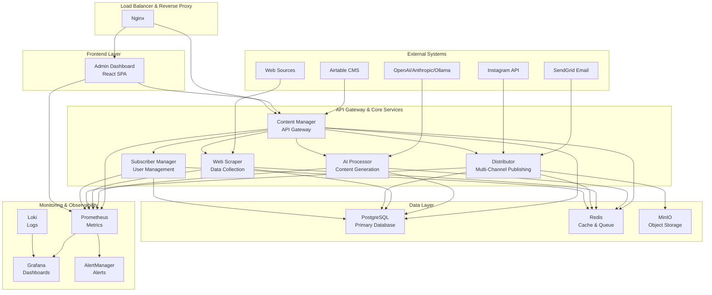
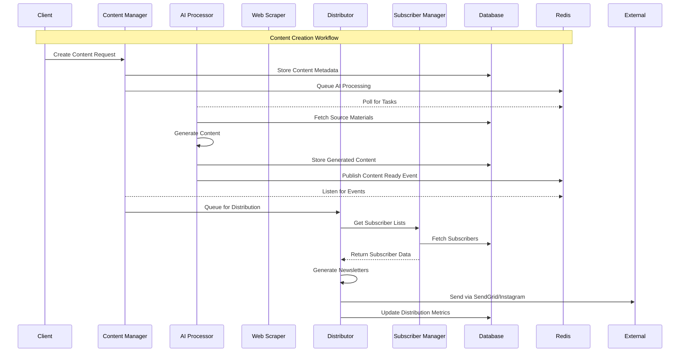
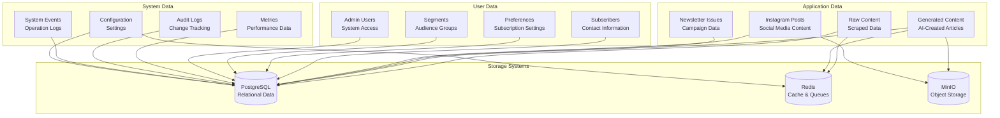

# AquaScene Content Engine - System Architecture

## Table of Contents
1. [System Overview](#system-overview)
2. [Architecture Principles](#architecture-principles)
3. [High-Level Architecture](#high-level-architecture)
4. [Service Architecture](#service-architecture)
5. [Data Flow Architecture](#data-flow-architecture)
6. [Integration Architecture](#integration-architecture)
7. [Security Architecture](#security-architecture)
8. [Scalability Architecture](#scalability-architecture)

## System Overview

The AquaScene Content Engine is a comprehensive microservices-based platform designed for automated content creation, management, and distribution in the aquascaping domain. The system implements modern cloud-native patterns with Docker containerization, service mesh communication, and observability-first design.

### Key Components
- **5 Core Microservices**: Content Manager, AI Processor, Web Scraper, Distributor, Subscriber Manager
- **Admin Dashboard**: React-based management interface
- **Infrastructure Services**: PostgreSQL, Redis, MinIO, Nginx, Monitoring Stack
- **Content Processing Pipeline**: AI-powered content generation and optimization
- **Multi-Channel Distribution**: Email newsletters, Instagram automation

## Architecture Principles

### 1. Microservices Architecture
- **Service Decomposition**: Domain-driven design with clear service boundaries
- **Loose Coupling**: Services communicate via well-defined APIs
- **High Cohesion**: Each service owns its domain logic and data
- **Independent Deployability**: Services can be deployed and scaled independently

### 2. Event-Driven Architecture
- **Asynchronous Communication**: Redis pub/sub for inter-service messaging
- **Event Sourcing**: Audit trails and system events tracking
- **CQRS Pattern**: Separate read/write models where appropriate

### 3. Cloud-Native Design
- **Containerization**: All services run in Docker containers
- **Container Orchestration**: Docker Compose for development, production-ready for Kubernetes
- **Infrastructure as Code**: Declarative configuration management
- **12-Factor App**: Stateless services, configuration externalization

### 4. Observability-First
- **Distributed Tracing**: Request flow tracking across services
- **Metrics Collection**: Prometheus-based monitoring
- **Centralized Logging**: Structured logging with Loki/Grafana
- **Health Checks**: Comprehensive service health monitoring

## High-Level Architecture



## Service Architecture

### Core Services Overview

| Service | Port | Purpose | Technology Stack |
|---------|------|---------|------------------|
| **Content Manager** | 8000 | API Gateway, Content CRUD, Workflow Orchestration | Python, FastAPI, SQLAlchemy |
| **AI Processor** | 8001 | Content Generation, AI Model Management | Python, FastAPI, OpenAI/Anthropic/Ollama |
| **Web Scraper** | 8002 | Data Collection, Content Scraping | Python, FastAPI, BeautifulSoup, Selenium |
| **Distributor** | 8003 | Multi-Channel Publishing, Newsletter/Instagram | Python, FastAPI, SendGrid, Instagram API |
| **Subscriber Manager** | 8004 | User Management, Segmentation, Preferences | Python, FastAPI, JWT, Encryption |

### Service Communication Patterns



## Data Flow Architecture

### Content Processing Pipeline

```
┌─────────────────┐    ┌──────────────────┐    ┌─────────────────┐
│   Data Sources  │───▶│  Web Scraper     │───▶│   Raw Content   │
│                 │    │                  │    │    Storage      │
│ • Web Sites     │    │ • Content        │    │                 │
│ • APIs          │    │   Extraction     │    │ • PostgreSQL    │
│ • Airtable      │    │ • Data Cleaning  │    │ • Structured    │
└─────────────────┘    │ • Rate Limiting  │    │   Data          │
                       └──────────────────┘    └─────────────────┘
                                │                       │
                                ▼                       ▼
┌─────────────────┐    ┌──────────────────┐    ┌─────────────────┐
│ AI Content      │◀───│  Content         │◀───│  Content        │
│ Generation      │    │  Manager         │    │  Orchestration  │
│                 │    │                  │    │                 │
│ • GPT-4/Claude  │    │ • Workflow       │    │ • Queue         │
│ • Llama 3       │    │   Management     │    │   Management    │
│ • Templates     │    │ • Quality        │    │ • Job           │
│ • Optimization  │    │   Validation     │    │   Scheduling    │
└─────────────────┘    │ • Brand Voice    │    │ • Batch         │
                       └──────────────────┘    │   Processing    │
                                │               └─────────────────┘
                                ▼
┌─────────────────┐    ┌──────────────────┐    ┌─────────────────┐
│   Generated     │───▶│   Distribution   │───▶│   Multi-Channel │
│   Content       │    │   Service        │    │   Publishing    │
│                 │    │                  │    │                 │
│ • Articles      │    │ • Newsletter     │    │ • Email         │
│ • Newsletters   │    │   Generation     │    │   Campaigns     │
│ • Social Posts  │    │ • Instagram      │    │ • Instagram     │
│ • SEO Content   │    │   Automation     │    │   Posts         │
└─────────────────┘    │ • Personalization│    │ • Social Media  │
                       └──────────────────┘    └─────────────────┘
```

### Data Storage Architecture



## Integration Architecture

### External System Integrations

#### 1. AI Service Providers
```yaml
OpenAI Integration:
  - Model: GPT-4 Mini
  - Usage: Content generation, summarization
  - Fallback: Anthropic Claude
  - Rate Limiting: Token-based

Anthropic Integration:
  - Model: Claude Sonnet
  - Usage: Content analysis, optimization
  - Fallback: OpenAI GPT-4
  - Rate Limiting: Request-based

Ollama Integration:
  - Model: Llama 3
  - Usage: Local processing, privacy-sensitive content
  - Deployment: Self-hosted container
  - Rate Limiting: Resource-based
```

#### 2. Content Management System
```yaml
Airtable Integration:
  - Purpose: Content planning, editorial calendar
  - API: REST API with pagination
  - Sync: Bidirectional content synchronization
  - Rate Limiting: 5 requests/second
  - Data Flow: 
    - Inbound: Content briefs, topics, schedules
    - Outbound: Generated content, metrics, status updates
```

#### 3. Distribution Channels
```yaml
SendGrid Integration:
  - Purpose: Email newsletter delivery
  - API: V3 REST API
  - Features: Templates, personalization, analytics
  - Rate Limiting: Based on plan tier
  - Tracking: Opens, clicks, bounces, unsubscribes

Instagram Basic Display API:
  - Purpose: Content publishing, analytics
  - API: Graph API v18.0
  - Features: Feed posts, stories, insights
  - Rate Limiting: 200 calls per hour per user
  - Content Types: Images, carousels, reels
```

### Internal Service Communication

#### 1. Synchronous Communication
- **Protocol**: HTTP/HTTPS REST APIs
- **Format**: JSON with OpenAPI specifications
- **Authentication**: Service-to-service JWT tokens
- **Load Balancing**: Nginx upstream with least-connections
- **Timeout Strategy**: Progressive timeouts (5s connect, 60-300s read)

#### 2. Asynchronous Communication
- **Protocol**: Redis Pub/Sub and Stream
- **Message Format**: JSON with schema validation
- **Queue Strategy**: Work queues for batch processing
- **Dead Letter Queues**: Failed message handling
- **Event Sourcing**: Audit trail and replay capability

## Security Architecture

### 1. Network Security
```
Internet
    │
    ▼
┌─────────────┐
│    Nginx    │ ◀─── SSL Termination, Rate Limiting
│ Reverse     │      DDoS Protection, WAF
│ Proxy       │
└─────────────┘
    │
    ▼
┌─────────────┐
│  Docker     │ ◀─── Internal Network, Service Mesh
│  Network    │      Container Isolation
│  Bridge     │
└─────────────┘
    │
    ▼
┌─────────────┐
│ Microservice│ ◀─── Service-to-Service Auth
│ Endpoints   │      Input Validation, Rate Limiting
└─────────────┘
```

### 2. Authentication & Authorization
- **Admin Users**: JWT-based authentication with role-based access control
- **Service-to-Service**: Mutual TLS and API keys
- **External APIs**: OAuth 2.0 and API key management
- **Session Management**: Redis-based session store with expiration
- **Password Policy**: bcrypt hashing, complexity requirements

### 3. Data Protection
- **Encryption at Rest**: PostgreSQL encrypted storage, encrypted backups
- **Encryption in Transit**: TLS 1.3 for all communications
- **Data Privacy**: GDPR compliance, data retention policies
- **PII Handling**: Field-level encryption for sensitive data
- **Audit Logging**: Comprehensive change tracking and access logs

## Scalability Architecture

### Horizontal Scaling Strategy

#### 1. Service Scaling
```yaml
Content Manager:
  Scaling: Load balancer + multiple instances
  Bottlenecks: Database connections, Redis connections
  Strategy: Stateless design, connection pooling

AI Processor:
  Scaling: Queue-based horizontal scaling
  Bottlenecks: GPU resources, API rate limits
  Strategy: Model load balancing, request queuing

Web Scraper:
  Scaling: Distributed scraping with coordination
  Bottlenecks: Rate limiting, IP blocking
  Strategy: Proxy rotation, request scheduling

Distributor:
  Scaling: Message queue partitioning
  Bottlenecks: External API limits
  Strategy: Queue sharding, batch processing

Subscriber Manager:
  Scaling: Read replicas, caching
  Bottlenecks: Database queries, complex filtering
  Strategy: Database optimization, search indexing
```

#### 2. Data Scaling
```yaml
PostgreSQL:
  Read Replicas: Horizontal read scaling
  Partitioning: Time-based partitioning for metrics
  Indexing: Comprehensive index strategy
  Connection Pooling: PgBouncer integration

Redis:
  Clustering: Redis Cluster mode
  Persistence: RDB + AOF hybrid
  Memory Management: LRU eviction policies
  Replication: Master-replica setup

MinIO:
  Distributed Mode: Multi-node object storage
  Erasure Coding: Data redundancy and recovery
  Load Balancing: Multiple access points
  CDN Integration: Content delivery optimization
```

### Performance Optimization

#### 1. Caching Strategy
```
┌─────────────┐    ┌─────────────┐    ┌─────────────┐
│  L1 Cache   │───▶│  L2 Cache   │───▶│  Database   │
│ Application │    │    Redis    │    │ PostgreSQL  │
│ Memory      │    │             │    │             │
│ 1-5 min TTL │    │ 15-60 min   │    │ Source of   │
└─────────────┘    │ TTL         │    │ Truth       │
                   └─────────────┘    └─────────────┘
                   
Cache Layers:
- Application: In-memory caching for frequently accessed data
- Redis: Distributed caching for session data, computed results
- Database: Query result caching, materialized views
- CDN: Static asset caching, image optimization
```

#### 2. Database Optimization
- **Indexing Strategy**: B-tree, GIN, and full-text search indexes
- **Query Optimization**: Explain plan analysis, query rewriting
- **Connection Management**: Pool sizing, connection lifetime
- **Partitioning**: Time-based partitioning for metrics and logs
- **Vacuum Strategy**: Automated maintenance scheduling

#### 3. API Optimization
- **Response Compression**: Gzip compression for API responses
- **Pagination**: Cursor-based pagination for large datasets
- **Field Selection**: GraphQL-style field filtering
- **Bulk Operations**: Batch processing for data operations
- **Rate Limiting**: Adaptive rate limiting based on resource usage

## Deployment Architecture

### Container Strategy
```dockerfile
# Multi-stage build pattern
FROM python:3.11-slim as builder
# Build dependencies and application

FROM python:3.11-slim as runtime
# Runtime environment with minimal dependencies
# Security hardening and non-root user
```

### Environment Configuration
```yaml
Development:
  Containers: Docker Compose
  Database: Single PostgreSQL instance
  Cache: Single Redis instance
  Monitoring: Local Prometheus/Grafana
  
Staging:
  Containers: Docker Swarm or Kubernetes
  Database: PostgreSQL with read replica
  Cache: Redis with persistence
  Monitoring: Centralized monitoring stack
  
Production:
  Containers: Kubernetes cluster
  Database: Highly available PostgreSQL cluster
  Cache: Redis cluster with failover
  Monitoring: Enterprise monitoring with alerting
  Load Balancer: External load balancer + CDN
  Backup: Automated backup with retention
```

### High Availability Patterns

#### 1. Service Resilience
- **Circuit Breakers**: Failure isolation and recovery
- **Bulkheads**: Resource isolation between services
- **Timeouts**: Progressive timeout strategies
- **Retries**: Exponential backoff with jitter
- **Health Checks**: Liveness and readiness probes

#### 2. Data Resilience
- **Replication**: Multi-zone database replication
- **Backup Strategy**: Automated backups with point-in-time recovery
- **Disaster Recovery**: Cross-region backup storage
- **Data Validation**: Integrity checks and corruption detection

## Monitoring and Observability

### Metrics Collection
```yaml
Application Metrics:
  - Request/response metrics (latency, throughput, errors)
  - Business metrics (content generation, distribution success)
  - Resource utilization (CPU, memory, disk, network)

Infrastructure Metrics:
  - Container metrics (Docker stats)
  - Database metrics (connection pools, query performance)
  - Cache metrics (hit rates, memory usage)
  - Network metrics (bandwidth, packet loss)
```

### Alerting Strategy
```yaml
Critical Alerts (PagerDuty):
  - Service down (health check failures)
  - High error rates (>5% for 5 minutes)
  - Database connectivity issues
  - External API failures

Warning Alerts (Slack):
  - High response times (>2s 95th percentile)
  - Queue depth growth
  - Disk space utilization (>80%)
  - Unusual traffic patterns

Info Alerts (Email):
  - Deployment notifications
  - Backup completion status
  - Weekly performance summaries
```

This comprehensive system architecture provides the foundation for a scalable, maintainable, and observable content engine that can handle the demands of automated content creation and distribution while maintaining high availability and performance standards.