# AquaScene Content Engine - Technical Diagrams Collection

## Table of Contents
1. [Diagram Overview](#diagram-overview)
2. [System Architecture Diagrams](#system-architecture-diagrams)
3. [Service Architecture Diagrams](#service-architecture-diagrams)
4. [Database Architecture Diagrams](#database-architecture-diagrams)
5. [Infrastructure Diagrams](#infrastructure-diagrams)
6. [Security Architecture Diagrams](#security-architecture-diagrams)
7. [Performance and Scaling Diagrams](#performance-and-scaling-diagrams)
8. [Data Flow Diagrams](#data-flow-diagrams)
9. [Deployment Architecture Diagrams](#deployment-architecture-diagrams)

## Diagram Overview

This document consolidates all technical diagrams for the AquaScene Content Engine, providing visual representations of the system's architecture, data flows, and operational patterns. All diagrams are created using Mermaid syntax for consistency and maintainability.

### Diagram Legend
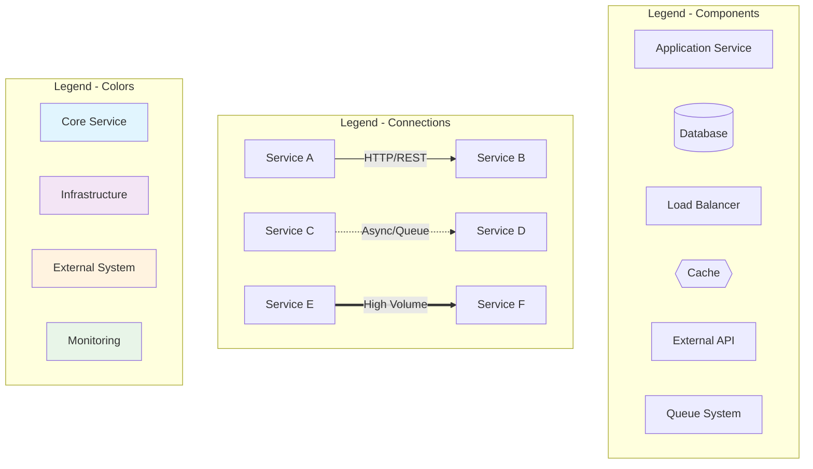

## System Architecture Diagrams

### 1. High-Level System Architecture
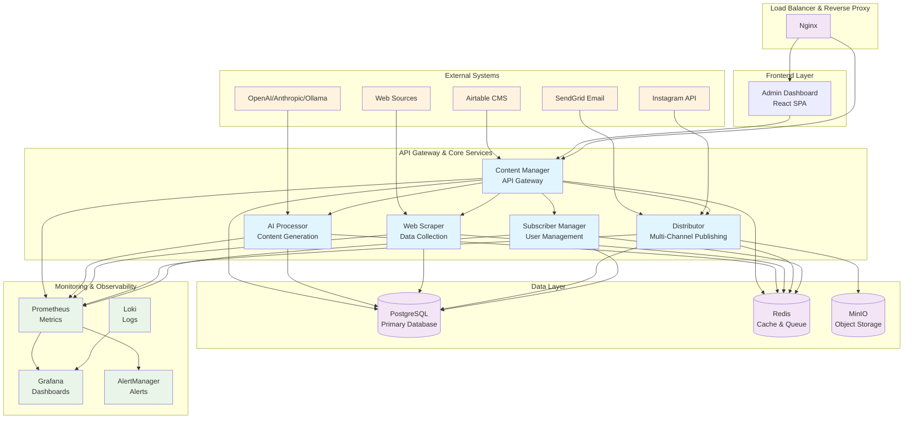

### 2. Service Interaction Flow
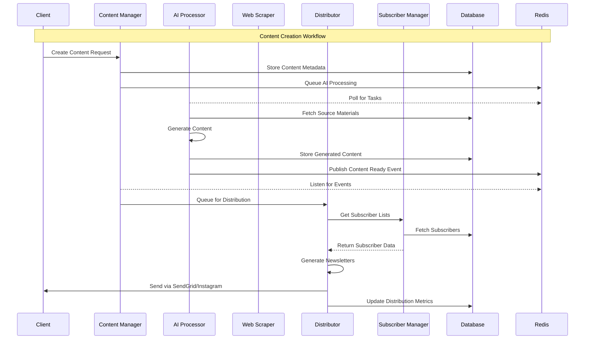

## Service Architecture Diagrams

### 3. Microservices Communication Patterns
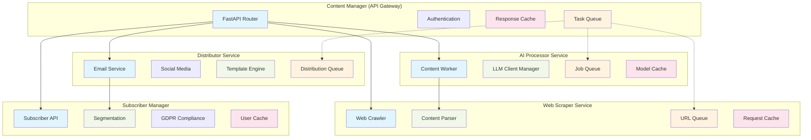

### 4. Event-Driven Architecture
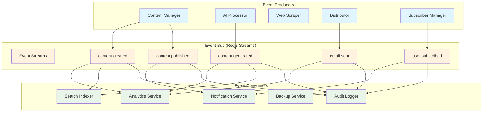

## Database Architecture Diagrams

### 5. Database Schema Relationships
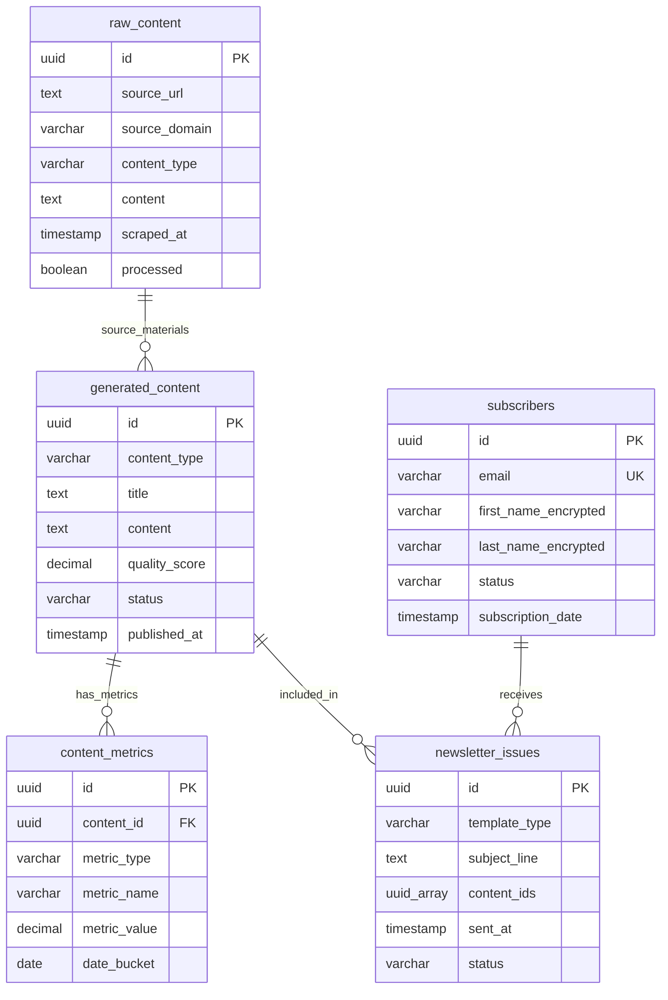

### 6. Data Flow Architecture
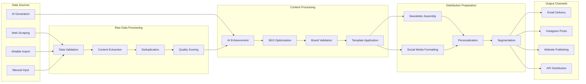

## Infrastructure Diagrams

### 7. Container Orchestration Architecture
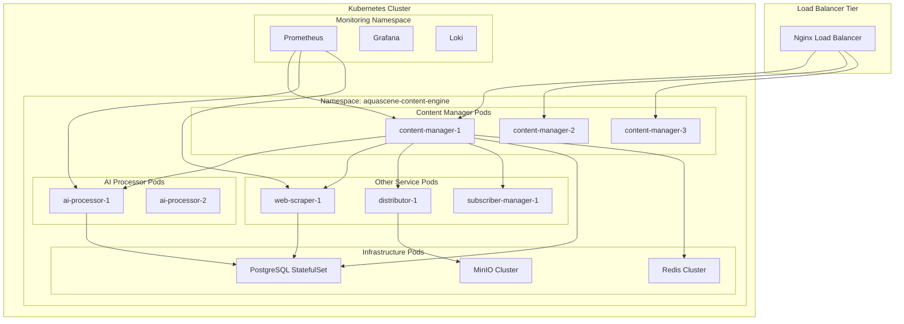

### 8. Network Architecture
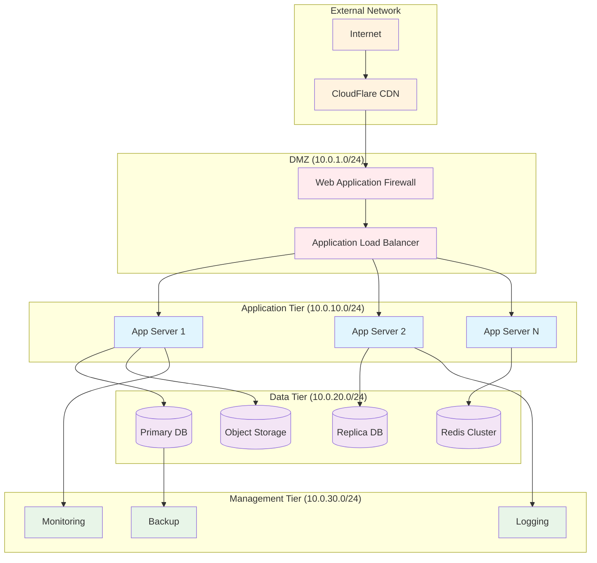

## Security Architecture Diagrams

### 9. Authentication Flow
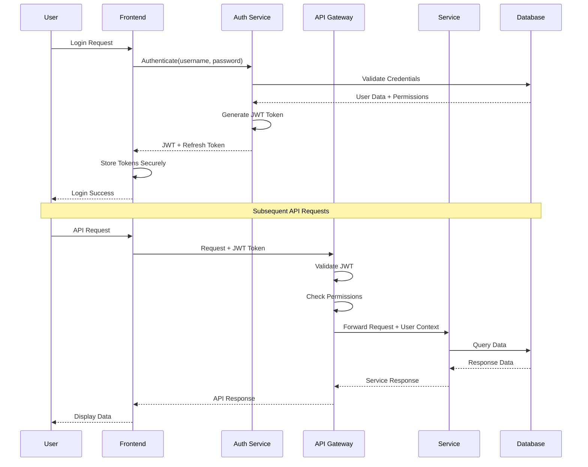

### 10. Security Layers
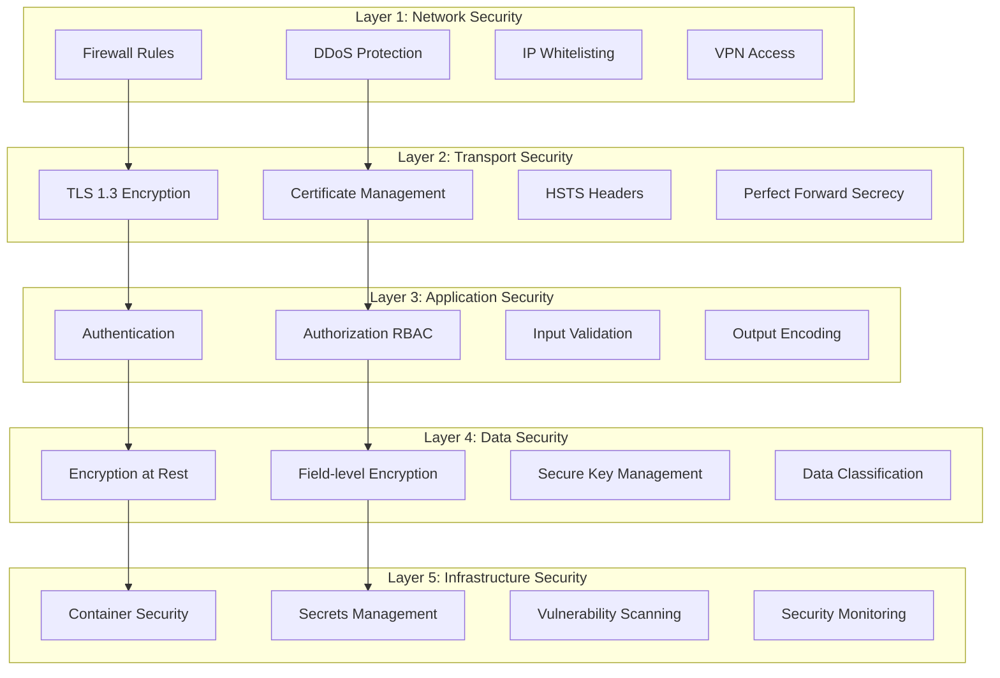

## Performance and Scaling Diagrams

### 11. Horizontal Scaling Architecture
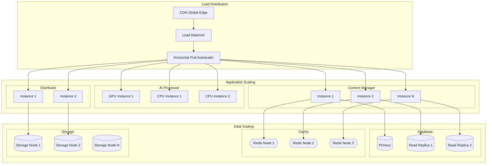

### 12. Caching Strategy
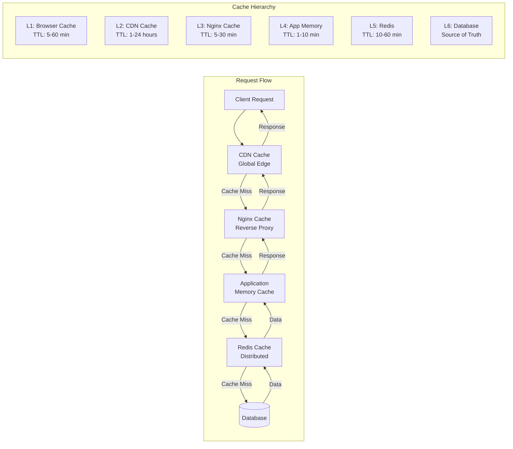

## Data Flow Diagrams

### 13. Content Generation Pipeline
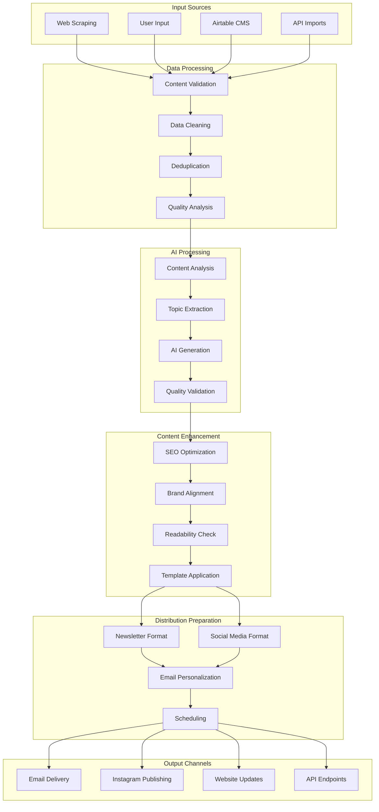

### 14. Newsletter Distribution Flow
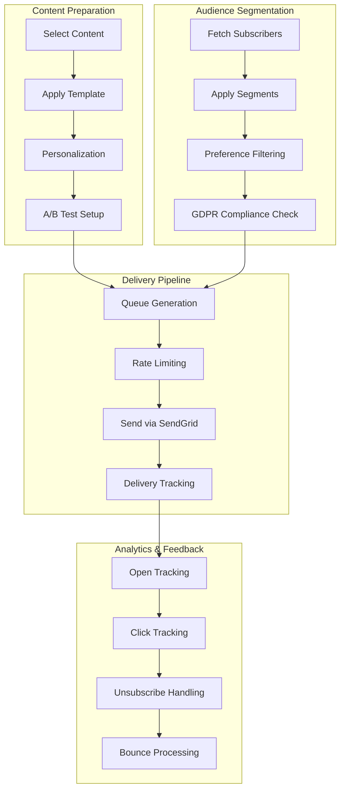

## Deployment Architecture Diagrams

### 15. CI/CD Pipeline
```mermaid
graph LR
    subgraph "Development"
        A[Developer Commits]
        B[Feature Branch]
        C[Pull Request]
    end
    
    subgraph "CI Pipeline"
        D[Code Analysis]
        E[Unit Tests]
        F[Integration Tests]
        G[Security Scan]
        H[Build Images]
    end
    
    subgraph "CD Pipeline"
        I[Deploy to Staging]
        J[E2E Tests]
        K[Performance Tests]
        L[Approval Gate]
        M[Deploy to Production]
    end
    
    subgraph "Monitoring"
        N[Health Checks]
        O[Performance Monitoring]
        P[Error Tracking]
        Q[Rollback Trigger]
    end
    
    A --> B
    B --> C
    C --> D
    
    D --> E
    E --> F
    F --> G
    G --> H
    
    H --> I
    I --> J
    J --> K
    K --> L
    L --> M
    
    M --> N
    N --> O
    O --> P
    P --> Q
    Q -.->|If Issues| M
```

### 16. Multi-Environment Architecture
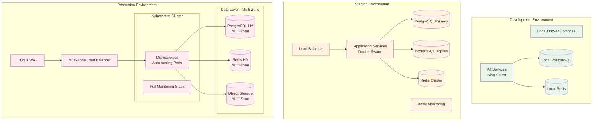

### 17. Monitoring and Observability Architecture
```mermaid
graph TB
    subgraph "Data Collection Layer"
        A[Application Metrics]
        B[Infrastructure Metrics]
        C[Application Logs]
        D[Infrastructure Logs]
        E[Distributed Traces]
        F[Custom Events]
    end
    
    subgraph "Collection Agents"
        G[Prometheus Exporters]
        H[Node Exporter]
        I[Promtail]
        J[Fluentd]
        K[OpenTelemetry Collector]
        L[Custom Collectors]
    end
    
    subgraph "Storage & Processing"
        M[Prometheus TSDB]
        N[Loki Log Storage]
        O[Jaeger Traces]
        P[InfluxDB (Custom)]
    end
    
    subgraph "Visualization & Alerting"
        Q[Grafana Dashboards]
        R[AlertManager]
        S[Custom Dashboards]
        T[Alert Channels]
    end
    
    subgraph "External Integrations"
        U[Slack Notifications]
        V[PagerDuty]
        W[Email Alerts]
        X[Webhook Endpoints]
    end
    
    A --> G
    B --> H
    C --> I
    D --> J
    E --> K
    F --> L
    
    G --> M
    H --> M
    I --> N
    J --> N
    K --> O
    L --> P
    
    M --> Q
    N --> Q
    O --> Q
    P --> S
    
    M --> R
    R --> T
    
    T --> U
    T --> V
    T --> W
    T --> X
```

This comprehensive collection of technical diagrams provides visual documentation for all aspects of the AquaScene Content Engine architecture, enabling teams to understand system design, data flows, and operational patterns at both high and detailed levels.